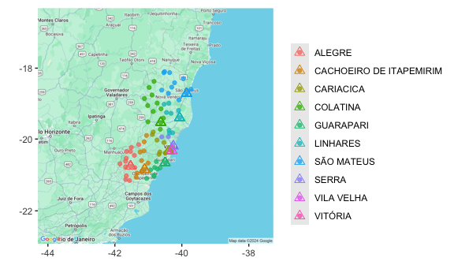
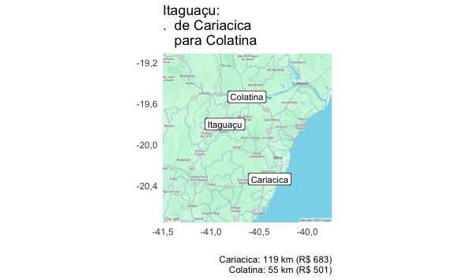
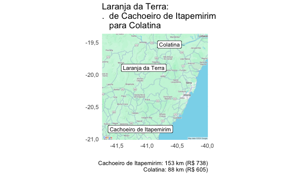
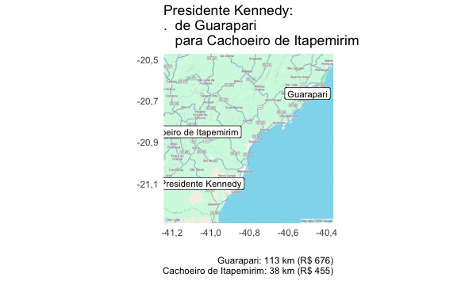

# Otimizando a Coleta de Dados do IBGE com o Pacote R ‘orce’
Eduardo Leoni - SES/BA - IBGE

# Introdução

A otimização dos custos de coleta de dados é um desafio comum em
instituições de pesquisa que lidam com grandes volumes de informações
distribuídas geograficamente. No caso do IBGE, a necessidade de otimizar
a alocação de setores censitários, escolas, ou empresas, às agências de
coleta do IBGE, se torna essencial, dada a complexidade logística e os
elevados custos envolvidos no processo.

As pesquisas MUNIC (Pesquisa de Informações Básicas Municipais) e POF
(Pesquisa de Orçamentos Familiares) são dois exemplos que ilustram a
importância dessa otimização. A MUNIC, que coleta dados sobre a gestão e
estrutura dos municípios brasileiros, e a POF, que investiga os hábitos
de consumo das famílias brasileiras, envolvem a coleta de dados em
milhares de domicílios e municípios, gerando altos custos logísticos.

O pacote orce é uma ferramenta projetada para otimizar a alocação de
Unidades de Coleta (UCs), como setores censitários, prefeituras de
municípios ou estabelecimentos de ensino, às agências do IBGE. A
eficiência dessa alocação é fundamental para garantir a coleta de dados
de forma econômica e eficaz em pesquisas e censos de grande escala, como
o Censo Demográfico.

Coletar dados em milhares de domicílios espalhados por um vasto
território é um grande desafio. O orce entra em ação para ajudar a
definir a melhor estratégia, minimizando o tempo de deslocamento e os
custos envolvidos.

## Principais Características

1.  **Roteamento e Geocodificação:**

    -   Para o caso em que as unidades de coleta são setores
        censitários, a função `ponto_setor_densidade` auxilia na
        identificação de locais representativos dentro dos setores
        censitários, priorizando áreas de alta densidade populacional
        para facilitar o acesso e garantir que o algorítimo de
        roteamento tenha destinos/origens válidos.

2.  **Otimização Avançada da Alocação:**

    -   O `orce` implementa um algoritmo inteligente que encontra a
        melhor forma de distribuir as UCs entre as agências do IBGE,
        levando em conta diversos fatores, como a distância entre os
        locais, o tempo de viagem, os custos fixos de cada agência e a
        necessidade de pagar diárias aos pesquisadores.
    -   A função `alocar_ucs` permite que você personalize as
        restrições, como a capacidade de cada agência e as preferências
        de localização, para que a alocação se adapte às necessidades
        específicas do seu projeto. A função `alocar_municipios`, por
        sua vez, otimiza a alocação mantendo as unidades de coleta de um
        mesmo município com uma só agência.

3.  **Cálculo de Custos Detalhados:**

    -   O pacote considera as fronteiras administrativas para determinar
        quando é necessário pagar diárias aos pesquisadores, garantindo
        que os custos totais sejam calculados com precisão.
    -   Outros custos importantes, como combustível e tempo de viagem,
        também são levados em conta para fornecer uma estimativa
        completa dos gastos da coleta de dados.

4.  **Flexibilidade e Adaptabilidade:**

    -   O `orce` permite que você personalize vários parâmetros, como o
        custo do combustível, o custo por hora de viagem, o consumo de
        combustível por quilômetro e as restrições específicas de cada
        agência.
    -   Essa flexibilidade garante que o pacote possa ser adaptado a
        diferentes tipos de pesquisas e necessidades de coleta de dados,
        tornando-o uma ferramenta versátil para o IBGE.

## Impacto e Aplicações

O pacote `orce` tem o potencial de gerar um impacto significativo na
eficiência e na economicidade das operações de pesquisa e censo do IBGE.
Ao otimizar a alocação de UCs, o pacote pode:

-   **Reduzir custos de viagem e tempo de deslocamento:** Ao minimizar
    as distâncias percorridas e o tempo gasto em viagens, o pacote
    contribui para a redução dos custos operacionais e aumenta a
    produtividade das equipes de coleta de dados.
-   **Otimizar a utilização dos recursos das agências:** A alocação
    eficiente das UCs às agências garante que os recursos sejam
    utilizados de forma equilibrada. A opção de impor límites máximos e
    mínimos de unidades de coleta por agência ajuda a evitar sobrecarga
    em algumas agências e ociosidade em outras.
-   **Facilitar o planejamento e a gestão da coleta de dados:** A
    capacidade de personalizar parâmetros e restrições permite que o
    pacote se adapte às necessidades específicas de cada projeto,
    facilitando o planejamento e a gestão das operações de coleta de
    dados.

# Estudos de caso

## Caso 1. Calculando os custos da coleta da MUNIC

A Pesquisa de Informações Básicas Municipais (MUNIC) realizada pelo
Instituto Brasileiro de Geografia e Estatística (IBGE) é uma pesquisa
fundamental para coletar informações essenciais sobre os municípios em
todo o Brasil.

A alocação eficiente dos municípios às agências do IBGE responsáveis
pela coleta de dados é um aspecto importante para o sucesso da pesquisa
MUNIC, principalmente nas Unidades da Federação com maior número de
agências e municípios. O processo envolve atribuir cada município à
agência mais adequada, considerando fatores como proximidade geográfica,
capacidade da agência e custos de viagem. A complexidade dessa tarefa
aumenta com o número de municípios e agências envolvidas, tornando a
alocação manual desafiadora e potencialmente levando a atribuições
abaixo do ideal.

Para enfrentar esse desafio, o pacote `orce` utiliza algoritmos
avançados de otimização e incorpora vários fatores de custo para
identificar a estratégia de alocação mais eficiente, minimizando
despesas de viagem, carga de trabalho da equipe e custos gerais da
pesquisa.

Vamos começar a Superintendência Estadual do Espírito Santo, que tem 78
municípios, e 10 agências do IBGE.

``` r
map_uc_agencias(mnow%>%rename(uc_lat=municipio_sede_lat, uc_lon=municipio_sede_lon)) +
  geom_point(aes(y=municipio_sede_lat, x=municipio_sede_lon, color=agencia_nome_bdo), data=mnow, alpha=3/4)+
  geom_point(aes(y=agencia_lat, x=agencia_lon, color=agencia_nome_bdo), data=mnow, shape=2, size=3) + 
  labs(x="", y="", color="")
```



Vamos supor que seja necessário visitar todos os 78 municípios. Como
podemos estimar o custo da coleta? Partiremos de algumas premissas.

1.  Municípios na mesma microrregião ou região metropolitana não pagam
    diária, a não ser que seja exigida pernoite.
2.  Quando o tempo de viagem é maior que 1,5 horas, paga-se diária,
    mesmo se na jurisdição da agência.
3.  A coleta presencial dura 2 dias.
4.  Quando há pernoite, são pagas 1,5 diárias, e a coleta é feita em 1
    viagem(ns).
5.  Quando não há pernoite, são feitas 2 viagem(ns) (ida e volta). Há
    pagamento de meia-diária nos casos especificados no item 1.
6.  As viagens, feitas por veículos do IBGE, tem origem nas agências e
    destino nos municípios de coleta. Os veículos fazem 10 quilômetros
    por litro, e o custo do combustível é de 6 por litro.
    **Importante**: o consumo de combustível pode ser reduzido
    significativamente fazendo “roteiros”, em que uma viagem percorre
    mais de um município. Vamos ignorar, por enquanto, essa
    possibilidade.
7.  Diárias são calculadas para apenas um funcionário e tem o valor de
    335.

``` r
ucs_now <- municipios_22%>%
  sf::st_drop_geometry()%>%
  filter(substr(municipio_codigo,1,2)==ufnow$uf_codigo)%>%
  left_join(agencias_bdo_mun%>%select(agencia_codigo, municipio_codigo), by="municipio_codigo")%>%
  mutate(uc=municipio_codigo)%>%
  ## com agências intramunicipais tem mais de uma agência associada a município
  ## vamos deixar só a primeira (em ordem numérica)
  group_by(municipio_codigo)%>%
  arrange(agencia_codigo)%>%
  slice(1)%>%
  mutate(viagens=params$viagens_munic, dias_coleta=params$dias_coleta_munic)
```

Os dados com as unidades de coleta tem a seguinte estrutura:

``` r
gt1(ucs_now%>%
      distinct(agencia_codigo, dias_coleta, viagens, .keep_all = TRUE)%>%
      arrange(agencia_codigo, uc)%>%
      head(10)%>%
      ungroup%>%
      select(uc=municipio_codigo, agencia_codigo, dias_coleta, viagens))
```

<div id="spxynwtjkj" style="padding-left:0px;padding-right:0px;padding-top:10px;padding-bottom:10px;overflow-x:auto;overflow-y:auto;width:auto;height:auto;">
<style>#spxynwtjkj table {
  font-family: system-ui, 'Segoe UI', Roboto, Helvetica, Arial, sans-serif, 'Apple Color Emoji', 'Segoe UI Emoji', 'Segoe UI Symbol', 'Noto Color Emoji';
  -webkit-font-smoothing: antialiased;
  -moz-osx-font-smoothing: grayscale;
}

#spxynwtjkj thead, #spxynwtjkj tbody, #spxynwtjkj tfoot, #spxynwtjkj tr, #spxynwtjkj td, #spxynwtjkj th {
  border-style: none;
}

#spxynwtjkj p {
  margin: 0;
  padding: 0;
}

#spxynwtjkj .gt_table {
  display: table;
  border-collapse: collapse;
  line-height: normal;
  margin-left: auto;
  margin-right: auto;
  color: #333333;
  font-size: 16px;
  font-weight: normal;
  font-style: normal;
  background-color: #FFFFFF;
  width: auto;
  border-top-style: solid;
  border-top-width: 2px;
  border-top-color: #A8A8A8;
  border-right-style: none;
  border-right-width: 2px;
  border-right-color: #D3D3D3;
  border-bottom-style: solid;
  border-bottom-width: 2px;
  border-bottom-color: #A8A8A8;
  border-left-style: none;
  border-left-width: 2px;
  border-left-color: #D3D3D3;
}

#spxynwtjkj .gt_caption {
  padding-top: 4px;
  padding-bottom: 4px;
}

#spxynwtjkj .gt_title {
  color: #333333;
  font-size: 125%;
  font-weight: initial;
  padding-top: 4px;
  padding-bottom: 4px;
  padding-left: 5px;
  padding-right: 5px;
  border-bottom-color: #FFFFFF;
  border-bottom-width: 0;
}

#spxynwtjkj .gt_subtitle {
  color: #333333;
  font-size: 85%;
  font-weight: initial;
  padding-top: 3px;
  padding-bottom: 5px;
  padding-left: 5px;
  padding-right: 5px;
  border-top-color: #FFFFFF;
  border-top-width: 0;
}

#spxynwtjkj .gt_heading {
  background-color: #FFFFFF;
  text-align: center;
  border-bottom-color: #FFFFFF;
  border-left-style: none;
  border-left-width: 1px;
  border-left-color: #D3D3D3;
  border-right-style: none;
  border-right-width: 1px;
  border-right-color: #D3D3D3;
}

#spxynwtjkj .gt_bottom_border {
  border-bottom-style: solid;
  border-bottom-width: 2px;
  border-bottom-color: #D3D3D3;
}

#spxynwtjkj .gt_col_headings {
  border-top-style: solid;
  border-top-width: 2px;
  border-top-color: #D3D3D3;
  border-bottom-style: solid;
  border-bottom-width: 2px;
  border-bottom-color: #D3D3D3;
  border-left-style: none;
  border-left-width: 1px;
  border-left-color: #D3D3D3;
  border-right-style: none;
  border-right-width: 1px;
  border-right-color: #D3D3D3;
}

#spxynwtjkj .gt_col_heading {
  color: #333333;
  background-color: #FFFFFF;
  font-size: 100%;
  font-weight: normal;
  text-transform: inherit;
  border-left-style: none;
  border-left-width: 1px;
  border-left-color: #D3D3D3;
  border-right-style: none;
  border-right-width: 1px;
  border-right-color: #D3D3D3;
  vertical-align: bottom;
  padding-top: 5px;
  padding-bottom: 6px;
  padding-left: 5px;
  padding-right: 5px;
  overflow-x: hidden;
}

#spxynwtjkj .gt_column_spanner_outer {
  color: #333333;
  background-color: #FFFFFF;
  font-size: 100%;
  font-weight: normal;
  text-transform: inherit;
  padding-top: 0;
  padding-bottom: 0;
  padding-left: 4px;
  padding-right: 4px;
}

#spxynwtjkj .gt_column_spanner_outer:first-child {
  padding-left: 0;
}

#spxynwtjkj .gt_column_spanner_outer:last-child {
  padding-right: 0;
}

#spxynwtjkj .gt_column_spanner {
  border-bottom-style: solid;
  border-bottom-width: 2px;
  border-bottom-color: #D3D3D3;
  vertical-align: bottom;
  padding-top: 5px;
  padding-bottom: 5px;
  overflow-x: hidden;
  display: inline-block;
  width: 100%;
}

#spxynwtjkj .gt_spanner_row {
  border-bottom-style: hidden;
}

#spxynwtjkj .gt_group_heading {
  padding-top: 8px;
  padding-bottom: 8px;
  padding-left: 5px;
  padding-right: 5px;
  color: #333333;
  background-color: #FFFFFF;
  font-size: 100%;
  font-weight: initial;
  text-transform: inherit;
  border-top-style: solid;
  border-top-width: 2px;
  border-top-color: #D3D3D3;
  border-bottom-style: solid;
  border-bottom-width: 2px;
  border-bottom-color: #D3D3D3;
  border-left-style: none;
  border-left-width: 1px;
  border-left-color: #D3D3D3;
  border-right-style: none;
  border-right-width: 1px;
  border-right-color: #D3D3D3;
  vertical-align: middle;
  text-align: left;
}

#spxynwtjkj .gt_empty_group_heading {
  padding: 0.5px;
  color: #333333;
  background-color: #FFFFFF;
  font-size: 100%;
  font-weight: initial;
  border-top-style: solid;
  border-top-width: 2px;
  border-top-color: #D3D3D3;
  border-bottom-style: solid;
  border-bottom-width: 2px;
  border-bottom-color: #D3D3D3;
  vertical-align: middle;
}

#spxynwtjkj .gt_from_md > :first-child {
  margin-top: 0;
}

#spxynwtjkj .gt_from_md > :last-child {
  margin-bottom: 0;
}

#spxynwtjkj .gt_row {
  padding-top: 8px;
  padding-bottom: 8px;
  padding-left: 5px;
  padding-right: 5px;
  margin: 10px;
  border-top-style: solid;
  border-top-width: 1px;
  border-top-color: #D3D3D3;
  border-left-style: none;
  border-left-width: 1px;
  border-left-color: #D3D3D3;
  border-right-style: none;
  border-right-width: 1px;
  border-right-color: #D3D3D3;
  vertical-align: middle;
  overflow-x: hidden;
}

#spxynwtjkj .gt_stub {
  color: #333333;
  background-color: #FFFFFF;
  font-size: 100%;
  font-weight: initial;
  text-transform: inherit;
  border-right-style: solid;
  border-right-width: 2px;
  border-right-color: #D3D3D3;
  padding-left: 5px;
  padding-right: 5px;
}

#spxynwtjkj .gt_stub_row_group {
  color: #333333;
  background-color: #FFFFFF;
  font-size: 100%;
  font-weight: initial;
  text-transform: inherit;
  border-right-style: solid;
  border-right-width: 2px;
  border-right-color: #D3D3D3;
  padding-left: 5px;
  padding-right: 5px;
  vertical-align: top;
}

#spxynwtjkj .gt_row_group_first td {
  border-top-width: 2px;
}

#spxynwtjkj .gt_row_group_first th {
  border-top-width: 2px;
}

#spxynwtjkj .gt_summary_row {
  color: #333333;
  background-color: #FFFFFF;
  text-transform: inherit;
  padding-top: 8px;
  padding-bottom: 8px;
  padding-left: 5px;
  padding-right: 5px;
}

#spxynwtjkj .gt_first_summary_row {
  border-top-style: solid;
  border-top-color: #D3D3D3;
}

#spxynwtjkj .gt_first_summary_row.thick {
  border-top-width: 2px;
}

#spxynwtjkj .gt_last_summary_row {
  padding-top: 8px;
  padding-bottom: 8px;
  padding-left: 5px;
  padding-right: 5px;
  border-bottom-style: solid;
  border-bottom-width: 2px;
  border-bottom-color: #D3D3D3;
}

#spxynwtjkj .gt_grand_summary_row {
  color: #333333;
  background-color: #FFFFFF;
  text-transform: inherit;
  padding-top: 8px;
  padding-bottom: 8px;
  padding-left: 5px;
  padding-right: 5px;
}

#spxynwtjkj .gt_first_grand_summary_row {
  padding-top: 8px;
  padding-bottom: 8px;
  padding-left: 5px;
  padding-right: 5px;
  border-top-style: double;
  border-top-width: 6px;
  border-top-color: #D3D3D3;
}

#spxynwtjkj .gt_last_grand_summary_row_top {
  padding-top: 8px;
  padding-bottom: 8px;
  padding-left: 5px;
  padding-right: 5px;
  border-bottom-style: double;
  border-bottom-width: 6px;
  border-bottom-color: #D3D3D3;
}

#spxynwtjkj .gt_striped {
  background-color: rgba(128, 128, 128, 0.05);
}

#spxynwtjkj .gt_table_body {
  border-top-style: solid;
  border-top-width: 2px;
  border-top-color: #D3D3D3;
  border-bottom-style: solid;
  border-bottom-width: 2px;
  border-bottom-color: #D3D3D3;
}

#spxynwtjkj .gt_footnotes {
  color: #333333;
  background-color: #FFFFFF;
  border-bottom-style: none;
  border-bottom-width: 2px;
  border-bottom-color: #D3D3D3;
  border-left-style: none;
  border-left-width: 2px;
  border-left-color: #D3D3D3;
  border-right-style: none;
  border-right-width: 2px;
  border-right-color: #D3D3D3;
}

#spxynwtjkj .gt_footnote {
  margin: 0px;
  font-size: 90%;
  padding-top: 4px;
  padding-bottom: 4px;
  padding-left: 5px;
  padding-right: 5px;
}

#spxynwtjkj .gt_sourcenotes {
  color: #333333;
  background-color: #FFFFFF;
  border-bottom-style: none;
  border-bottom-width: 2px;
  border-bottom-color: #D3D3D3;
  border-left-style: none;
  border-left-width: 2px;
  border-left-color: #D3D3D3;
  border-right-style: none;
  border-right-width: 2px;
  border-right-color: #D3D3D3;
}

#spxynwtjkj .gt_sourcenote {
  font-size: 90%;
  padding-top: 4px;
  padding-bottom: 4px;
  padding-left: 5px;
  padding-right: 5px;
}

#spxynwtjkj .gt_left {
  text-align: left;
}

#spxynwtjkj .gt_center {
  text-align: center;
}

#spxynwtjkj .gt_right {
  text-align: right;
  font-variant-numeric: tabular-nums;
}

#spxynwtjkj .gt_font_normal {
  font-weight: normal;
}

#spxynwtjkj .gt_font_bold {
  font-weight: bold;
}

#spxynwtjkj .gt_font_italic {
  font-style: italic;
}

#spxynwtjkj .gt_super {
  font-size: 65%;
}

#spxynwtjkj .gt_footnote_marks {
  font-size: 75%;
  vertical-align: 0.4em;
  position: initial;
}

#spxynwtjkj .gt_asterisk {
  font-size: 100%;
  vertical-align: 0;
}

#spxynwtjkj .gt_indent_1 {
  text-indent: 5px;
}

#spxynwtjkj .gt_indent_2 {
  text-indent: 10px;
}

#spxynwtjkj .gt_indent_3 {
  text-indent: 15px;
}

#spxynwtjkj .gt_indent_4 {
  text-indent: 20px;
}

#spxynwtjkj .gt_indent_5 {
  text-indent: 25px;
}

#spxynwtjkj .katex-display {
  display: inline-flex !important;
  margin-bottom: 0.75em !important;
}

#spxynwtjkj div.Reactable > div.rt-table > div.rt-thead > div.rt-tr.rt-tr-group-header > div.rt-th-group:after {
  height: 0px !important;
}
</style>

<table class="gt_table" data-quarto-postprocess="true"
data-quarto-disable-processing="false" data-quarto-bootstrap="false">
<thead>
<tr class="header gt_col_headings">
<th id="Uc" class="gt_col_heading gt_columns_bottom_border gt_right"
data-quarto-table-cell-role="th" scope="col">Uc</th>
<th id="Agencia Codigo"
class="gt_col_heading gt_columns_bottom_border gt_right"
data-quarto-table-cell-role="th" scope="col">Agencia Codigo</th>
<th id="Dias Coleta"
class="gt_col_heading gt_columns_bottom_border gt_right"
data-quarto-table-cell-role="th" scope="col">Dias Coleta</th>
<th id="Viagens"
class="gt_col_heading gt_columns_bottom_border gt_right"
data-quarto-table-cell-role="th" scope="col">Viagens</th>
</tr>
</thead>
<tbody class="gt_table_body">
<tr class="odd">
<td class="gt_row gt_right" headers="uc">3200201</td>
<td class="gt_row gt_right" headers="agencia_codigo">320020100</td>
<td class="gt_row gt_right" headers="dias_coleta">2</td>
<td class="gt_row gt_right" headers="viagens">1</td>
</tr>
<tr class="even">
<td class="gt_row gt_right" headers="uc">3200508</td>
<td class="gt_row gt_right" headers="agencia_codigo">320020100</td>
<td class="gt_row gt_right" headers="dias_coleta">2</td>
<td class="gt_row gt_right" headers="viagens">1</td>
</tr>
<tr class="odd">
<td class="gt_row gt_right" headers="uc">3201100</td>
<td class="gt_row gt_right" headers="agencia_codigo">320020100</td>
<td class="gt_row gt_right" headers="dias_coleta">2</td>
<td class="gt_row gt_right" headers="viagens">1</td>
</tr>
<tr class="even">
<td class="gt_row gt_right" headers="uc">3201159</td>
<td class="gt_row gt_right" headers="agencia_codigo">320020100</td>
<td class="gt_row gt_right" headers="dias_coleta">2</td>
<td class="gt_row gt_right" headers="viagens">1</td>
</tr>
<tr class="odd">
<td class="gt_row gt_right" headers="uc">3201803</td>
<td class="gt_row gt_right" headers="agencia_codigo">320020100</td>
<td class="gt_row gt_right" headers="dias_coleta">2</td>
<td class="gt_row gt_right" headers="viagens">1</td>
</tr>
<tr class="even">
<td class="gt_row gt_right" headers="uc">3202009</td>
<td class="gt_row gt_right" headers="agencia_codigo">320020100</td>
<td class="gt_row gt_right" headers="dias_coleta">2</td>
<td class="gt_row gt_right" headers="viagens">1</td>
</tr>
<tr class="odd">
<td class="gt_row gt_right" headers="uc">3202306</td>
<td class="gt_row gt_right" headers="agencia_codigo">320020100</td>
<td class="gt_row gt_right" headers="dias_coleta">2</td>
<td class="gt_row gt_right" headers="viagens">1</td>
</tr>
<tr class="even">
<td class="gt_row gt_right" headers="uc">3202454</td>
<td class="gt_row gt_right" headers="agencia_codigo">320020100</td>
<td class="gt_row gt_right" headers="dias_coleta">2</td>
<td class="gt_row gt_right" headers="viagens">1</td>
</tr>
<tr class="odd">
<td class="gt_row gt_right" headers="uc">3202553</td>
<td class="gt_row gt_right" headers="agencia_codigo">320020100</td>
<td class="gt_row gt_right" headers="dias_coleta">2</td>
<td class="gt_row gt_right" headers="viagens">1</td>
</tr>
<tr class="even">
<td class="gt_row gt_right" headers="uc">3202652</td>
<td class="gt_row gt_right" headers="agencia_codigo">320020100</td>
<td class="gt_row gt_right" headers="dias_coleta">2</td>
<td class="gt_row gt_right" headers="viagens">1</td>
</tr>
</tbody>
</table>

</div>

Usamos como código da unidade de coleta (`uc`) o código IBGE do
município. Os dados devem ser únicos por `uc`. Dias de coleta
(`dias_coleta`) e número de viagens (`viagens`) poderiam variar por
município.

Precisamos também da distância de cada agência para cada município, e se
a viagem paga diária quando não há pernoite. No momento, estamos só
analisando os municípios com as respectivas agências de jurisdição, essa
diária não é devida. Mas ao analisar alocações alternativas, é
importante saber quando é que diárias são devidas. Essa informação está
na tabela `agencias_municipios_diaria`, disponível no pacote para todas
as unidades da federação.

``` r
agencias_municipios_diaria%>%
  semi_join(ucs_now, by="municipio_codigo")%>%
  distinct(agencia_codigo, diaria_municipio, .keep_all = TRUE)%>%
  arrange(agencia_codigo)%>%
  head(10)%>%gt1()
```

<div id="nfesbfgszh" style="padding-left:0px;padding-right:0px;padding-top:10px;padding-bottom:10px;overflow-x:auto;overflow-y:auto;width:auto;height:auto;">
<style>#nfesbfgszh table {
  font-family: system-ui, 'Segoe UI', Roboto, Helvetica, Arial, sans-serif, 'Apple Color Emoji', 'Segoe UI Emoji', 'Segoe UI Symbol', 'Noto Color Emoji';
  -webkit-font-smoothing: antialiased;
  -moz-osx-font-smoothing: grayscale;
}

#nfesbfgszh thead, #nfesbfgszh tbody, #nfesbfgszh tfoot, #nfesbfgszh tr, #nfesbfgszh td, #nfesbfgszh th {
  border-style: none;
}

#nfesbfgszh p {
  margin: 0;
  padding: 0;
}

#nfesbfgszh .gt_table {
  display: table;
  border-collapse: collapse;
  line-height: normal;
  margin-left: auto;
  margin-right: auto;
  color: #333333;
  font-size: 16px;
  font-weight: normal;
  font-style: normal;
  background-color: #FFFFFF;
  width: auto;
  border-top-style: solid;
  border-top-width: 2px;
  border-top-color: #A8A8A8;
  border-right-style: none;
  border-right-width: 2px;
  border-right-color: #D3D3D3;
  border-bottom-style: solid;
  border-bottom-width: 2px;
  border-bottom-color: #A8A8A8;
  border-left-style: none;
  border-left-width: 2px;
  border-left-color: #D3D3D3;
}

#nfesbfgszh .gt_caption {
  padding-top: 4px;
  padding-bottom: 4px;
}

#nfesbfgszh .gt_title {
  color: #333333;
  font-size: 125%;
  font-weight: initial;
  padding-top: 4px;
  padding-bottom: 4px;
  padding-left: 5px;
  padding-right: 5px;
  border-bottom-color: #FFFFFF;
  border-bottom-width: 0;
}

#nfesbfgszh .gt_subtitle {
  color: #333333;
  font-size: 85%;
  font-weight: initial;
  padding-top: 3px;
  padding-bottom: 5px;
  padding-left: 5px;
  padding-right: 5px;
  border-top-color: #FFFFFF;
  border-top-width: 0;
}

#nfesbfgszh .gt_heading {
  background-color: #FFFFFF;
  text-align: center;
  border-bottom-color: #FFFFFF;
  border-left-style: none;
  border-left-width: 1px;
  border-left-color: #D3D3D3;
  border-right-style: none;
  border-right-width: 1px;
  border-right-color: #D3D3D3;
}

#nfesbfgszh .gt_bottom_border {
  border-bottom-style: solid;
  border-bottom-width: 2px;
  border-bottom-color: #D3D3D3;
}

#nfesbfgszh .gt_col_headings {
  border-top-style: solid;
  border-top-width: 2px;
  border-top-color: #D3D3D3;
  border-bottom-style: solid;
  border-bottom-width: 2px;
  border-bottom-color: #D3D3D3;
  border-left-style: none;
  border-left-width: 1px;
  border-left-color: #D3D3D3;
  border-right-style: none;
  border-right-width: 1px;
  border-right-color: #D3D3D3;
}

#nfesbfgszh .gt_col_heading {
  color: #333333;
  background-color: #FFFFFF;
  font-size: 100%;
  font-weight: normal;
  text-transform: inherit;
  border-left-style: none;
  border-left-width: 1px;
  border-left-color: #D3D3D3;
  border-right-style: none;
  border-right-width: 1px;
  border-right-color: #D3D3D3;
  vertical-align: bottom;
  padding-top: 5px;
  padding-bottom: 6px;
  padding-left: 5px;
  padding-right: 5px;
  overflow-x: hidden;
}

#nfesbfgszh .gt_column_spanner_outer {
  color: #333333;
  background-color: #FFFFFF;
  font-size: 100%;
  font-weight: normal;
  text-transform: inherit;
  padding-top: 0;
  padding-bottom: 0;
  padding-left: 4px;
  padding-right: 4px;
}

#nfesbfgszh .gt_column_spanner_outer:first-child {
  padding-left: 0;
}

#nfesbfgszh .gt_column_spanner_outer:last-child {
  padding-right: 0;
}

#nfesbfgszh .gt_column_spanner {
  border-bottom-style: solid;
  border-bottom-width: 2px;
  border-bottom-color: #D3D3D3;
  vertical-align: bottom;
  padding-top: 5px;
  padding-bottom: 5px;
  overflow-x: hidden;
  display: inline-block;
  width: 100%;
}

#nfesbfgszh .gt_spanner_row {
  border-bottom-style: hidden;
}

#nfesbfgszh .gt_group_heading {
  padding-top: 8px;
  padding-bottom: 8px;
  padding-left: 5px;
  padding-right: 5px;
  color: #333333;
  background-color: #FFFFFF;
  font-size: 100%;
  font-weight: initial;
  text-transform: inherit;
  border-top-style: solid;
  border-top-width: 2px;
  border-top-color: #D3D3D3;
  border-bottom-style: solid;
  border-bottom-width: 2px;
  border-bottom-color: #D3D3D3;
  border-left-style: none;
  border-left-width: 1px;
  border-left-color: #D3D3D3;
  border-right-style: none;
  border-right-width: 1px;
  border-right-color: #D3D3D3;
  vertical-align: middle;
  text-align: left;
}

#nfesbfgszh .gt_empty_group_heading {
  padding: 0.5px;
  color: #333333;
  background-color: #FFFFFF;
  font-size: 100%;
  font-weight: initial;
  border-top-style: solid;
  border-top-width: 2px;
  border-top-color: #D3D3D3;
  border-bottom-style: solid;
  border-bottom-width: 2px;
  border-bottom-color: #D3D3D3;
  vertical-align: middle;
}

#nfesbfgszh .gt_from_md > :first-child {
  margin-top: 0;
}

#nfesbfgszh .gt_from_md > :last-child {
  margin-bottom: 0;
}

#nfesbfgszh .gt_row {
  padding-top: 8px;
  padding-bottom: 8px;
  padding-left: 5px;
  padding-right: 5px;
  margin: 10px;
  border-top-style: solid;
  border-top-width: 1px;
  border-top-color: #D3D3D3;
  border-left-style: none;
  border-left-width: 1px;
  border-left-color: #D3D3D3;
  border-right-style: none;
  border-right-width: 1px;
  border-right-color: #D3D3D3;
  vertical-align: middle;
  overflow-x: hidden;
}

#nfesbfgszh .gt_stub {
  color: #333333;
  background-color: #FFFFFF;
  font-size: 100%;
  font-weight: initial;
  text-transform: inherit;
  border-right-style: solid;
  border-right-width: 2px;
  border-right-color: #D3D3D3;
  padding-left: 5px;
  padding-right: 5px;
}

#nfesbfgszh .gt_stub_row_group {
  color: #333333;
  background-color: #FFFFFF;
  font-size: 100%;
  font-weight: initial;
  text-transform: inherit;
  border-right-style: solid;
  border-right-width: 2px;
  border-right-color: #D3D3D3;
  padding-left: 5px;
  padding-right: 5px;
  vertical-align: top;
}

#nfesbfgszh .gt_row_group_first td {
  border-top-width: 2px;
}

#nfesbfgszh .gt_row_group_first th {
  border-top-width: 2px;
}

#nfesbfgszh .gt_summary_row {
  color: #333333;
  background-color: #FFFFFF;
  text-transform: inherit;
  padding-top: 8px;
  padding-bottom: 8px;
  padding-left: 5px;
  padding-right: 5px;
}

#nfesbfgszh .gt_first_summary_row {
  border-top-style: solid;
  border-top-color: #D3D3D3;
}

#nfesbfgszh .gt_first_summary_row.thick {
  border-top-width: 2px;
}

#nfesbfgszh .gt_last_summary_row {
  padding-top: 8px;
  padding-bottom: 8px;
  padding-left: 5px;
  padding-right: 5px;
  border-bottom-style: solid;
  border-bottom-width: 2px;
  border-bottom-color: #D3D3D3;
}

#nfesbfgszh .gt_grand_summary_row {
  color: #333333;
  background-color: #FFFFFF;
  text-transform: inherit;
  padding-top: 8px;
  padding-bottom: 8px;
  padding-left: 5px;
  padding-right: 5px;
}

#nfesbfgszh .gt_first_grand_summary_row {
  padding-top: 8px;
  padding-bottom: 8px;
  padding-left: 5px;
  padding-right: 5px;
  border-top-style: double;
  border-top-width: 6px;
  border-top-color: #D3D3D3;
}

#nfesbfgszh .gt_last_grand_summary_row_top {
  padding-top: 8px;
  padding-bottom: 8px;
  padding-left: 5px;
  padding-right: 5px;
  border-bottom-style: double;
  border-bottom-width: 6px;
  border-bottom-color: #D3D3D3;
}

#nfesbfgszh .gt_striped {
  background-color: rgba(128, 128, 128, 0.05);
}

#nfesbfgszh .gt_table_body {
  border-top-style: solid;
  border-top-width: 2px;
  border-top-color: #D3D3D3;
  border-bottom-style: solid;
  border-bottom-width: 2px;
  border-bottom-color: #D3D3D3;
}

#nfesbfgszh .gt_footnotes {
  color: #333333;
  background-color: #FFFFFF;
  border-bottom-style: none;
  border-bottom-width: 2px;
  border-bottom-color: #D3D3D3;
  border-left-style: none;
  border-left-width: 2px;
  border-left-color: #D3D3D3;
  border-right-style: none;
  border-right-width: 2px;
  border-right-color: #D3D3D3;
}

#nfesbfgszh .gt_footnote {
  margin: 0px;
  font-size: 90%;
  padding-top: 4px;
  padding-bottom: 4px;
  padding-left: 5px;
  padding-right: 5px;
}

#nfesbfgszh .gt_sourcenotes {
  color: #333333;
  background-color: #FFFFFF;
  border-bottom-style: none;
  border-bottom-width: 2px;
  border-bottom-color: #D3D3D3;
  border-left-style: none;
  border-left-width: 2px;
  border-left-color: #D3D3D3;
  border-right-style: none;
  border-right-width: 2px;
  border-right-color: #D3D3D3;
}

#nfesbfgszh .gt_sourcenote {
  font-size: 90%;
  padding-top: 4px;
  padding-bottom: 4px;
  padding-left: 5px;
  padding-right: 5px;
}

#nfesbfgszh .gt_left {
  text-align: left;
}

#nfesbfgszh .gt_center {
  text-align: center;
}

#nfesbfgszh .gt_right {
  text-align: right;
  font-variant-numeric: tabular-nums;
}

#nfesbfgszh .gt_font_normal {
  font-weight: normal;
}

#nfesbfgszh .gt_font_bold {
  font-weight: bold;
}

#nfesbfgszh .gt_font_italic {
  font-style: italic;
}

#nfesbfgszh .gt_super {
  font-size: 65%;
}

#nfesbfgszh .gt_footnote_marks {
  font-size: 75%;
  vertical-align: 0.4em;
  position: initial;
}

#nfesbfgszh .gt_asterisk {
  font-size: 100%;
  vertical-align: 0;
}

#nfesbfgszh .gt_indent_1 {
  text-indent: 5px;
}

#nfesbfgszh .gt_indent_2 {
  text-indent: 10px;
}

#nfesbfgszh .gt_indent_3 {
  text-indent: 15px;
}

#nfesbfgszh .gt_indent_4 {
  text-indent: 20px;
}

#nfesbfgszh .gt_indent_5 {
  text-indent: 25px;
}

#nfesbfgszh .katex-display {
  display: inline-flex !important;
  margin-bottom: 0.75em !important;
}

#nfesbfgszh div.Reactable > div.rt-table > div.rt-thead > div.rt-tr.rt-tr-group-header > div.rt-th-group:after {
  height: 0px !important;
}
</style>

<table class="gt_table" data-quarto-postprocess="true"
data-quarto-disable-processing="false" data-quarto-bootstrap="false">
<thead>
<tr class="header gt_col_headings">
<th id="Agencia Codigo"
class="gt_col_heading gt_columns_bottom_border gt_right"
data-quarto-table-cell-role="th" scope="col">Agencia Codigo</th>
<th id="Municipio Codigo"
class="gt_col_heading gt_columns_bottom_border gt_right"
data-quarto-table-cell-role="th" scope="col">Municipio Codigo</th>
<th id="Diaria Municipio"
class="gt_col_heading gt_columns_bottom_border gt_center"
data-quarto-table-cell-role="th" scope="col">Diaria Municipio</th>
</tr>
</thead>
<tbody class="gt_table_body">
<tr class="odd">
<td class="gt_row gt_right" headers="agencia_codigo">320020100</td>
<td class="gt_row gt_right" headers="municipio_codigo">3200102</td>
<td class="gt_row gt_center" headers="diaria_municipio">TRUE</td>
</tr>
<tr class="even">
<td class="gt_row gt_right" headers="agencia_codigo">320020100</td>
<td class="gt_row gt_right" headers="municipio_codigo">3200201</td>
<td class="gt_row gt_center" headers="diaria_municipio">FALSE</td>
</tr>
<tr class="odd">
<td class="gt_row gt_right" headers="agencia_codigo">320120900</td>
<td class="gt_row gt_right" headers="municipio_codigo">3200102</td>
<td class="gt_row gt_center" headers="diaria_municipio">FALSE</td>
</tr>
<tr class="even">
<td class="gt_row gt_right" headers="agencia_codigo">320120900</td>
<td class="gt_row gt_right" headers="municipio_codigo">3200136</td>
<td class="gt_row gt_center" headers="diaria_municipio">TRUE</td>
</tr>
<tr class="odd">
<td class="gt_row gt_right" headers="agencia_codigo">320130800</td>
<td class="gt_row gt_right" headers="municipio_codigo">3200102</td>
<td class="gt_row gt_center" headers="diaria_municipio">TRUE</td>
</tr>
<tr class="even">
<td class="gt_row gt_right" headers="agencia_codigo">320130800</td>
<td class="gt_row gt_right" headers="municipio_codigo">3201308</td>
<td class="gt_row gt_center" headers="diaria_municipio">FALSE</td>
</tr>
<tr class="odd">
<td class="gt_row gt_right" headers="agencia_codigo">320150600</td>
<td class="gt_row gt_right" headers="municipio_codigo">3200102</td>
<td class="gt_row gt_center" headers="diaria_municipio">TRUE</td>
</tr>
<tr class="even">
<td class="gt_row gt_right" headers="agencia_codigo">320150600</td>
<td class="gt_row gt_right" headers="municipio_codigo">3200136</td>
<td class="gt_row gt_center" headers="diaria_municipio">FALSE</td>
</tr>
<tr class="odd">
<td class="gt_row gt_right" headers="agencia_codigo">320240500</td>
<td class="gt_row gt_right" headers="municipio_codigo">3200102</td>
<td class="gt_row gt_center" headers="diaria_municipio">TRUE</td>
</tr>
<tr class="even">
<td class="gt_row gt_right" headers="agencia_codigo">320240500</td>
<td class="gt_row gt_right" headers="municipio_codigo">3200300</td>
<td class="gt_row gt_center" headers="diaria_municipio">FALSE</td>
</tr>
</tbody>
</table>

</div>

Precisamos também das distâncias, em quilômetros, entre cada agência e
cada sede municipal (disponível em
`distancias_agencias_municipios_osrm`), que combinamos com as
informações sobre as diárias (`agencias_municipios_diaria`).

``` r
distancias_ucs <- distancias_agencias_municipios_osrm%>%
                    left_join(agencias_municipios_diaria_now,
                              by = join_by(agencia_codigo, municipio_codigo))%>%
                    mutate(uc=municipio_codigo)%>%
  semi_join(ucs_now, by="uc")%>%
  mutate(diaria_pernoite=duracao_horas>params$horas_viagem_pernoite)

gt1(distancias_ucs%>%
      distinct(agencia_codigo, diaria_municipio, diaria_pernoite, .keep_all = TRUE)%>%
         select(agencia_codigo, uc, distancia_km,
                               duracao_horas, diaria_municipio, diaria_pernoite)%>%
      arrange(agencia_codigo, uc)%>%
  head())
```

<div id="wmhteikscn" style="padding-left:0px;padding-right:0px;padding-top:10px;padding-bottom:10px;overflow-x:auto;overflow-y:auto;width:auto;height:auto;">
<style>#wmhteikscn table {
  font-family: system-ui, 'Segoe UI', Roboto, Helvetica, Arial, sans-serif, 'Apple Color Emoji', 'Segoe UI Emoji', 'Segoe UI Symbol', 'Noto Color Emoji';
  -webkit-font-smoothing: antialiased;
  -moz-osx-font-smoothing: grayscale;
}

#wmhteikscn thead, #wmhteikscn tbody, #wmhteikscn tfoot, #wmhteikscn tr, #wmhteikscn td, #wmhteikscn th {
  border-style: none;
}

#wmhteikscn p {
  margin: 0;
  padding: 0;
}

#wmhteikscn .gt_table {
  display: table;
  border-collapse: collapse;
  line-height: normal;
  margin-left: auto;
  margin-right: auto;
  color: #333333;
  font-size: 16px;
  font-weight: normal;
  font-style: normal;
  background-color: #FFFFFF;
  width: auto;
  border-top-style: solid;
  border-top-width: 2px;
  border-top-color: #A8A8A8;
  border-right-style: none;
  border-right-width: 2px;
  border-right-color: #D3D3D3;
  border-bottom-style: solid;
  border-bottom-width: 2px;
  border-bottom-color: #A8A8A8;
  border-left-style: none;
  border-left-width: 2px;
  border-left-color: #D3D3D3;
}

#wmhteikscn .gt_caption {
  padding-top: 4px;
  padding-bottom: 4px;
}

#wmhteikscn .gt_title {
  color: #333333;
  font-size: 125%;
  font-weight: initial;
  padding-top: 4px;
  padding-bottom: 4px;
  padding-left: 5px;
  padding-right: 5px;
  border-bottom-color: #FFFFFF;
  border-bottom-width: 0;
}

#wmhteikscn .gt_subtitle {
  color: #333333;
  font-size: 85%;
  font-weight: initial;
  padding-top: 3px;
  padding-bottom: 5px;
  padding-left: 5px;
  padding-right: 5px;
  border-top-color: #FFFFFF;
  border-top-width: 0;
}

#wmhteikscn .gt_heading {
  background-color: #FFFFFF;
  text-align: center;
  border-bottom-color: #FFFFFF;
  border-left-style: none;
  border-left-width: 1px;
  border-left-color: #D3D3D3;
  border-right-style: none;
  border-right-width: 1px;
  border-right-color: #D3D3D3;
}

#wmhteikscn .gt_bottom_border {
  border-bottom-style: solid;
  border-bottom-width: 2px;
  border-bottom-color: #D3D3D3;
}

#wmhteikscn .gt_col_headings {
  border-top-style: solid;
  border-top-width: 2px;
  border-top-color: #D3D3D3;
  border-bottom-style: solid;
  border-bottom-width: 2px;
  border-bottom-color: #D3D3D3;
  border-left-style: none;
  border-left-width: 1px;
  border-left-color: #D3D3D3;
  border-right-style: none;
  border-right-width: 1px;
  border-right-color: #D3D3D3;
}

#wmhteikscn .gt_col_heading {
  color: #333333;
  background-color: #FFFFFF;
  font-size: 100%;
  font-weight: normal;
  text-transform: inherit;
  border-left-style: none;
  border-left-width: 1px;
  border-left-color: #D3D3D3;
  border-right-style: none;
  border-right-width: 1px;
  border-right-color: #D3D3D3;
  vertical-align: bottom;
  padding-top: 5px;
  padding-bottom: 6px;
  padding-left: 5px;
  padding-right: 5px;
  overflow-x: hidden;
}

#wmhteikscn .gt_column_spanner_outer {
  color: #333333;
  background-color: #FFFFFF;
  font-size: 100%;
  font-weight: normal;
  text-transform: inherit;
  padding-top: 0;
  padding-bottom: 0;
  padding-left: 4px;
  padding-right: 4px;
}

#wmhteikscn .gt_column_spanner_outer:first-child {
  padding-left: 0;
}

#wmhteikscn .gt_column_spanner_outer:last-child {
  padding-right: 0;
}

#wmhteikscn .gt_column_spanner {
  border-bottom-style: solid;
  border-bottom-width: 2px;
  border-bottom-color: #D3D3D3;
  vertical-align: bottom;
  padding-top: 5px;
  padding-bottom: 5px;
  overflow-x: hidden;
  display: inline-block;
  width: 100%;
}

#wmhteikscn .gt_spanner_row {
  border-bottom-style: hidden;
}

#wmhteikscn .gt_group_heading {
  padding-top: 8px;
  padding-bottom: 8px;
  padding-left: 5px;
  padding-right: 5px;
  color: #333333;
  background-color: #FFFFFF;
  font-size: 100%;
  font-weight: initial;
  text-transform: inherit;
  border-top-style: solid;
  border-top-width: 2px;
  border-top-color: #D3D3D3;
  border-bottom-style: solid;
  border-bottom-width: 2px;
  border-bottom-color: #D3D3D3;
  border-left-style: none;
  border-left-width: 1px;
  border-left-color: #D3D3D3;
  border-right-style: none;
  border-right-width: 1px;
  border-right-color: #D3D3D3;
  vertical-align: middle;
  text-align: left;
}

#wmhteikscn .gt_empty_group_heading {
  padding: 0.5px;
  color: #333333;
  background-color: #FFFFFF;
  font-size: 100%;
  font-weight: initial;
  border-top-style: solid;
  border-top-width: 2px;
  border-top-color: #D3D3D3;
  border-bottom-style: solid;
  border-bottom-width: 2px;
  border-bottom-color: #D3D3D3;
  vertical-align: middle;
}

#wmhteikscn .gt_from_md > :first-child {
  margin-top: 0;
}

#wmhteikscn .gt_from_md > :last-child {
  margin-bottom: 0;
}

#wmhteikscn .gt_row {
  padding-top: 8px;
  padding-bottom: 8px;
  padding-left: 5px;
  padding-right: 5px;
  margin: 10px;
  border-top-style: solid;
  border-top-width: 1px;
  border-top-color: #D3D3D3;
  border-left-style: none;
  border-left-width: 1px;
  border-left-color: #D3D3D3;
  border-right-style: none;
  border-right-width: 1px;
  border-right-color: #D3D3D3;
  vertical-align: middle;
  overflow-x: hidden;
}

#wmhteikscn .gt_stub {
  color: #333333;
  background-color: #FFFFFF;
  font-size: 100%;
  font-weight: initial;
  text-transform: inherit;
  border-right-style: solid;
  border-right-width: 2px;
  border-right-color: #D3D3D3;
  padding-left: 5px;
  padding-right: 5px;
}

#wmhteikscn .gt_stub_row_group {
  color: #333333;
  background-color: #FFFFFF;
  font-size: 100%;
  font-weight: initial;
  text-transform: inherit;
  border-right-style: solid;
  border-right-width: 2px;
  border-right-color: #D3D3D3;
  padding-left: 5px;
  padding-right: 5px;
  vertical-align: top;
}

#wmhteikscn .gt_row_group_first td {
  border-top-width: 2px;
}

#wmhteikscn .gt_row_group_first th {
  border-top-width: 2px;
}

#wmhteikscn .gt_summary_row {
  color: #333333;
  background-color: #FFFFFF;
  text-transform: inherit;
  padding-top: 8px;
  padding-bottom: 8px;
  padding-left: 5px;
  padding-right: 5px;
}

#wmhteikscn .gt_first_summary_row {
  border-top-style: solid;
  border-top-color: #D3D3D3;
}

#wmhteikscn .gt_first_summary_row.thick {
  border-top-width: 2px;
}

#wmhteikscn .gt_last_summary_row {
  padding-top: 8px;
  padding-bottom: 8px;
  padding-left: 5px;
  padding-right: 5px;
  border-bottom-style: solid;
  border-bottom-width: 2px;
  border-bottom-color: #D3D3D3;
}

#wmhteikscn .gt_grand_summary_row {
  color: #333333;
  background-color: #FFFFFF;
  text-transform: inherit;
  padding-top: 8px;
  padding-bottom: 8px;
  padding-left: 5px;
  padding-right: 5px;
}

#wmhteikscn .gt_first_grand_summary_row {
  padding-top: 8px;
  padding-bottom: 8px;
  padding-left: 5px;
  padding-right: 5px;
  border-top-style: double;
  border-top-width: 6px;
  border-top-color: #D3D3D3;
}

#wmhteikscn .gt_last_grand_summary_row_top {
  padding-top: 8px;
  padding-bottom: 8px;
  padding-left: 5px;
  padding-right: 5px;
  border-bottom-style: double;
  border-bottom-width: 6px;
  border-bottom-color: #D3D3D3;
}

#wmhteikscn .gt_striped {
  background-color: rgba(128, 128, 128, 0.05);
}

#wmhteikscn .gt_table_body {
  border-top-style: solid;
  border-top-width: 2px;
  border-top-color: #D3D3D3;
  border-bottom-style: solid;
  border-bottom-width: 2px;
  border-bottom-color: #D3D3D3;
}

#wmhteikscn .gt_footnotes {
  color: #333333;
  background-color: #FFFFFF;
  border-bottom-style: none;
  border-bottom-width: 2px;
  border-bottom-color: #D3D3D3;
  border-left-style: none;
  border-left-width: 2px;
  border-left-color: #D3D3D3;
  border-right-style: none;
  border-right-width: 2px;
  border-right-color: #D3D3D3;
}

#wmhteikscn .gt_footnote {
  margin: 0px;
  font-size: 90%;
  padding-top: 4px;
  padding-bottom: 4px;
  padding-left: 5px;
  padding-right: 5px;
}

#wmhteikscn .gt_sourcenotes {
  color: #333333;
  background-color: #FFFFFF;
  border-bottom-style: none;
  border-bottom-width: 2px;
  border-bottom-color: #D3D3D3;
  border-left-style: none;
  border-left-width: 2px;
  border-left-color: #D3D3D3;
  border-right-style: none;
  border-right-width: 2px;
  border-right-color: #D3D3D3;
}

#wmhteikscn .gt_sourcenote {
  font-size: 90%;
  padding-top: 4px;
  padding-bottom: 4px;
  padding-left: 5px;
  padding-right: 5px;
}

#wmhteikscn .gt_left {
  text-align: left;
}

#wmhteikscn .gt_center {
  text-align: center;
}

#wmhteikscn .gt_right {
  text-align: right;
  font-variant-numeric: tabular-nums;
}

#wmhteikscn .gt_font_normal {
  font-weight: normal;
}

#wmhteikscn .gt_font_bold {
  font-weight: bold;
}

#wmhteikscn .gt_font_italic {
  font-style: italic;
}

#wmhteikscn .gt_super {
  font-size: 65%;
}

#wmhteikscn .gt_footnote_marks {
  font-size: 75%;
  vertical-align: 0.4em;
  position: initial;
}

#wmhteikscn .gt_asterisk {
  font-size: 100%;
  vertical-align: 0;
}

#wmhteikscn .gt_indent_1 {
  text-indent: 5px;
}

#wmhteikscn .gt_indent_2 {
  text-indent: 10px;
}

#wmhteikscn .gt_indent_3 {
  text-indent: 15px;
}

#wmhteikscn .gt_indent_4 {
  text-indent: 20px;
}

#wmhteikscn .gt_indent_5 {
  text-indent: 25px;
}

#wmhteikscn .katex-display {
  display: inline-flex !important;
  margin-bottom: 0.75em !important;
}

#wmhteikscn div.Reactable > div.rt-table > div.rt-thead > div.rt-tr.rt-tr-group-header > div.rt-th-group:after {
  height: 0px !important;
}
</style>

<table class="gt_table" data-quarto-postprocess="true"
data-quarto-disable-processing="false" data-quarto-bootstrap="false">
<thead>
<tr class="header gt_col_headings">
<th id="Agencia Codigo"
class="gt_col_heading gt_columns_bottom_border gt_right"
data-quarto-table-cell-role="th" scope="col">Agencia Codigo</th>
<th id="Uc" class="gt_col_heading gt_columns_bottom_border gt_right"
data-quarto-table-cell-role="th" scope="col">Uc</th>
<th id="Distancia Km"
class="gt_col_heading gt_columns_bottom_border gt_right"
data-quarto-table-cell-role="th" scope="col">Distancia Km</th>
<th id="Duracao Horas"
class="gt_col_heading gt_columns_bottom_border gt_right"
data-quarto-table-cell-role="th" scope="col">Duracao Horas</th>
<th id="Diaria Municipio"
class="gt_col_heading gt_columns_bottom_border gt_center"
data-quarto-table-cell-role="th" scope="col">Diaria Municipio</th>
<th id="Diaria Pernoite"
class="gt_col_heading gt_columns_bottom_border gt_center"
data-quarto-table-cell-role="th" scope="col">Diaria Pernoite</th>
</tr>
</thead>
<tbody class="gt_table_body">
<tr class="odd">
<td class="gt_row gt_right" headers="agencia_codigo">320020100</td>
<td class="gt_row gt_right" headers="uc">3200102</td>
<td class="gt_row gt_right" headers="distancia_km">132,51</td>
<td class="gt_row gt_right" headers="duracao_horas">2,2</td>
<td class="gt_row gt_center" headers="diaria_municipio">TRUE</td>
<td class="gt_row gt_center" headers="diaria_pernoite">TRUE</td>
</tr>
<tr class="even">
<td class="gt_row gt_right" headers="agencia_codigo">320020100</td>
<td class="gt_row gt_right" headers="uc">3200201</td>
<td class="gt_row gt_right" headers="distancia_km">1,14</td>
<td class="gt_row gt_right" headers="duracao_horas">0,03</td>
<td class="gt_row gt_center" headers="diaria_municipio">FALSE</td>
<td class="gt_row gt_center" headers="diaria_pernoite">FALSE</td>
</tr>
<tr class="odd">
<td class="gt_row gt_right" headers="agencia_codigo">320020100</td>
<td class="gt_row gt_right" headers="uc">3200706</td>
<td class="gt_row gt_right" headers="distancia_km">62,91</td>
<td class="gt_row gt_right" headers="duracao_horas">1,01</td>
<td class="gt_row gt_center" headers="diaria_municipio">TRUE</td>
<td class="gt_row gt_center" headers="diaria_pernoite">FALSE</td>
</tr>
<tr class="even">
<td class="gt_row gt_right" headers="agencia_codigo">320020100</td>
<td class="gt_row gt_right" headers="uc">3201159</td>
<td class="gt_row gt_right" headers="distancia_km">95,86</td>
<td class="gt_row gt_right" headers="duracao_horas">1,59</td>
<td class="gt_row gt_center" headers="diaria_municipio">FALSE</td>
<td class="gt_row gt_center" headers="diaria_pernoite">TRUE</td>
</tr>
<tr class="odd">
<td class="gt_row gt_right" headers="agencia_codigo">320120900</td>
<td class="gt_row gt_right" headers="uc">3200102</td>
<td class="gt_row gt_right" headers="distancia_km">119,44</td>
<td class="gt_row gt_right" headers="duracao_horas">2,03</td>
<td class="gt_row gt_center" headers="diaria_municipio">FALSE</td>
<td class="gt_row gt_center" headers="diaria_pernoite">TRUE</td>
</tr>
<tr class="even">
<td class="gt_row gt_right" headers="agencia_codigo">320120900</td>
<td class="gt_row gt_right" headers="uc">3200136</td>
<td class="gt_row gt_right" headers="distancia_km">305,85</td>
<td class="gt_row gt_right" headers="duracao_horas">5,09</td>
<td class="gt_row gt_center" headers="diaria_municipio">TRUE</td>
<td class="gt_row gt_center" headers="diaria_pernoite">TRUE</td>
</tr>
</tbody>
</table>

</div>

Observação: A coluna `diaria_pernoite` é calculada com base na duração
da viagem (ida). A partir de 1,5, são pagas diárias, mesmo se na
jurisdição da agência.

Estamos, agora, prontos para calcular os custos de coleta.

``` r
params_munic <- params[names(params)%in%params_alocar_ucs]
params_munic$remuneracao_entrevistador <- 0

params_munic$agencias <- agencias_now%>%mutate(dias_coleta_agencia_max=params$dias_coleta_agencia_max_munic)
params_munic$distancias_ucs <- distancias_ucs
params_munic$ucs <- ucs_now
params_munic$resultado_completo <- TRUE
params_munic$dias_coleta_entrevistador_max <- params$dias_coleta_entrevistador_max_munic

print(lapply(params_munic,head,2))
#> $custo_hora_viagem
#> [1] 10
#> 
#> $custo_litro_combustivel
#> [1] 6
#> 
#> $kml
#> [1] 10
#> 
#> $valor_diaria
#> [1] 335
#> 
#> $adicional_troca_jurisdicao
#> [1] 100
#> 
#> $remuneracao_entrevistador
#> [1] 0
#> 
#> $solver
#> [1] "cbc"
#> 
#> $max_time
#> [1] 9000
#> 
#> $rel_tol
#> [1] 0,02
#> 
#> $agencias
#> Simple feature collection with 2 features and 9 fields
#> Geometry type: POINT
#> Dimension:     XY
#> Bounding box:  xmin: -41,5317 ymin: -20,8496 xmax: -41,1114 ymax: -20,7613
#> Geodetic CRS:  SIRGAS 2000
#> # A tibble: 2 × 10
#>   uf_codigo agencia_codigo agencia_nome            uorg  agencia_lat agencia_lon
#>   <chr>     <chr>          <chr>                   <chr>       <dbl>       <dbl>
#> 1 32        320020100      Alegre                  593         -20.8       -41.5
#> 2 32        320120900      Cachoeiro de Itapemirim 594         -20.8       -41.1
#> # ℹ 4 more variables: geometry <POINT [°]>, custo_fixo <dbl>,
#> #   max_uc_agencia <dbl>, dias_coleta_agencia_max <chr>
#> 
#> $distancias_ucs
#>   agencia_codigo municipio_codigo distancia_km duracao_horas diaria_municipio
#> 1      320020100          3200102       132,51          2,20             TRUE
#> 2      320120900          3200102       119,44          2,03            FALSE
#>        uc diaria_pernoite
#> 1 3200102            TRUE
#> 2 3200102            TRUE
#> 
#> $ucs
#> # A tibble: 2 × 14
#> # Groups:   municipio_codigo [2]
#>   municipio_codigo municipio_sede_lon municipio_sede_lat municipio_nome
#>   <chr>                         <dbl>              <dbl> <chr>         
#> 1 3200102                       -41.1              -20.1 Afonso Cláudio
#> 2 3200136                       -40.7              -19.0 Águia Branca  
#> # ℹ 10 more variables: uf_codigo <chr>, uf_sigla <chr>, uf_nome <chr>,
#> #   regiao_codigo <chr>, regiao_nome <chr>, municipio_populacao <int>,
#> #   agencia_codigo <chr>, uc <chr>, viagens <int>, dias_coleta <int>
#> 
#> $resultado_completo
#> [1] TRUE
#> 
#> $dias_coleta_entrevistador_max
#> [1] 40
print(paste("parâmetros sem valor fixado: ", paste(setdiff(x=params_alocar_ucs, names(params_munic)), collapse=", ")))
#> [1] "parâmetros sem valor fixado:  diarias_entrevistador_max, n_entrevistadores_min, dias_treinamento, agencias_treinadas, agencias_treinamento, distancias_agencias"
res <- do.call(what = alocar_ucs, 
              args=params_munic)
```

#### Custos por agência

``` r

j <- res$resultado_ucs_jurisdicao%>%
  left_join(agencias_now%>%sf::st_drop_geometry(), by="agencia_codigo")%>%
  left_join(assistencias, by="agencia_codigo")%>%
  group_by(assistencia_nome, agencia_nome)%>%
  mutate(municipios=1)%>%
  summarise(across(c(municipios, total_diarias, custo_diarias, distancia_total_km, custo_combustivel), sum))
gt(j%>%ungroup, groupname_col = 'assistencia_nome', rowname_col='agencia_nome')%>%
  gt::summary_rows(fns = list(fn='sum', label="Total da Assistência"), fmt=~fmt_nums(.))%>%
  fmt_nums()%>%
  gt::cols_label_with(fn="nomear_colunas")%>%
  gt::grand_summary_rows(fns = list(fn='sum', label="Total da Superintendência")
                         , fmt = ~fmt_nums(.))%>%
  print_gt()
```

<div id="djwhrqpbqk" style="padding-left:0px;padding-right:0px;padding-top:10px;padding-bottom:10px;overflow-x:auto;overflow-y:auto;width:auto;height:auto;">
<style>#djwhrqpbqk table {
  font-family: system-ui, 'Segoe UI', Roboto, Helvetica, Arial, sans-serif, 'Apple Color Emoji', 'Segoe UI Emoji', 'Segoe UI Symbol', 'Noto Color Emoji';
  -webkit-font-smoothing: antialiased;
  -moz-osx-font-smoothing: grayscale;
}

#djwhrqpbqk thead, #djwhrqpbqk tbody, #djwhrqpbqk tfoot, #djwhrqpbqk tr, #djwhrqpbqk td, #djwhrqpbqk th {
  border-style: none;
}

#djwhrqpbqk p {
  margin: 0;
  padding: 0;
}

#djwhrqpbqk .gt_table {
  display: table;
  border-collapse: collapse;
  line-height: normal;
  margin-left: auto;
  margin-right: auto;
  color: #333333;
  font-size: 16px;
  font-weight: normal;
  font-style: normal;
  background-color: #FFFFFF;
  width: auto;
  border-top-style: solid;
  border-top-width: 2px;
  border-top-color: #A8A8A8;
  border-right-style: none;
  border-right-width: 2px;
  border-right-color: #D3D3D3;
  border-bottom-style: solid;
  border-bottom-width: 2px;
  border-bottom-color: #A8A8A8;
  border-left-style: none;
  border-left-width: 2px;
  border-left-color: #D3D3D3;
}

#djwhrqpbqk .gt_caption {
  padding-top: 4px;
  padding-bottom: 4px;
}

#djwhrqpbqk .gt_title {
  color: #333333;
  font-size: 125%;
  font-weight: initial;
  padding-top: 4px;
  padding-bottom: 4px;
  padding-left: 5px;
  padding-right: 5px;
  border-bottom-color: #FFFFFF;
  border-bottom-width: 0;
}

#djwhrqpbqk .gt_subtitle {
  color: #333333;
  font-size: 85%;
  font-weight: initial;
  padding-top: 3px;
  padding-bottom: 5px;
  padding-left: 5px;
  padding-right: 5px;
  border-top-color: #FFFFFF;
  border-top-width: 0;
}

#djwhrqpbqk .gt_heading {
  background-color: #FFFFFF;
  text-align: center;
  border-bottom-color: #FFFFFF;
  border-left-style: none;
  border-left-width: 1px;
  border-left-color: #D3D3D3;
  border-right-style: none;
  border-right-width: 1px;
  border-right-color: #D3D3D3;
}

#djwhrqpbqk .gt_bottom_border {
  border-bottom-style: solid;
  border-bottom-width: 2px;
  border-bottom-color: #D3D3D3;
}

#djwhrqpbqk .gt_col_headings {
  border-top-style: solid;
  border-top-width: 2px;
  border-top-color: #D3D3D3;
  border-bottom-style: solid;
  border-bottom-width: 2px;
  border-bottom-color: #D3D3D3;
  border-left-style: none;
  border-left-width: 1px;
  border-left-color: #D3D3D3;
  border-right-style: none;
  border-right-width: 1px;
  border-right-color: #D3D3D3;
}

#djwhrqpbqk .gt_col_heading {
  color: #333333;
  background-color: #FFFFFF;
  font-size: 100%;
  font-weight: normal;
  text-transform: inherit;
  border-left-style: none;
  border-left-width: 1px;
  border-left-color: #D3D3D3;
  border-right-style: none;
  border-right-width: 1px;
  border-right-color: #D3D3D3;
  vertical-align: bottom;
  padding-top: 5px;
  padding-bottom: 6px;
  padding-left: 5px;
  padding-right: 5px;
  overflow-x: hidden;
}

#djwhrqpbqk .gt_column_spanner_outer {
  color: #333333;
  background-color: #FFFFFF;
  font-size: 100%;
  font-weight: normal;
  text-transform: inherit;
  padding-top: 0;
  padding-bottom: 0;
  padding-left: 4px;
  padding-right: 4px;
}

#djwhrqpbqk .gt_column_spanner_outer:first-child {
  padding-left: 0;
}

#djwhrqpbqk .gt_column_spanner_outer:last-child {
  padding-right: 0;
}

#djwhrqpbqk .gt_column_spanner {
  border-bottom-style: solid;
  border-bottom-width: 2px;
  border-bottom-color: #D3D3D3;
  vertical-align: bottom;
  padding-top: 5px;
  padding-bottom: 5px;
  overflow-x: hidden;
  display: inline-block;
  width: 100%;
}

#djwhrqpbqk .gt_spanner_row {
  border-bottom-style: hidden;
}

#djwhrqpbqk .gt_group_heading {
  padding-top: 8px;
  padding-bottom: 8px;
  padding-left: 5px;
  padding-right: 5px;
  color: #333333;
  background-color: #FFFFFF;
  font-size: 100%;
  font-weight: initial;
  text-transform: inherit;
  border-top-style: solid;
  border-top-width: 2px;
  border-top-color: #D3D3D3;
  border-bottom-style: solid;
  border-bottom-width: 2px;
  border-bottom-color: #D3D3D3;
  border-left-style: none;
  border-left-width: 1px;
  border-left-color: #D3D3D3;
  border-right-style: none;
  border-right-width: 1px;
  border-right-color: #D3D3D3;
  vertical-align: middle;
  text-align: left;
}

#djwhrqpbqk .gt_empty_group_heading {
  padding: 0.5px;
  color: #333333;
  background-color: #FFFFFF;
  font-size: 100%;
  font-weight: initial;
  border-top-style: solid;
  border-top-width: 2px;
  border-top-color: #D3D3D3;
  border-bottom-style: solid;
  border-bottom-width: 2px;
  border-bottom-color: #D3D3D3;
  vertical-align: middle;
}

#djwhrqpbqk .gt_from_md > :first-child {
  margin-top: 0;
}

#djwhrqpbqk .gt_from_md > :last-child {
  margin-bottom: 0;
}

#djwhrqpbqk .gt_row {
  padding-top: 8px;
  padding-bottom: 8px;
  padding-left: 5px;
  padding-right: 5px;
  margin: 10px;
  border-top-style: solid;
  border-top-width: 1px;
  border-top-color: #D3D3D3;
  border-left-style: none;
  border-left-width: 1px;
  border-left-color: #D3D3D3;
  border-right-style: none;
  border-right-width: 1px;
  border-right-color: #D3D3D3;
  vertical-align: middle;
  overflow-x: hidden;
}

#djwhrqpbqk .gt_stub {
  color: #333333;
  background-color: #FFFFFF;
  font-size: 100%;
  font-weight: initial;
  text-transform: inherit;
  border-right-style: solid;
  border-right-width: 2px;
  border-right-color: #D3D3D3;
  padding-left: 5px;
  padding-right: 5px;
}

#djwhrqpbqk .gt_stub_row_group {
  color: #333333;
  background-color: #FFFFFF;
  font-size: 100%;
  font-weight: initial;
  text-transform: inherit;
  border-right-style: solid;
  border-right-width: 2px;
  border-right-color: #D3D3D3;
  padding-left: 5px;
  padding-right: 5px;
  vertical-align: top;
}

#djwhrqpbqk .gt_row_group_first td {
  border-top-width: 2px;
}

#djwhrqpbqk .gt_row_group_first th {
  border-top-width: 2px;
}

#djwhrqpbqk .gt_summary_row {
  color: #333333;
  background-color: #FFFFFF;
  text-transform: inherit;
  padding-top: 8px;
  padding-bottom: 8px;
  padding-left: 5px;
  padding-right: 5px;
}

#djwhrqpbqk .gt_first_summary_row {
  border-top-style: solid;
  border-top-color: #D3D3D3;
}

#djwhrqpbqk .gt_first_summary_row.thick {
  border-top-width: 2px;
}

#djwhrqpbqk .gt_last_summary_row {
  padding-top: 8px;
  padding-bottom: 8px;
  padding-left: 5px;
  padding-right: 5px;
  border-bottom-style: solid;
  border-bottom-width: 2px;
  border-bottom-color: #D3D3D3;
}

#djwhrqpbqk .gt_grand_summary_row {
  color: #333333;
  background-color: #FFFFFF;
  text-transform: inherit;
  padding-top: 8px;
  padding-bottom: 8px;
  padding-left: 5px;
  padding-right: 5px;
}

#djwhrqpbqk .gt_first_grand_summary_row {
  padding-top: 8px;
  padding-bottom: 8px;
  padding-left: 5px;
  padding-right: 5px;
  border-top-style: double;
  border-top-width: 6px;
  border-top-color: #D3D3D3;
}

#djwhrqpbqk .gt_last_grand_summary_row_top {
  padding-top: 8px;
  padding-bottom: 8px;
  padding-left: 5px;
  padding-right: 5px;
  border-bottom-style: double;
  border-bottom-width: 6px;
  border-bottom-color: #D3D3D3;
}

#djwhrqpbqk .gt_striped {
  background-color: rgba(128, 128, 128, 0.05);
}

#djwhrqpbqk .gt_table_body {
  border-top-style: solid;
  border-top-width: 2px;
  border-top-color: #D3D3D3;
  border-bottom-style: solid;
  border-bottom-width: 2px;
  border-bottom-color: #D3D3D3;
}

#djwhrqpbqk .gt_footnotes {
  color: #333333;
  background-color: #FFFFFF;
  border-bottom-style: none;
  border-bottom-width: 2px;
  border-bottom-color: #D3D3D3;
  border-left-style: none;
  border-left-width: 2px;
  border-left-color: #D3D3D3;
  border-right-style: none;
  border-right-width: 2px;
  border-right-color: #D3D3D3;
}

#djwhrqpbqk .gt_footnote {
  margin: 0px;
  font-size: 90%;
  padding-top: 4px;
  padding-bottom: 4px;
  padding-left: 5px;
  padding-right: 5px;
}

#djwhrqpbqk .gt_sourcenotes {
  color: #333333;
  background-color: #FFFFFF;
  border-bottom-style: none;
  border-bottom-width: 2px;
  border-bottom-color: #D3D3D3;
  border-left-style: none;
  border-left-width: 2px;
  border-left-color: #D3D3D3;
  border-right-style: none;
  border-right-width: 2px;
  border-right-color: #D3D3D3;
}

#djwhrqpbqk .gt_sourcenote {
  font-size: 90%;
  padding-top: 4px;
  padding-bottom: 4px;
  padding-left: 5px;
  padding-right: 5px;
}

#djwhrqpbqk .gt_left {
  text-align: left;
}

#djwhrqpbqk .gt_center {
  text-align: center;
}

#djwhrqpbqk .gt_right {
  text-align: right;
  font-variant-numeric: tabular-nums;
}

#djwhrqpbqk .gt_font_normal {
  font-weight: normal;
}

#djwhrqpbqk .gt_font_bold {
  font-weight: bold;
}

#djwhrqpbqk .gt_font_italic {
  font-style: italic;
}

#djwhrqpbqk .gt_super {
  font-size: 65%;
}

#djwhrqpbqk .gt_footnote_marks {
  font-size: 75%;
  vertical-align: 0.4em;
  position: initial;
}

#djwhrqpbqk .gt_asterisk {
  font-size: 100%;
  vertical-align: 0;
}

#djwhrqpbqk .gt_indent_1 {
  text-indent: 5px;
}

#djwhrqpbqk .gt_indent_2 {
  text-indent: 10px;
}

#djwhrqpbqk .gt_indent_3 {
  text-indent: 15px;
}

#djwhrqpbqk .gt_indent_4 {
  text-indent: 20px;
}

#djwhrqpbqk .gt_indent_5 {
  text-indent: 25px;
}

#djwhrqpbqk .katex-display {
  display: inline-flex !important;
  margin-bottom: 0.75em !important;
}

#djwhrqpbqk div.Reactable > div.rt-table > div.rt-thead > div.rt-tr.rt-tr-group-header > div.rt-th-group:after {
  height: 0px !important;
}
</style>

<table class="gt_table" data-quarto-postprocess="true"
data-quarto-disable-processing="false" data-quarto-bootstrap="false">
<thead>
<tr class="header gt_col_headings">
<th class="gt_col_heading gt_columns_bottom_border gt_left"
data-quarto-table-cell-role="th" scope="col"></th>
<th id="Municipios"
class="gt_col_heading gt_columns_bottom_border gt_right"
data-quarto-table-cell-role="th" scope="col">Municipios</th>
<th id="Total Diarias"
class="gt_col_heading gt_columns_bottom_border gt_right"
data-quarto-table-cell-role="th" scope="col">Total Diarias</th>
<th id="Custo Diarias"
class="gt_col_heading gt_columns_bottom_border gt_right"
data-quarto-table-cell-role="th" scope="col">Custo Diarias</th>
<th id="Distancia Total Km"
class="gt_col_heading gt_columns_bottom_border gt_right"
data-quarto-table-cell-role="th" scope="col">Distancia Total Km</th>
<th id="Custo Combustivel"
class="gt_col_heading gt_columns_bottom_border gt_right"
data-quarto-table-cell-role="th" scope="col">Custo Combustivel</th>
</tr>
</thead>
<tbody class="gt_table_body">
<tr class="odd gt_group_heading_row">
<td colspan="6" class="gt_empty_group_heading"
data-quarto-table-cell-role="th" scope="colgroup"></td>
</tr>
<tr class="even gt_row_group_first">
<td id="stub_1_1" class="gt_row gt_left gt_stub"
data-quarto-table-cell-role="th" scope="row">Alegre</td>
<td class="gt_row gt_right" headers=" stub_1_1 municipios">14</td>
<td class="gt_row gt_right" headers=" stub_1_1 total_diarias">1,5</td>
<td class="gt_row gt_right" headers=" stub_1_1 custo_diarias">R$502</td>
<td class="gt_row gt_right"
headers=" stub_1_1 distancia_total_km">2.723</td>
<td class="gt_row gt_right"
headers=" stub_1_1 custo_combustivel">R$1.634</td>
</tr>
<tr class="odd">
<td id="stub_1_2" class="gt_row gt_left gt_stub"
data-quarto-table-cell-role="th" scope="row">Cachoeiro de
Itapemirim</td>
<td class="gt_row gt_right" headers=" stub_1_2 municipios">10</td>
<td class="gt_row gt_right" headers=" stub_1_2 total_diarias">3</td>
<td class="gt_row gt_right"
headers=" stub_1_2 custo_diarias">R$1.005</td>
<td class="gt_row gt_right"
headers=" stub_1_2 distancia_total_km">1.892,12</td>
<td class="gt_row gt_right"
headers=" stub_1_2 custo_combustivel">R$1.135</td>
</tr>
<tr class="even">
<td id="stub_1_3" class="gt_row gt_left gt_stub"
data-quarto-table-cell-role="th" scope="row">Cariacica</td>
<td class="gt_row gt_right" headers=" stub_1_3 municipios">8</td>
<td class="gt_row gt_right" headers=" stub_1_3 total_diarias">3</td>
<td class="gt_row gt_right"
headers=" stub_1_3 custo_diarias">R$1.005</td>
<td class="gt_row gt_right"
headers=" stub_1_3 distancia_total_km">1.347,08</td>
<td class="gt_row gt_right"
headers=" stub_1_3 custo_combustivel">R$808</td>
</tr>
<tr class="odd">
<td id="stub_1_4" class="gt_row gt_left gt_stub"
data-quarto-table-cell-role="th" scope="row">Colatina</td>
<td class="gt_row gt_right" headers=" stub_1_4 municipios">12</td>
<td class="gt_row gt_right" headers=" stub_1_4 total_diarias">7,5</td>
<td class="gt_row gt_right"
headers=" stub_1_4 custo_diarias">R$2.512</td>
<td class="gt_row gt_right"
headers=" stub_1_4 distancia_total_km">2.605,74</td>
<td class="gt_row gt_right"
headers=" stub_1_4 custo_combustivel">R$1.563</td>
</tr>
<tr class="even">
<td id="stub_1_5" class="gt_row gt_left gt_stub"
data-quarto-table-cell-role="th" scope="row">Guarapari</td>
<td class="gt_row gt_right" headers=" stub_1_5 municipios">9</td>
<td class="gt_row gt_right" headers=" stub_1_5 total_diarias">1,5</td>
<td class="gt_row gt_right" headers=" stub_1_5 custo_diarias">R$502</td>
<td class="gt_row gt_right"
headers=" stub_1_5 distancia_total_km">1.799,58</td>
<td class="gt_row gt_right"
headers=" stub_1_5 custo_combustivel">R$1.080</td>
</tr>
<tr class="odd">
<td id="stub_1_6" class="gt_row gt_left gt_stub"
data-quarto-table-cell-role="th" scope="row">Linhares</td>
<td class="gt_row gt_right" headers=" stub_1_6 municipios">9</td>
<td class="gt_row gt_right" headers=" stub_1_6 total_diarias">1,5</td>
<td class="gt_row gt_right" headers=" stub_1_6 custo_diarias">R$502</td>
<td class="gt_row gt_right"
headers=" stub_1_6 distancia_total_km">1.796,6</td>
<td class="gt_row gt_right"
headers=" stub_1_6 custo_combustivel">R$1.078</td>
</tr>
<tr class="even">
<td id="stub_1_7" class="gt_row gt_left gt_stub"
data-quarto-table-cell-role="th" scope="row">Serra</td>
<td class="gt_row gt_right" headers=" stub_1_7 municipios">3</td>
<td class="gt_row gt_right" headers=" stub_1_7 total_diarias">0</td>
<td class="gt_row gt_right" headers=" stub_1_7 custo_diarias">R$0</td>
<td class="gt_row gt_right"
headers=" stub_1_7 distancia_total_km">414,28</td>
<td class="gt_row gt_right"
headers=" stub_1_7 custo_combustivel">R$249</td>
</tr>
<tr class="odd">
<td id="stub_1_8" class="gt_row gt_left gt_stub"
data-quarto-table-cell-role="th" scope="row">São Mateus</td>
<td class="gt_row gt_right" headers=" stub_1_8 municipios">11</td>
<td class="gt_row gt_right" headers=" stub_1_8 total_diarias">6</td>
<td class="gt_row gt_right"
headers=" stub_1_8 custo_diarias">R$2.010</td>
<td class="gt_row gt_right"
headers=" stub_1_8 distancia_total_km">2.259,2</td>
<td class="gt_row gt_right"
headers=" stub_1_8 custo_combustivel">R$1.356</td>
</tr>
<tr class="even">
<td id="stub_1_9" class="gt_row gt_left gt_stub"
data-quarto-table-cell-role="th" scope="row">Vila Velha</td>
<td class="gt_row gt_right" headers=" stub_1_9 municipios">1</td>
<td class="gt_row gt_right" headers=" stub_1_9 total_diarias">0</td>
<td class="gt_row gt_right" headers=" stub_1_9 custo_diarias">R$0</td>
<td class="gt_row gt_right"
headers=" stub_1_9 distancia_total_km">3,32</td>
<td class="gt_row gt_right"
headers=" stub_1_9 custo_combustivel">R$2</td>
</tr>
<tr class="odd">
<td id="stub_1_10" class="gt_row gt_left gt_stub"
data-quarto-table-cell-role="th" scope="row">Vitória</td>
<td class="gt_row gt_right" headers=" stub_1_10 municipios">1</td>
<td class="gt_row gt_right" headers=" stub_1_10 total_diarias">0</td>
<td class="gt_row gt_right" headers=" stub_1_10 custo_diarias">R$0</td>
<td class="gt_row gt_right"
headers=" stub_1_10 distancia_total_km">21,08</td>
<td class="gt_row gt_right"
headers=" stub_1_10 custo_combustivel">R$13</td>
</tr>
<tr class="even">
<td id="grand_summary_stub_1"
class="gt_row gt_left gt_stub gt_grand_summary_row gt_first_grand_summary_row gt_last_summary_row"
data-quarto-table-cell-role="th" scope="row">Total da
Superintendência</td>
<td
class="gt_row gt_right gt_grand_summary_row gt_first_grand_summary_row gt_last_summary_row"
headers="grand_summary_stub_1 municipios">78</td>
<td
class="gt_row gt_right gt_grand_summary_row gt_first_grand_summary_row gt_last_summary_row"
headers="grand_summary_stub_1 total_diarias">24</td>
<td
class="gt_row gt_right gt_grand_summary_row gt_first_grand_summary_row gt_last_summary_row"
headers="grand_summary_stub_1 custo_diarias">R$8.040</td>
<td
class="gt_row gt_right gt_grand_summary_row gt_first_grand_summary_row gt_last_summary_row"
headers="grand_summary_stub_1 distancia_total_km">14.862</td>
<td
class="gt_row gt_right gt_grand_summary_row gt_first_grand_summary_row gt_last_summary_row"
headers="grand_summary_stub_1 custo_combustivel">R$8.917</td>
</tr>
</tbody>
</table>

</div>

``` r
resultado_ucs <- bind_rows(
  res$resultado_ucs_otimo%>%mutate(plano= "otimo"),
  res$resultado_ucs_jurisdicao%>%mutate(plano= "jurisdicao"))%>%
  group_by(uc)%>%
  mutate(mudanca=length(unique(agencia_codigo))>1)
```

``` r
toexport <- res$resultado_ucs_jurisdicao%>%
  rename(municipio_codigo=uc)%>%
  left_join(agencias_now%>%sf::st_drop_geometry(), by = join_by(agencia_codigo))%>%
  left_join(municipios_22%>%select(municipio_codigo, municipio_nome), by = join_by(municipio_codigo))%>%
  left_join(assistencias, by = join_by(agencia_codigo))%>%
  transmute(
    assistencia_nome,
    agencia_codigo, agencia_nome,
    municipio_nome, municipio_codigo,
            distancia_km, duracao_horas, diaria, meia_diaria, trechos, total_diarias, custo_diarias, distancia_total_km, custo_combustivel, custo_horas_viagem, custo_deslocamento)


# export_dir <- file.path(here::here("vignettes", "articles", "munic"))
# dir.create(export_dir, recursive = TRUE, showWarnings = FALSE)
# export_path <- file.path(export_dir,paste0("munic_", ufnow$uf_codigo, "_", format(Sys.time(), "%Y%m%d_%H"), ".xlsx"))
# toexport_l <- lapply(toexport%>%split(.$assistencia_nome), function(x) janitor::remove_constant(x))
#sigba::excel(toexport_l, filename = export_path)
```

#### Custos por município

``` r
mnow%>%
  left_join(res$resultado_ucs_jurisdicao, by=c("municipio_codigo"="uc", "agencia_codigo"))%>%
  transmute(municipio_nome, agencia_nome=capitalizar(agencia_nome), custo_diarias, custo_combustivel)%>%
  sf::st_drop_geometry()%>%
  arrange(desc(custo_diarias+custo_combustivel))%>%
  head(10)%>%
  gt1()
```

<div id="dkiyrrwgeh" style="padding-left:0px;padding-right:0px;padding-top:10px;padding-bottom:10px;overflow-x:auto;overflow-y:auto;width:auto;height:auto;">
<style>#dkiyrrwgeh table {
  font-family: system-ui, 'Segoe UI', Roboto, Helvetica, Arial, sans-serif, 'Apple Color Emoji', 'Segoe UI Emoji', 'Segoe UI Symbol', 'Noto Color Emoji';
  -webkit-font-smoothing: antialiased;
  -moz-osx-font-smoothing: grayscale;
}

#dkiyrrwgeh thead, #dkiyrrwgeh tbody, #dkiyrrwgeh tfoot, #dkiyrrwgeh tr, #dkiyrrwgeh td, #dkiyrrwgeh th {
  border-style: none;
}

#dkiyrrwgeh p {
  margin: 0;
  padding: 0;
}

#dkiyrrwgeh .gt_table {
  display: table;
  border-collapse: collapse;
  line-height: normal;
  margin-left: auto;
  margin-right: auto;
  color: #333333;
  font-size: 16px;
  font-weight: normal;
  font-style: normal;
  background-color: #FFFFFF;
  width: auto;
  border-top-style: solid;
  border-top-width: 2px;
  border-top-color: #A8A8A8;
  border-right-style: none;
  border-right-width: 2px;
  border-right-color: #D3D3D3;
  border-bottom-style: solid;
  border-bottom-width: 2px;
  border-bottom-color: #A8A8A8;
  border-left-style: none;
  border-left-width: 2px;
  border-left-color: #D3D3D3;
}

#dkiyrrwgeh .gt_caption {
  padding-top: 4px;
  padding-bottom: 4px;
}

#dkiyrrwgeh .gt_title {
  color: #333333;
  font-size: 125%;
  font-weight: initial;
  padding-top: 4px;
  padding-bottom: 4px;
  padding-left: 5px;
  padding-right: 5px;
  border-bottom-color: #FFFFFF;
  border-bottom-width: 0;
}

#dkiyrrwgeh .gt_subtitle {
  color: #333333;
  font-size: 85%;
  font-weight: initial;
  padding-top: 3px;
  padding-bottom: 5px;
  padding-left: 5px;
  padding-right: 5px;
  border-top-color: #FFFFFF;
  border-top-width: 0;
}

#dkiyrrwgeh .gt_heading {
  background-color: #FFFFFF;
  text-align: center;
  border-bottom-color: #FFFFFF;
  border-left-style: none;
  border-left-width: 1px;
  border-left-color: #D3D3D3;
  border-right-style: none;
  border-right-width: 1px;
  border-right-color: #D3D3D3;
}

#dkiyrrwgeh .gt_bottom_border {
  border-bottom-style: solid;
  border-bottom-width: 2px;
  border-bottom-color: #D3D3D3;
}

#dkiyrrwgeh .gt_col_headings {
  border-top-style: solid;
  border-top-width: 2px;
  border-top-color: #D3D3D3;
  border-bottom-style: solid;
  border-bottom-width: 2px;
  border-bottom-color: #D3D3D3;
  border-left-style: none;
  border-left-width: 1px;
  border-left-color: #D3D3D3;
  border-right-style: none;
  border-right-width: 1px;
  border-right-color: #D3D3D3;
}

#dkiyrrwgeh .gt_col_heading {
  color: #333333;
  background-color: #FFFFFF;
  font-size: 100%;
  font-weight: normal;
  text-transform: inherit;
  border-left-style: none;
  border-left-width: 1px;
  border-left-color: #D3D3D3;
  border-right-style: none;
  border-right-width: 1px;
  border-right-color: #D3D3D3;
  vertical-align: bottom;
  padding-top: 5px;
  padding-bottom: 6px;
  padding-left: 5px;
  padding-right: 5px;
  overflow-x: hidden;
}

#dkiyrrwgeh .gt_column_spanner_outer {
  color: #333333;
  background-color: #FFFFFF;
  font-size: 100%;
  font-weight: normal;
  text-transform: inherit;
  padding-top: 0;
  padding-bottom: 0;
  padding-left: 4px;
  padding-right: 4px;
}

#dkiyrrwgeh .gt_column_spanner_outer:first-child {
  padding-left: 0;
}

#dkiyrrwgeh .gt_column_spanner_outer:last-child {
  padding-right: 0;
}

#dkiyrrwgeh .gt_column_spanner {
  border-bottom-style: solid;
  border-bottom-width: 2px;
  border-bottom-color: #D3D3D3;
  vertical-align: bottom;
  padding-top: 5px;
  padding-bottom: 5px;
  overflow-x: hidden;
  display: inline-block;
  width: 100%;
}

#dkiyrrwgeh .gt_spanner_row {
  border-bottom-style: hidden;
}

#dkiyrrwgeh .gt_group_heading {
  padding-top: 8px;
  padding-bottom: 8px;
  padding-left: 5px;
  padding-right: 5px;
  color: #333333;
  background-color: #FFFFFF;
  font-size: 100%;
  font-weight: initial;
  text-transform: inherit;
  border-top-style: solid;
  border-top-width: 2px;
  border-top-color: #D3D3D3;
  border-bottom-style: solid;
  border-bottom-width: 2px;
  border-bottom-color: #D3D3D3;
  border-left-style: none;
  border-left-width: 1px;
  border-left-color: #D3D3D3;
  border-right-style: none;
  border-right-width: 1px;
  border-right-color: #D3D3D3;
  vertical-align: middle;
  text-align: left;
}

#dkiyrrwgeh .gt_empty_group_heading {
  padding: 0.5px;
  color: #333333;
  background-color: #FFFFFF;
  font-size: 100%;
  font-weight: initial;
  border-top-style: solid;
  border-top-width: 2px;
  border-top-color: #D3D3D3;
  border-bottom-style: solid;
  border-bottom-width: 2px;
  border-bottom-color: #D3D3D3;
  vertical-align: middle;
}

#dkiyrrwgeh .gt_from_md > :first-child {
  margin-top: 0;
}

#dkiyrrwgeh .gt_from_md > :last-child {
  margin-bottom: 0;
}

#dkiyrrwgeh .gt_row {
  padding-top: 8px;
  padding-bottom: 8px;
  padding-left: 5px;
  padding-right: 5px;
  margin: 10px;
  border-top-style: solid;
  border-top-width: 1px;
  border-top-color: #D3D3D3;
  border-left-style: none;
  border-left-width: 1px;
  border-left-color: #D3D3D3;
  border-right-style: none;
  border-right-width: 1px;
  border-right-color: #D3D3D3;
  vertical-align: middle;
  overflow-x: hidden;
}

#dkiyrrwgeh .gt_stub {
  color: #333333;
  background-color: #FFFFFF;
  font-size: 100%;
  font-weight: initial;
  text-transform: inherit;
  border-right-style: solid;
  border-right-width: 2px;
  border-right-color: #D3D3D3;
  padding-left: 5px;
  padding-right: 5px;
}

#dkiyrrwgeh .gt_stub_row_group {
  color: #333333;
  background-color: #FFFFFF;
  font-size: 100%;
  font-weight: initial;
  text-transform: inherit;
  border-right-style: solid;
  border-right-width: 2px;
  border-right-color: #D3D3D3;
  padding-left: 5px;
  padding-right: 5px;
  vertical-align: top;
}

#dkiyrrwgeh .gt_row_group_first td {
  border-top-width: 2px;
}

#dkiyrrwgeh .gt_row_group_first th {
  border-top-width: 2px;
}

#dkiyrrwgeh .gt_summary_row {
  color: #333333;
  background-color: #FFFFFF;
  text-transform: inherit;
  padding-top: 8px;
  padding-bottom: 8px;
  padding-left: 5px;
  padding-right: 5px;
}

#dkiyrrwgeh .gt_first_summary_row {
  border-top-style: solid;
  border-top-color: #D3D3D3;
}

#dkiyrrwgeh .gt_first_summary_row.thick {
  border-top-width: 2px;
}

#dkiyrrwgeh .gt_last_summary_row {
  padding-top: 8px;
  padding-bottom: 8px;
  padding-left: 5px;
  padding-right: 5px;
  border-bottom-style: solid;
  border-bottom-width: 2px;
  border-bottom-color: #D3D3D3;
}

#dkiyrrwgeh .gt_grand_summary_row {
  color: #333333;
  background-color: #FFFFFF;
  text-transform: inherit;
  padding-top: 8px;
  padding-bottom: 8px;
  padding-left: 5px;
  padding-right: 5px;
}

#dkiyrrwgeh .gt_first_grand_summary_row {
  padding-top: 8px;
  padding-bottom: 8px;
  padding-left: 5px;
  padding-right: 5px;
  border-top-style: double;
  border-top-width: 6px;
  border-top-color: #D3D3D3;
}

#dkiyrrwgeh .gt_last_grand_summary_row_top {
  padding-top: 8px;
  padding-bottom: 8px;
  padding-left: 5px;
  padding-right: 5px;
  border-bottom-style: double;
  border-bottom-width: 6px;
  border-bottom-color: #D3D3D3;
}

#dkiyrrwgeh .gt_striped {
  background-color: rgba(128, 128, 128, 0.05);
}

#dkiyrrwgeh .gt_table_body {
  border-top-style: solid;
  border-top-width: 2px;
  border-top-color: #D3D3D3;
  border-bottom-style: solid;
  border-bottom-width: 2px;
  border-bottom-color: #D3D3D3;
}

#dkiyrrwgeh .gt_footnotes {
  color: #333333;
  background-color: #FFFFFF;
  border-bottom-style: none;
  border-bottom-width: 2px;
  border-bottom-color: #D3D3D3;
  border-left-style: none;
  border-left-width: 2px;
  border-left-color: #D3D3D3;
  border-right-style: none;
  border-right-width: 2px;
  border-right-color: #D3D3D3;
}

#dkiyrrwgeh .gt_footnote {
  margin: 0px;
  font-size: 90%;
  padding-top: 4px;
  padding-bottom: 4px;
  padding-left: 5px;
  padding-right: 5px;
}

#dkiyrrwgeh .gt_sourcenotes {
  color: #333333;
  background-color: #FFFFFF;
  border-bottom-style: none;
  border-bottom-width: 2px;
  border-bottom-color: #D3D3D3;
  border-left-style: none;
  border-left-width: 2px;
  border-left-color: #D3D3D3;
  border-right-style: none;
  border-right-width: 2px;
  border-right-color: #D3D3D3;
}

#dkiyrrwgeh .gt_sourcenote {
  font-size: 90%;
  padding-top: 4px;
  padding-bottom: 4px;
  padding-left: 5px;
  padding-right: 5px;
}

#dkiyrrwgeh .gt_left {
  text-align: left;
}

#dkiyrrwgeh .gt_center {
  text-align: center;
}

#dkiyrrwgeh .gt_right {
  text-align: right;
  font-variant-numeric: tabular-nums;
}

#dkiyrrwgeh .gt_font_normal {
  font-weight: normal;
}

#dkiyrrwgeh .gt_font_bold {
  font-weight: bold;
}

#dkiyrrwgeh .gt_font_italic {
  font-style: italic;
}

#dkiyrrwgeh .gt_super {
  font-size: 65%;
}

#dkiyrrwgeh .gt_footnote_marks {
  font-size: 75%;
  vertical-align: 0.4em;
  position: initial;
}

#dkiyrrwgeh .gt_asterisk {
  font-size: 100%;
  vertical-align: 0;
}

#dkiyrrwgeh .gt_indent_1 {
  text-indent: 5px;
}

#dkiyrrwgeh .gt_indent_2 {
  text-indent: 10px;
}

#dkiyrrwgeh .gt_indent_3 {
  text-indent: 15px;
}

#dkiyrrwgeh .gt_indent_4 {
  text-indent: 20px;
}

#dkiyrrwgeh .gt_indent_5 {
  text-indent: 25px;
}

#dkiyrrwgeh .katex-display {
  display: inline-flex !important;
  margin-bottom: 0.75em !important;
}

#dkiyrrwgeh div.Reactable > div.rt-table > div.rt-thead > div.rt-tr.rt-tr-group-header > div.rt-th-group:after {
  height: 0px !important;
}
</style>

<table class="gt_table" data-quarto-postprocess="true"
data-quarto-disable-processing="false" data-quarto-bootstrap="false">
<thead>
<tr class="header gt_col_headings">
<th id="Municipio "
class="gt_col_heading gt_columns_bottom_border gt_left"
data-quarto-table-cell-role="th" scope="col">Municipio</th>
<th id="Agencia "
class="gt_col_heading gt_columns_bottom_border gt_left"
data-quarto-table-cell-role="th" scope="col">Agencia</th>
<th id="Custo Diarias"
class="gt_col_heading gt_columns_bottom_border gt_right"
data-quarto-table-cell-role="th" scope="col">Custo Diarias</th>
<th id="Custo Combustivel"
class="gt_col_heading gt_columns_bottom_border gt_right"
data-quarto-table-cell-role="th" scope="col">Custo Combustivel</th>
</tr>
</thead>
<tbody class="gt_table_body">
<tr class="odd">
<td class="gt_row gt_left" headers="municipio_nome">Ecoporanga</td>
<td class="gt_row gt_left" headers="agencia_nome">Colatina</td>
<td class="gt_row gt_right" headers="custo_diarias">R$502</td>
<td class="gt_row gt_right" headers="custo_combustivel">R$218</td>
</tr>
<tr class="even">
<td class="gt_row gt_left" headers="municipio_nome">Água Doce do
Norte</td>
<td class="gt_row gt_left" headers="agencia_nome">Colatina</td>
<td class="gt_row gt_right" headers="custo_diarias">R$502</td>
<td class="gt_row gt_right" headers="custo_combustivel">R$189</td>
</tr>
<tr class="odd">
<td class="gt_row gt_left" headers="municipio_nome">Laranja da
Terra</td>
<td class="gt_row gt_left" headers="agencia_nome">Cachoeiro de
Itapemirim</td>
<td class="gt_row gt_right" headers="custo_diarias">R$502</td>
<td class="gt_row gt_right" headers="custo_combustivel">R$184</td>
</tr>
<tr class="even">
<td class="gt_row gt_left" headers="municipio_nome">Ponto Belo</td>
<td class="gt_row gt_left" headers="agencia_nome">São Mateus</td>
<td class="gt_row gt_right" headers="custo_diarias">R$502</td>
<td class="gt_row gt_right" headers="custo_combustivel">R$166</td>
</tr>
<tr class="odd">
<td class="gt_row gt_left" headers="municipio_nome">Mucurici</td>
<td class="gt_row gt_left" headers="agencia_nome">São Mateus</td>
<td class="gt_row gt_right" headers="custo_diarias">R$502</td>
<td class="gt_row gt_right" headers="custo_combustivel">R$159</td>
</tr>
<tr class="even">
<td class="gt_row gt_left" headers="municipio_nome">Mantenópolis</td>
<td class="gt_row gt_left" headers="agencia_nome">Colatina</td>
<td class="gt_row gt_right" headers="custo_diarias">R$502</td>
<td class="gt_row gt_right" headers="custo_combustivel">R$153</td>
</tr>
<tr class="odd">
<td class="gt_row gt_left" headers="municipio_nome">Barra de São
Francisco</td>
<td class="gt_row gt_left" headers="agencia_nome">Colatina</td>
<td class="gt_row gt_right" headers="custo_diarias">R$502</td>
<td class="gt_row gt_right" headers="custo_combustivel">R$152</td>
</tr>
<tr class="even">
<td class="gt_row gt_left" headers="municipio_nome">Afonso Cláudio</td>
<td class="gt_row gt_left" headers="agencia_nome">Cachoeiro de
Itapemirim</td>
<td class="gt_row gt_right" headers="custo_diarias">R$502</td>
<td class="gt_row gt_right" headers="custo_combustivel">R$143</td>
</tr>
<tr class="odd">
<td class="gt_row gt_left" headers="municipio_nome">Itaguaçu</td>
<td class="gt_row gt_left" headers="agencia_nome">Cariacica</td>
<td class="gt_row gt_right" headers="custo_diarias">R$502</td>
<td class="gt_row gt_right" headers="custo_combustivel">R$143</td>
</tr>
<tr class="even">
<td class="gt_row gt_left" headers="municipio_nome">Montanha</td>
<td class="gt_row gt_left" headers="agencia_nome">São Mateus</td>
<td class="gt_row gt_right" headers="custo_diarias">R$502</td>
<td class="gt_row gt_right" headers="custo_combustivel">R$137</td>
</tr>
</tbody>
</table>

</div>

#### Lidando com contigências da coleta

``` r
munnow <- municipios_22%>%filter(municipio_codigo=='3200904')
```

Suponha agora que é necessário fazer uma visita ao município de Barra de
São Francisco, mas a agência de jurisdição não está disponível por
qualquer motivo (férias, licença de saúde, veículo do IBGE quebrado,
etc.) Quais são as agências alternativas para realizar essa coleta? A
função `alocar_ucs` retorna, opcionalmente, a lista completa de
combinações entre agências *X* municípios, que permite facilmente
responder essa pergunta.

``` r
res$ucs_agencias_todas%>%
  semi_join(munnow, by=c("uc"="municipio_codigo"))%>%
  left_join(agencias_now, by="agencia_codigo")%>%
  mutate(jurisdicao=agencia_codigo_jurisdicao==agencia_codigo)|>
  transmute(agencia_nome=glue::glue("{agencia_nome} {if_else(jurisdicao, '(Jurisdição)', '')}"), duracao_horas, distancia_km, custo_diarias, custo_combustivel)%>%
  arrange(custo_diarias+custo_combustivel)%>%
  head(4)%>%
  gt::gt()|>
  print_gt()
```

<div id="amxhftxmev" style="padding-left:0px;padding-right:0px;padding-top:10px;padding-bottom:10px;overflow-x:auto;overflow-y:auto;width:auto;height:auto;">
<style>#amxhftxmev table {
  font-family: system-ui, 'Segoe UI', Roboto, Helvetica, Arial, sans-serif, 'Apple Color Emoji', 'Segoe UI Emoji', 'Segoe UI Symbol', 'Noto Color Emoji';
  -webkit-font-smoothing: antialiased;
  -moz-osx-font-smoothing: grayscale;
}

#amxhftxmev thead, #amxhftxmev tbody, #amxhftxmev tfoot, #amxhftxmev tr, #amxhftxmev td, #amxhftxmev th {
  border-style: none;
}

#amxhftxmev p {
  margin: 0;
  padding: 0;
}

#amxhftxmev .gt_table {
  display: table;
  border-collapse: collapse;
  line-height: normal;
  margin-left: auto;
  margin-right: auto;
  color: #333333;
  font-size: 16px;
  font-weight: normal;
  font-style: normal;
  background-color: #FFFFFF;
  width: auto;
  border-top-style: solid;
  border-top-width: 2px;
  border-top-color: #A8A8A8;
  border-right-style: none;
  border-right-width: 2px;
  border-right-color: #D3D3D3;
  border-bottom-style: solid;
  border-bottom-width: 2px;
  border-bottom-color: #A8A8A8;
  border-left-style: none;
  border-left-width: 2px;
  border-left-color: #D3D3D3;
}

#amxhftxmev .gt_caption {
  padding-top: 4px;
  padding-bottom: 4px;
}

#amxhftxmev .gt_title {
  color: #333333;
  font-size: 125%;
  font-weight: initial;
  padding-top: 4px;
  padding-bottom: 4px;
  padding-left: 5px;
  padding-right: 5px;
  border-bottom-color: #FFFFFF;
  border-bottom-width: 0;
}

#amxhftxmev .gt_subtitle {
  color: #333333;
  font-size: 85%;
  font-weight: initial;
  padding-top: 3px;
  padding-bottom: 5px;
  padding-left: 5px;
  padding-right: 5px;
  border-top-color: #FFFFFF;
  border-top-width: 0;
}

#amxhftxmev .gt_heading {
  background-color: #FFFFFF;
  text-align: center;
  border-bottom-color: #FFFFFF;
  border-left-style: none;
  border-left-width: 1px;
  border-left-color: #D3D3D3;
  border-right-style: none;
  border-right-width: 1px;
  border-right-color: #D3D3D3;
}

#amxhftxmev .gt_bottom_border {
  border-bottom-style: solid;
  border-bottom-width: 2px;
  border-bottom-color: #D3D3D3;
}

#amxhftxmev .gt_col_headings {
  border-top-style: solid;
  border-top-width: 2px;
  border-top-color: #D3D3D3;
  border-bottom-style: solid;
  border-bottom-width: 2px;
  border-bottom-color: #D3D3D3;
  border-left-style: none;
  border-left-width: 1px;
  border-left-color: #D3D3D3;
  border-right-style: none;
  border-right-width: 1px;
  border-right-color: #D3D3D3;
}

#amxhftxmev .gt_col_heading {
  color: #333333;
  background-color: #FFFFFF;
  font-size: 100%;
  font-weight: normal;
  text-transform: inherit;
  border-left-style: none;
  border-left-width: 1px;
  border-left-color: #D3D3D3;
  border-right-style: none;
  border-right-width: 1px;
  border-right-color: #D3D3D3;
  vertical-align: bottom;
  padding-top: 5px;
  padding-bottom: 6px;
  padding-left: 5px;
  padding-right: 5px;
  overflow-x: hidden;
}

#amxhftxmev .gt_column_spanner_outer {
  color: #333333;
  background-color: #FFFFFF;
  font-size: 100%;
  font-weight: normal;
  text-transform: inherit;
  padding-top: 0;
  padding-bottom: 0;
  padding-left: 4px;
  padding-right: 4px;
}

#amxhftxmev .gt_column_spanner_outer:first-child {
  padding-left: 0;
}

#amxhftxmev .gt_column_spanner_outer:last-child {
  padding-right: 0;
}

#amxhftxmev .gt_column_spanner {
  border-bottom-style: solid;
  border-bottom-width: 2px;
  border-bottom-color: #D3D3D3;
  vertical-align: bottom;
  padding-top: 5px;
  padding-bottom: 5px;
  overflow-x: hidden;
  display: inline-block;
  width: 100%;
}

#amxhftxmev .gt_spanner_row {
  border-bottom-style: hidden;
}

#amxhftxmev .gt_group_heading {
  padding-top: 8px;
  padding-bottom: 8px;
  padding-left: 5px;
  padding-right: 5px;
  color: #333333;
  background-color: #FFFFFF;
  font-size: 100%;
  font-weight: initial;
  text-transform: inherit;
  border-top-style: solid;
  border-top-width: 2px;
  border-top-color: #D3D3D3;
  border-bottom-style: solid;
  border-bottom-width: 2px;
  border-bottom-color: #D3D3D3;
  border-left-style: none;
  border-left-width: 1px;
  border-left-color: #D3D3D3;
  border-right-style: none;
  border-right-width: 1px;
  border-right-color: #D3D3D3;
  vertical-align: middle;
  text-align: left;
}

#amxhftxmev .gt_empty_group_heading {
  padding: 0.5px;
  color: #333333;
  background-color: #FFFFFF;
  font-size: 100%;
  font-weight: initial;
  border-top-style: solid;
  border-top-width: 2px;
  border-top-color: #D3D3D3;
  border-bottom-style: solid;
  border-bottom-width: 2px;
  border-bottom-color: #D3D3D3;
  vertical-align: middle;
}

#amxhftxmev .gt_from_md > :first-child {
  margin-top: 0;
}

#amxhftxmev .gt_from_md > :last-child {
  margin-bottom: 0;
}

#amxhftxmev .gt_row {
  padding-top: 8px;
  padding-bottom: 8px;
  padding-left: 5px;
  padding-right: 5px;
  margin: 10px;
  border-top-style: solid;
  border-top-width: 1px;
  border-top-color: #D3D3D3;
  border-left-style: none;
  border-left-width: 1px;
  border-left-color: #D3D3D3;
  border-right-style: none;
  border-right-width: 1px;
  border-right-color: #D3D3D3;
  vertical-align: middle;
  overflow-x: hidden;
}

#amxhftxmev .gt_stub {
  color: #333333;
  background-color: #FFFFFF;
  font-size: 100%;
  font-weight: initial;
  text-transform: inherit;
  border-right-style: solid;
  border-right-width: 2px;
  border-right-color: #D3D3D3;
  padding-left: 5px;
  padding-right: 5px;
}

#amxhftxmev .gt_stub_row_group {
  color: #333333;
  background-color: #FFFFFF;
  font-size: 100%;
  font-weight: initial;
  text-transform: inherit;
  border-right-style: solid;
  border-right-width: 2px;
  border-right-color: #D3D3D3;
  padding-left: 5px;
  padding-right: 5px;
  vertical-align: top;
}

#amxhftxmev .gt_row_group_first td {
  border-top-width: 2px;
}

#amxhftxmev .gt_row_group_first th {
  border-top-width: 2px;
}

#amxhftxmev .gt_summary_row {
  color: #333333;
  background-color: #FFFFFF;
  text-transform: inherit;
  padding-top: 8px;
  padding-bottom: 8px;
  padding-left: 5px;
  padding-right: 5px;
}

#amxhftxmev .gt_first_summary_row {
  border-top-style: solid;
  border-top-color: #D3D3D3;
}

#amxhftxmev .gt_first_summary_row.thick {
  border-top-width: 2px;
}

#amxhftxmev .gt_last_summary_row {
  padding-top: 8px;
  padding-bottom: 8px;
  padding-left: 5px;
  padding-right: 5px;
  border-bottom-style: solid;
  border-bottom-width: 2px;
  border-bottom-color: #D3D3D3;
}

#amxhftxmev .gt_grand_summary_row {
  color: #333333;
  background-color: #FFFFFF;
  text-transform: inherit;
  padding-top: 8px;
  padding-bottom: 8px;
  padding-left: 5px;
  padding-right: 5px;
}

#amxhftxmev .gt_first_grand_summary_row {
  padding-top: 8px;
  padding-bottom: 8px;
  padding-left: 5px;
  padding-right: 5px;
  border-top-style: double;
  border-top-width: 6px;
  border-top-color: #D3D3D3;
}

#amxhftxmev .gt_last_grand_summary_row_top {
  padding-top: 8px;
  padding-bottom: 8px;
  padding-left: 5px;
  padding-right: 5px;
  border-bottom-style: double;
  border-bottom-width: 6px;
  border-bottom-color: #D3D3D3;
}

#amxhftxmev .gt_striped {
  background-color: rgba(128, 128, 128, 0.05);
}

#amxhftxmev .gt_table_body {
  border-top-style: solid;
  border-top-width: 2px;
  border-top-color: #D3D3D3;
  border-bottom-style: solid;
  border-bottom-width: 2px;
  border-bottom-color: #D3D3D3;
}

#amxhftxmev .gt_footnotes {
  color: #333333;
  background-color: #FFFFFF;
  border-bottom-style: none;
  border-bottom-width: 2px;
  border-bottom-color: #D3D3D3;
  border-left-style: none;
  border-left-width: 2px;
  border-left-color: #D3D3D3;
  border-right-style: none;
  border-right-width: 2px;
  border-right-color: #D3D3D3;
}

#amxhftxmev .gt_footnote {
  margin: 0px;
  font-size: 90%;
  padding-top: 4px;
  padding-bottom: 4px;
  padding-left: 5px;
  padding-right: 5px;
}

#amxhftxmev .gt_sourcenotes {
  color: #333333;
  background-color: #FFFFFF;
  border-bottom-style: none;
  border-bottom-width: 2px;
  border-bottom-color: #D3D3D3;
  border-left-style: none;
  border-left-width: 2px;
  border-left-color: #D3D3D3;
  border-right-style: none;
  border-right-width: 2px;
  border-right-color: #D3D3D3;
}

#amxhftxmev .gt_sourcenote {
  font-size: 90%;
  padding-top: 4px;
  padding-bottom: 4px;
  padding-left: 5px;
  padding-right: 5px;
}

#amxhftxmev .gt_left {
  text-align: left;
}

#amxhftxmev .gt_center {
  text-align: center;
}

#amxhftxmev .gt_right {
  text-align: right;
  font-variant-numeric: tabular-nums;
}

#amxhftxmev .gt_font_normal {
  font-weight: normal;
}

#amxhftxmev .gt_font_bold {
  font-weight: bold;
}

#amxhftxmev .gt_font_italic {
  font-style: italic;
}

#amxhftxmev .gt_super {
  font-size: 65%;
}

#amxhftxmev .gt_footnote_marks {
  font-size: 75%;
  vertical-align: 0.4em;
  position: initial;
}

#amxhftxmev .gt_asterisk {
  font-size: 100%;
  vertical-align: 0;
}

#amxhftxmev .gt_indent_1 {
  text-indent: 5px;
}

#amxhftxmev .gt_indent_2 {
  text-indent: 10px;
}

#amxhftxmev .gt_indent_3 {
  text-indent: 15px;
}

#amxhftxmev .gt_indent_4 {
  text-indent: 20px;
}

#amxhftxmev .gt_indent_5 {
  text-indent: 25px;
}

#amxhftxmev .katex-display {
  display: inline-flex !important;
  margin-bottom: 0.75em !important;
}

#amxhftxmev div.Reactable > div.rt-table > div.rt-thead > div.rt-tr.rt-tr-group-header > div.rt-th-group:after {
  height: 0px !important;
}
</style>

<table class="gt_table" data-quarto-postprocess="true"
data-quarto-disable-processing="false" data-quarto-bootstrap="false">
<thead>
<tr class="header gt_col_headings">
<th id="Agencia "
class="gt_col_heading gt_columns_bottom_border gt_center"
data-quarto-table-cell-role="th" scope="col">Agencia</th>
<th id="Duracao Horas"
class="gt_col_heading gt_columns_bottom_border gt_right"
data-quarto-table-cell-role="th" scope="col">Duracao Horas</th>
<th id="Distancia Km"
class="gt_col_heading gt_columns_bottom_border gt_right"
data-quarto-table-cell-role="th" scope="col">Distancia Km</th>
<th id="Custo Diarias"
class="gt_col_heading gt_columns_bottom_border gt_right"
data-quarto-table-cell-role="th" scope="col">Custo Diarias</th>
<th id="Custo Combustivel"
class="gt_col_heading gt_columns_bottom_border gt_right"
data-quarto-table-cell-role="th" scope="col">Custo Combustivel</th>
</tr>
</thead>
<tbody class="gt_table_body">
<tr class="odd">
<td class="gt_row gt_center" headers="agencia_nome">Colatina
(Jurisdição)</td>
<td class="gt_row gt_right" headers="duracao_horas">1,98</td>
<td class="gt_row gt_right" headers="distancia_km">126,91</td>
<td class="gt_row gt_right" headers="custo_diarias">R$502</td>
<td class="gt_row gt_right" headers="custo_combustivel">R$152</td>
</tr>
<tr class="even">
<td class="gt_row gt_center" headers="agencia_nome">São Mateus</td>
<td class="gt_row gt_right" headers="duracao_horas">2,43</td>
<td class="gt_row gt_right" headers="distancia_km">145,88</td>
<td class="gt_row gt_right" headers="custo_diarias">R$502</td>
<td class="gt_row gt_right" headers="custo_combustivel">R$175</td>
</tr>
<tr class="odd">
<td class="gt_row gt_center" headers="agencia_nome">Linhares</td>
<td class="gt_row gt_right" headers="duracao_horas">2,77</td>
<td class="gt_row gt_right" headers="distancia_km">168,86</td>
<td class="gt_row gt_right" headers="custo_diarias">R$502</td>
<td class="gt_row gt_right" headers="custo_combustivel">R$203</td>
</tr>
<tr class="even">
<td class="gt_row gt_center" headers="agencia_nome">Serra</td>
<td class="gt_row gt_right" headers="duracao_horas">3,72</td>
<td class="gt_row gt_right" headers="distancia_km">236,99</td>
<td class="gt_row gt_right" headers="custo_diarias">R$502</td>
<td class="gt_row gt_right" headers="custo_combustivel">R$284</td>
</tr>
</tbody>
</table>

</div>

Nota-se que outras agências podem realizar a coleta no municípios, e a
qual custo.

#### Otimizando a alocação de municípios

A pergunta que segue, naturalmente, é, há algum município que teria
custos de coleta menores se a coleta fosse realizada por agência
diferente da de jurisdição? A resposta é sim!

``` r
res$ucs_agencias_todas%>%
  group_by(municipio_codigo=uc)%>%
  mutate(custo_diaria_combustivel=custo_diarias+custo_combustivel)%>%
  arrange(custo_diaria_combustivel)%>%
  slice(1)%>%
  filter(agencia_codigo_jurisdicao!=agencia_codigo)|>
  left_join(agencias_now, by="agencia_codigo")%>%
  left_join(mnow%>%sf::st_drop_geometry()%>%
              select(municipio_codigo,municipio_nome))%>%
  ungroup%>%
  transmute(municipio_nome, agencia_nome, distancia_km, duracao_horas, custo_diarias, custo_combustivel)%>%
  arrange(custo_diarias+custo_combustivel)%>%
  gt::gt()|>
  print_gt()
```

<div id="uuzbxjauud" style="padding-left:0px;padding-right:0px;padding-top:10px;padding-bottom:10px;overflow-x:auto;overflow-y:auto;width:auto;height:auto;">
<style>#uuzbxjauud table {
  font-family: system-ui, 'Segoe UI', Roboto, Helvetica, Arial, sans-serif, 'Apple Color Emoji', 'Segoe UI Emoji', 'Segoe UI Symbol', 'Noto Color Emoji';
  -webkit-font-smoothing: antialiased;
  -moz-osx-font-smoothing: grayscale;
}

#uuzbxjauud thead, #uuzbxjauud tbody, #uuzbxjauud tfoot, #uuzbxjauud tr, #uuzbxjauud td, #uuzbxjauud th {
  border-style: none;
}

#uuzbxjauud p {
  margin: 0;
  padding: 0;
}

#uuzbxjauud .gt_table {
  display: table;
  border-collapse: collapse;
  line-height: normal;
  margin-left: auto;
  margin-right: auto;
  color: #333333;
  font-size: 16px;
  font-weight: normal;
  font-style: normal;
  background-color: #FFFFFF;
  width: auto;
  border-top-style: solid;
  border-top-width: 2px;
  border-top-color: #A8A8A8;
  border-right-style: none;
  border-right-width: 2px;
  border-right-color: #D3D3D3;
  border-bottom-style: solid;
  border-bottom-width: 2px;
  border-bottom-color: #A8A8A8;
  border-left-style: none;
  border-left-width: 2px;
  border-left-color: #D3D3D3;
}

#uuzbxjauud .gt_caption {
  padding-top: 4px;
  padding-bottom: 4px;
}

#uuzbxjauud .gt_title {
  color: #333333;
  font-size: 125%;
  font-weight: initial;
  padding-top: 4px;
  padding-bottom: 4px;
  padding-left: 5px;
  padding-right: 5px;
  border-bottom-color: #FFFFFF;
  border-bottom-width: 0;
}

#uuzbxjauud .gt_subtitle {
  color: #333333;
  font-size: 85%;
  font-weight: initial;
  padding-top: 3px;
  padding-bottom: 5px;
  padding-left: 5px;
  padding-right: 5px;
  border-top-color: #FFFFFF;
  border-top-width: 0;
}

#uuzbxjauud .gt_heading {
  background-color: #FFFFFF;
  text-align: center;
  border-bottom-color: #FFFFFF;
  border-left-style: none;
  border-left-width: 1px;
  border-left-color: #D3D3D3;
  border-right-style: none;
  border-right-width: 1px;
  border-right-color: #D3D3D3;
}

#uuzbxjauud .gt_bottom_border {
  border-bottom-style: solid;
  border-bottom-width: 2px;
  border-bottom-color: #D3D3D3;
}

#uuzbxjauud .gt_col_headings {
  border-top-style: solid;
  border-top-width: 2px;
  border-top-color: #D3D3D3;
  border-bottom-style: solid;
  border-bottom-width: 2px;
  border-bottom-color: #D3D3D3;
  border-left-style: none;
  border-left-width: 1px;
  border-left-color: #D3D3D3;
  border-right-style: none;
  border-right-width: 1px;
  border-right-color: #D3D3D3;
}

#uuzbxjauud .gt_col_heading {
  color: #333333;
  background-color: #FFFFFF;
  font-size: 100%;
  font-weight: normal;
  text-transform: inherit;
  border-left-style: none;
  border-left-width: 1px;
  border-left-color: #D3D3D3;
  border-right-style: none;
  border-right-width: 1px;
  border-right-color: #D3D3D3;
  vertical-align: bottom;
  padding-top: 5px;
  padding-bottom: 6px;
  padding-left: 5px;
  padding-right: 5px;
  overflow-x: hidden;
}

#uuzbxjauud .gt_column_spanner_outer {
  color: #333333;
  background-color: #FFFFFF;
  font-size: 100%;
  font-weight: normal;
  text-transform: inherit;
  padding-top: 0;
  padding-bottom: 0;
  padding-left: 4px;
  padding-right: 4px;
}

#uuzbxjauud .gt_column_spanner_outer:first-child {
  padding-left: 0;
}

#uuzbxjauud .gt_column_spanner_outer:last-child {
  padding-right: 0;
}

#uuzbxjauud .gt_column_spanner {
  border-bottom-style: solid;
  border-bottom-width: 2px;
  border-bottom-color: #D3D3D3;
  vertical-align: bottom;
  padding-top: 5px;
  padding-bottom: 5px;
  overflow-x: hidden;
  display: inline-block;
  width: 100%;
}

#uuzbxjauud .gt_spanner_row {
  border-bottom-style: hidden;
}

#uuzbxjauud .gt_group_heading {
  padding-top: 8px;
  padding-bottom: 8px;
  padding-left: 5px;
  padding-right: 5px;
  color: #333333;
  background-color: #FFFFFF;
  font-size: 100%;
  font-weight: initial;
  text-transform: inherit;
  border-top-style: solid;
  border-top-width: 2px;
  border-top-color: #D3D3D3;
  border-bottom-style: solid;
  border-bottom-width: 2px;
  border-bottom-color: #D3D3D3;
  border-left-style: none;
  border-left-width: 1px;
  border-left-color: #D3D3D3;
  border-right-style: none;
  border-right-width: 1px;
  border-right-color: #D3D3D3;
  vertical-align: middle;
  text-align: left;
}

#uuzbxjauud .gt_empty_group_heading {
  padding: 0.5px;
  color: #333333;
  background-color: #FFFFFF;
  font-size: 100%;
  font-weight: initial;
  border-top-style: solid;
  border-top-width: 2px;
  border-top-color: #D3D3D3;
  border-bottom-style: solid;
  border-bottom-width: 2px;
  border-bottom-color: #D3D3D3;
  vertical-align: middle;
}

#uuzbxjauud .gt_from_md > :first-child {
  margin-top: 0;
}

#uuzbxjauud .gt_from_md > :last-child {
  margin-bottom: 0;
}

#uuzbxjauud .gt_row {
  padding-top: 8px;
  padding-bottom: 8px;
  padding-left: 5px;
  padding-right: 5px;
  margin: 10px;
  border-top-style: solid;
  border-top-width: 1px;
  border-top-color: #D3D3D3;
  border-left-style: none;
  border-left-width: 1px;
  border-left-color: #D3D3D3;
  border-right-style: none;
  border-right-width: 1px;
  border-right-color: #D3D3D3;
  vertical-align: middle;
  overflow-x: hidden;
}

#uuzbxjauud .gt_stub {
  color: #333333;
  background-color: #FFFFFF;
  font-size: 100%;
  font-weight: initial;
  text-transform: inherit;
  border-right-style: solid;
  border-right-width: 2px;
  border-right-color: #D3D3D3;
  padding-left: 5px;
  padding-right: 5px;
}

#uuzbxjauud .gt_stub_row_group {
  color: #333333;
  background-color: #FFFFFF;
  font-size: 100%;
  font-weight: initial;
  text-transform: inherit;
  border-right-style: solid;
  border-right-width: 2px;
  border-right-color: #D3D3D3;
  padding-left: 5px;
  padding-right: 5px;
  vertical-align: top;
}

#uuzbxjauud .gt_row_group_first td {
  border-top-width: 2px;
}

#uuzbxjauud .gt_row_group_first th {
  border-top-width: 2px;
}

#uuzbxjauud .gt_summary_row {
  color: #333333;
  background-color: #FFFFFF;
  text-transform: inherit;
  padding-top: 8px;
  padding-bottom: 8px;
  padding-left: 5px;
  padding-right: 5px;
}

#uuzbxjauud .gt_first_summary_row {
  border-top-style: solid;
  border-top-color: #D3D3D3;
}

#uuzbxjauud .gt_first_summary_row.thick {
  border-top-width: 2px;
}

#uuzbxjauud .gt_last_summary_row {
  padding-top: 8px;
  padding-bottom: 8px;
  padding-left: 5px;
  padding-right: 5px;
  border-bottom-style: solid;
  border-bottom-width: 2px;
  border-bottom-color: #D3D3D3;
}

#uuzbxjauud .gt_grand_summary_row {
  color: #333333;
  background-color: #FFFFFF;
  text-transform: inherit;
  padding-top: 8px;
  padding-bottom: 8px;
  padding-left: 5px;
  padding-right: 5px;
}

#uuzbxjauud .gt_first_grand_summary_row {
  padding-top: 8px;
  padding-bottom: 8px;
  padding-left: 5px;
  padding-right: 5px;
  border-top-style: double;
  border-top-width: 6px;
  border-top-color: #D3D3D3;
}

#uuzbxjauud .gt_last_grand_summary_row_top {
  padding-top: 8px;
  padding-bottom: 8px;
  padding-left: 5px;
  padding-right: 5px;
  border-bottom-style: double;
  border-bottom-width: 6px;
  border-bottom-color: #D3D3D3;
}

#uuzbxjauud .gt_striped {
  background-color: rgba(128, 128, 128, 0.05);
}

#uuzbxjauud .gt_table_body {
  border-top-style: solid;
  border-top-width: 2px;
  border-top-color: #D3D3D3;
  border-bottom-style: solid;
  border-bottom-width: 2px;
  border-bottom-color: #D3D3D3;
}

#uuzbxjauud .gt_footnotes {
  color: #333333;
  background-color: #FFFFFF;
  border-bottom-style: none;
  border-bottom-width: 2px;
  border-bottom-color: #D3D3D3;
  border-left-style: none;
  border-left-width: 2px;
  border-left-color: #D3D3D3;
  border-right-style: none;
  border-right-width: 2px;
  border-right-color: #D3D3D3;
}

#uuzbxjauud .gt_footnote {
  margin: 0px;
  font-size: 90%;
  padding-top: 4px;
  padding-bottom: 4px;
  padding-left: 5px;
  padding-right: 5px;
}

#uuzbxjauud .gt_sourcenotes {
  color: #333333;
  background-color: #FFFFFF;
  border-bottom-style: none;
  border-bottom-width: 2px;
  border-bottom-color: #D3D3D3;
  border-left-style: none;
  border-left-width: 2px;
  border-left-color: #D3D3D3;
  border-right-style: none;
  border-right-width: 2px;
  border-right-color: #D3D3D3;
}

#uuzbxjauud .gt_sourcenote {
  font-size: 90%;
  padding-top: 4px;
  padding-bottom: 4px;
  padding-left: 5px;
  padding-right: 5px;
}

#uuzbxjauud .gt_left {
  text-align: left;
}

#uuzbxjauud .gt_center {
  text-align: center;
}

#uuzbxjauud .gt_right {
  text-align: right;
  font-variant-numeric: tabular-nums;
}

#uuzbxjauud .gt_font_normal {
  font-weight: normal;
}

#uuzbxjauud .gt_font_bold {
  font-weight: bold;
}

#uuzbxjauud .gt_font_italic {
  font-style: italic;
}

#uuzbxjauud .gt_super {
  font-size: 65%;
}

#uuzbxjauud .gt_footnote_marks {
  font-size: 75%;
  vertical-align: 0.4em;
  position: initial;
}

#uuzbxjauud .gt_asterisk {
  font-size: 100%;
  vertical-align: 0;
}

#uuzbxjauud .gt_indent_1 {
  text-indent: 5px;
}

#uuzbxjauud .gt_indent_2 {
  text-indent: 10px;
}

#uuzbxjauud .gt_indent_3 {
  text-indent: 15px;
}

#uuzbxjauud .gt_indent_4 {
  text-indent: 20px;
}

#uuzbxjauud .gt_indent_5 {
  text-indent: 25px;
}

#uuzbxjauud .katex-display {
  display: inline-flex !important;
  margin-bottom: 0.75em !important;
}

#uuzbxjauud div.Reactable > div.rt-table > div.rt-thead > div.rt-tr.rt-tr-group-header > div.rt-th-group:after {
  height: 0px !important;
}
</style>

<table class="gt_table" data-quarto-postprocess="true"
data-quarto-disable-processing="false" data-quarto-bootstrap="false">
<thead>
<tr class="header gt_col_headings">
<th id="Municipio "
class="gt_col_heading gt_columns_bottom_border gt_left"
data-quarto-table-cell-role="th" scope="col">Municipio</th>
<th id="Agencia "
class="gt_col_heading gt_columns_bottom_border gt_left"
data-quarto-table-cell-role="th" scope="col">Agencia</th>
<th id="Distancia Km"
class="gt_col_heading gt_columns_bottom_border gt_right"
data-quarto-table-cell-role="th" scope="col">Distancia Km</th>
<th id="Duracao Horas"
class="gt_col_heading gt_columns_bottom_border gt_right"
data-quarto-table-cell-role="th" scope="col">Duracao Horas</th>
<th id="Custo Diarias"
class="gt_col_heading gt_columns_bottom_border gt_right"
data-quarto-table-cell-role="th" scope="col">Custo Diarias</th>
<th id="Custo Combustivel"
class="gt_col_heading gt_columns_bottom_border gt_right"
data-quarto-table-cell-role="th" scope="col">Custo Combustivel</th>
</tr>
</thead>
<tbody class="gt_table_body">
<tr class="odd">
<td class="gt_row gt_left" headers="municipio_nome">Governador
Lindenberg</td>
<td class="gt_row gt_left" headers="agencia_nome">Colatina</td>
<td class="gt_row gt_right" headers="distancia_km">50,87</td>
<td class="gt_row gt_right" headers="duracao_horas">1,12</td>
<td class="gt_row gt_right" headers="custo_diarias">R$0</td>
<td class="gt_row gt_right" headers="custo_combustivel">R$122</td>
</tr>
<tr class="even">
<td class="gt_row gt_left" headers="municipio_nome">Presidente
Kennedy</td>
<td class="gt_row gt_left" headers="agencia_nome">Cachoeiro de
Itapemirim</td>
<td class="gt_row gt_right" headers="distancia_km">38,27</td>
<td class="gt_row gt_right" headers="duracao_horas">0,71</td>
<td class="gt_row gt_right" headers="custo_diarias">R$335</td>
<td class="gt_row gt_right" headers="custo_combustivel">R$92</td>
</tr>
<tr class="odd">
<td class="gt_row gt_left" headers="municipio_nome">Itaguaçu</td>
<td class="gt_row gt_left" headers="agencia_nome">Colatina</td>
<td class="gt_row gt_right" headers="distancia_km">54,89</td>
<td class="gt_row gt_right" headers="duracao_horas">0,85</td>
<td class="gt_row gt_right" headers="custo_diarias">R$335</td>
<td class="gt_row gt_right" headers="custo_combustivel">R$132</td>
</tr>
<tr class="even">
<td class="gt_row gt_left" headers="municipio_nome">Itarana</td>
<td class="gt_row gt_left" headers="agencia_nome">Colatina</td>
<td class="gt_row gt_right" headers="distancia_km">66,5</td>
<td class="gt_row gt_right" headers="duracao_horas">1,07</td>
<td class="gt_row gt_right" headers="custo_diarias">R$335</td>
<td class="gt_row gt_right" headers="custo_combustivel">R$160</td>
</tr>
<tr class="odd">
<td class="gt_row gt_left" headers="municipio_nome">São Gabriel da
Palha</td>
<td class="gt_row gt_left" headers="agencia_nome">Colatina</td>
<td class="gt_row gt_right" headers="distancia_km">79,68</td>
<td class="gt_row gt_right" headers="duracao_horas">1,32</td>
<td class="gt_row gt_right" headers="custo_diarias">R$335</td>
<td class="gt_row gt_right" headers="custo_combustivel">R$191</td>
</tr>
<tr class="even">
<td class="gt_row gt_left" headers="municipio_nome">Laranja da
Terra</td>
<td class="gt_row gt_left" headers="agencia_nome">Colatina</td>
<td class="gt_row gt_right" headers="distancia_km">88,22</td>
<td class="gt_row gt_right" headers="duracao_horas">1,45</td>
<td class="gt_row gt_right" headers="custo_diarias">R$335</td>
<td class="gt_row gt_right" headers="custo_combustivel">R$212</td>
</tr>
<tr class="odd">
<td class="gt_row gt_left" headers="municipio_nome">Afonso Cláudio</td>
<td class="gt_row gt_left" headers="agencia_nome">Colatina</td>
<td class="gt_row gt_right" headers="distancia_km">111,28</td>
<td class="gt_row gt_right" headers="duracao_horas">1,73</td>
<td class="gt_row gt_right" headers="custo_diarias">R$502</td>
<td class="gt_row gt_right" headers="custo_combustivel">R$134</td>
</tr>
<tr class="even">
<td class="gt_row gt_left" headers="municipio_nome">Ecoporanga</td>
<td class="gt_row gt_left" headers="agencia_nome">São Mateus</td>
<td class="gt_row gt_right" headers="distancia_km">146,89</td>
<td class="gt_row gt_right" headers="duracao_horas">2,62</td>
<td class="gt_row gt_right" headers="custo_diarias">R$502</td>
<td class="gt_row gt_right" headers="custo_combustivel">R$176</td>
</tr>
</tbody>
</table>

</div>

Sabemos que os custos com combustível e diárias estão longe de ser os
únicos fatores para selecionar a agência de coleta. A própria troca de
agência de coleta tem um custo não desprezível. Os funcionários da
agência de jurisdição provavelmente conhecem melhor o município de
coleta, e até na gerência da coleta (que agência mesmo coleta o
município X?) têm custos. Outras possibilidade é a distância em
quilômetros ser menor, mas o tempo de viagem (por conta de qualidade da
estrada, por exemplo) ser maior. O tempo gasto viajando certamente tem
um custo para além das diárias e combustível.

Propomos avaliar o custo de deslocamento como a soma do custo de
diárias, combustível, e custo adicional por hora de viagem
correspondente a R$10. Além disso, só são propostas trocas que
economizariam no mínimo R$100 no custo de deslocamento para o município.

``` r
mudancas <- resultado_ucs%>%
  filter(mudanca)%>%
  left_join(agencias_now%>%select(agencia_codigo, 
                                  agencia_nome,
                                  agencia_lat,
                                  agencia_lon), by="agencia_codigo")%>%
  left_join(municipios_22%>%
              sf::st_drop_geometry()%>%
              select(uc=municipio_codigo, municipio_nome, municipio_sede_lat, municipio_sede_lon), by="uc")%>%
  mutate(uc_lat=municipio_sede_lat, uc_lon=municipio_sede_lon)%>%
  ungroup()

if (nrow(mudancas)>0) {
  gt(
    mudancas%>%
      select(agencia_nome, municipio_nome, distancia_km, custo_deslocamento, plano)%>%
      tidyr::pivot_wider(names_from = c("plano"), id_cols = c("municipio_nome"), values_from=c("agencia_nome", "distancia_km", "custo_deslocamento"))#%>%arrange(agencia_nome_otimo)
  )%>%
    gt::cols_label_with(fn="nomear_colunas")|>
    print_gt()
}
```

<div id="qrelpcwqhs" style="padding-left:0px;padding-right:0px;padding-top:10px;padding-bottom:10px;overflow-x:auto;overflow-y:auto;width:auto;height:auto;">
<style>#qrelpcwqhs table {
  font-family: system-ui, 'Segoe UI', Roboto, Helvetica, Arial, sans-serif, 'Apple Color Emoji', 'Segoe UI Emoji', 'Segoe UI Symbol', 'Noto Color Emoji';
  -webkit-font-smoothing: antialiased;
  -moz-osx-font-smoothing: grayscale;
}

#qrelpcwqhs thead, #qrelpcwqhs tbody, #qrelpcwqhs tfoot, #qrelpcwqhs tr, #qrelpcwqhs td, #qrelpcwqhs th {
  border-style: none;
}

#qrelpcwqhs p {
  margin: 0;
  padding: 0;
}

#qrelpcwqhs .gt_table {
  display: table;
  border-collapse: collapse;
  line-height: normal;
  margin-left: auto;
  margin-right: auto;
  color: #333333;
  font-size: 16px;
  font-weight: normal;
  font-style: normal;
  background-color: #FFFFFF;
  width: auto;
  border-top-style: solid;
  border-top-width: 2px;
  border-top-color: #A8A8A8;
  border-right-style: none;
  border-right-width: 2px;
  border-right-color: #D3D3D3;
  border-bottom-style: solid;
  border-bottom-width: 2px;
  border-bottom-color: #A8A8A8;
  border-left-style: none;
  border-left-width: 2px;
  border-left-color: #D3D3D3;
}

#qrelpcwqhs .gt_caption {
  padding-top: 4px;
  padding-bottom: 4px;
}

#qrelpcwqhs .gt_title {
  color: #333333;
  font-size: 125%;
  font-weight: initial;
  padding-top: 4px;
  padding-bottom: 4px;
  padding-left: 5px;
  padding-right: 5px;
  border-bottom-color: #FFFFFF;
  border-bottom-width: 0;
}

#qrelpcwqhs .gt_subtitle {
  color: #333333;
  font-size: 85%;
  font-weight: initial;
  padding-top: 3px;
  padding-bottom: 5px;
  padding-left: 5px;
  padding-right: 5px;
  border-top-color: #FFFFFF;
  border-top-width: 0;
}

#qrelpcwqhs .gt_heading {
  background-color: #FFFFFF;
  text-align: center;
  border-bottom-color: #FFFFFF;
  border-left-style: none;
  border-left-width: 1px;
  border-left-color: #D3D3D3;
  border-right-style: none;
  border-right-width: 1px;
  border-right-color: #D3D3D3;
}

#qrelpcwqhs .gt_bottom_border {
  border-bottom-style: solid;
  border-bottom-width: 2px;
  border-bottom-color: #D3D3D3;
}

#qrelpcwqhs .gt_col_headings {
  border-top-style: solid;
  border-top-width: 2px;
  border-top-color: #D3D3D3;
  border-bottom-style: solid;
  border-bottom-width: 2px;
  border-bottom-color: #D3D3D3;
  border-left-style: none;
  border-left-width: 1px;
  border-left-color: #D3D3D3;
  border-right-style: none;
  border-right-width: 1px;
  border-right-color: #D3D3D3;
}

#qrelpcwqhs .gt_col_heading {
  color: #333333;
  background-color: #FFFFFF;
  font-size: 100%;
  font-weight: normal;
  text-transform: inherit;
  border-left-style: none;
  border-left-width: 1px;
  border-left-color: #D3D3D3;
  border-right-style: none;
  border-right-width: 1px;
  border-right-color: #D3D3D3;
  vertical-align: bottom;
  padding-top: 5px;
  padding-bottom: 6px;
  padding-left: 5px;
  padding-right: 5px;
  overflow-x: hidden;
}

#qrelpcwqhs .gt_column_spanner_outer {
  color: #333333;
  background-color: #FFFFFF;
  font-size: 100%;
  font-weight: normal;
  text-transform: inherit;
  padding-top: 0;
  padding-bottom: 0;
  padding-left: 4px;
  padding-right: 4px;
}

#qrelpcwqhs .gt_column_spanner_outer:first-child {
  padding-left: 0;
}

#qrelpcwqhs .gt_column_spanner_outer:last-child {
  padding-right: 0;
}

#qrelpcwqhs .gt_column_spanner {
  border-bottom-style: solid;
  border-bottom-width: 2px;
  border-bottom-color: #D3D3D3;
  vertical-align: bottom;
  padding-top: 5px;
  padding-bottom: 5px;
  overflow-x: hidden;
  display: inline-block;
  width: 100%;
}

#qrelpcwqhs .gt_spanner_row {
  border-bottom-style: hidden;
}

#qrelpcwqhs .gt_group_heading {
  padding-top: 8px;
  padding-bottom: 8px;
  padding-left: 5px;
  padding-right: 5px;
  color: #333333;
  background-color: #FFFFFF;
  font-size: 100%;
  font-weight: initial;
  text-transform: inherit;
  border-top-style: solid;
  border-top-width: 2px;
  border-top-color: #D3D3D3;
  border-bottom-style: solid;
  border-bottom-width: 2px;
  border-bottom-color: #D3D3D3;
  border-left-style: none;
  border-left-width: 1px;
  border-left-color: #D3D3D3;
  border-right-style: none;
  border-right-width: 1px;
  border-right-color: #D3D3D3;
  vertical-align: middle;
  text-align: left;
}

#qrelpcwqhs .gt_empty_group_heading {
  padding: 0.5px;
  color: #333333;
  background-color: #FFFFFF;
  font-size: 100%;
  font-weight: initial;
  border-top-style: solid;
  border-top-width: 2px;
  border-top-color: #D3D3D3;
  border-bottom-style: solid;
  border-bottom-width: 2px;
  border-bottom-color: #D3D3D3;
  vertical-align: middle;
}

#qrelpcwqhs .gt_from_md > :first-child {
  margin-top: 0;
}

#qrelpcwqhs .gt_from_md > :last-child {
  margin-bottom: 0;
}

#qrelpcwqhs .gt_row {
  padding-top: 8px;
  padding-bottom: 8px;
  padding-left: 5px;
  padding-right: 5px;
  margin: 10px;
  border-top-style: solid;
  border-top-width: 1px;
  border-top-color: #D3D3D3;
  border-left-style: none;
  border-left-width: 1px;
  border-left-color: #D3D3D3;
  border-right-style: none;
  border-right-width: 1px;
  border-right-color: #D3D3D3;
  vertical-align: middle;
  overflow-x: hidden;
}

#qrelpcwqhs .gt_stub {
  color: #333333;
  background-color: #FFFFFF;
  font-size: 100%;
  font-weight: initial;
  text-transform: inherit;
  border-right-style: solid;
  border-right-width: 2px;
  border-right-color: #D3D3D3;
  padding-left: 5px;
  padding-right: 5px;
}

#qrelpcwqhs .gt_stub_row_group {
  color: #333333;
  background-color: #FFFFFF;
  font-size: 100%;
  font-weight: initial;
  text-transform: inherit;
  border-right-style: solid;
  border-right-width: 2px;
  border-right-color: #D3D3D3;
  padding-left: 5px;
  padding-right: 5px;
  vertical-align: top;
}

#qrelpcwqhs .gt_row_group_first td {
  border-top-width: 2px;
}

#qrelpcwqhs .gt_row_group_first th {
  border-top-width: 2px;
}

#qrelpcwqhs .gt_summary_row {
  color: #333333;
  background-color: #FFFFFF;
  text-transform: inherit;
  padding-top: 8px;
  padding-bottom: 8px;
  padding-left: 5px;
  padding-right: 5px;
}

#qrelpcwqhs .gt_first_summary_row {
  border-top-style: solid;
  border-top-color: #D3D3D3;
}

#qrelpcwqhs .gt_first_summary_row.thick {
  border-top-width: 2px;
}

#qrelpcwqhs .gt_last_summary_row {
  padding-top: 8px;
  padding-bottom: 8px;
  padding-left: 5px;
  padding-right: 5px;
  border-bottom-style: solid;
  border-bottom-width: 2px;
  border-bottom-color: #D3D3D3;
}

#qrelpcwqhs .gt_grand_summary_row {
  color: #333333;
  background-color: #FFFFFF;
  text-transform: inherit;
  padding-top: 8px;
  padding-bottom: 8px;
  padding-left: 5px;
  padding-right: 5px;
}

#qrelpcwqhs .gt_first_grand_summary_row {
  padding-top: 8px;
  padding-bottom: 8px;
  padding-left: 5px;
  padding-right: 5px;
  border-top-style: double;
  border-top-width: 6px;
  border-top-color: #D3D3D3;
}

#qrelpcwqhs .gt_last_grand_summary_row_top {
  padding-top: 8px;
  padding-bottom: 8px;
  padding-left: 5px;
  padding-right: 5px;
  border-bottom-style: double;
  border-bottom-width: 6px;
  border-bottom-color: #D3D3D3;
}

#qrelpcwqhs .gt_striped {
  background-color: rgba(128, 128, 128, 0.05);
}

#qrelpcwqhs .gt_table_body {
  border-top-style: solid;
  border-top-width: 2px;
  border-top-color: #D3D3D3;
  border-bottom-style: solid;
  border-bottom-width: 2px;
  border-bottom-color: #D3D3D3;
}

#qrelpcwqhs .gt_footnotes {
  color: #333333;
  background-color: #FFFFFF;
  border-bottom-style: none;
  border-bottom-width: 2px;
  border-bottom-color: #D3D3D3;
  border-left-style: none;
  border-left-width: 2px;
  border-left-color: #D3D3D3;
  border-right-style: none;
  border-right-width: 2px;
  border-right-color: #D3D3D3;
}

#qrelpcwqhs .gt_footnote {
  margin: 0px;
  font-size: 90%;
  padding-top: 4px;
  padding-bottom: 4px;
  padding-left: 5px;
  padding-right: 5px;
}

#qrelpcwqhs .gt_sourcenotes {
  color: #333333;
  background-color: #FFFFFF;
  border-bottom-style: none;
  border-bottom-width: 2px;
  border-bottom-color: #D3D3D3;
  border-left-style: none;
  border-left-width: 2px;
  border-left-color: #D3D3D3;
  border-right-style: none;
  border-right-width: 2px;
  border-right-color: #D3D3D3;
}

#qrelpcwqhs .gt_sourcenote {
  font-size: 90%;
  padding-top: 4px;
  padding-bottom: 4px;
  padding-left: 5px;
  padding-right: 5px;
}

#qrelpcwqhs .gt_left {
  text-align: left;
}

#qrelpcwqhs .gt_center {
  text-align: center;
}

#qrelpcwqhs .gt_right {
  text-align: right;
  font-variant-numeric: tabular-nums;
}

#qrelpcwqhs .gt_font_normal {
  font-weight: normal;
}

#qrelpcwqhs .gt_font_bold {
  font-weight: bold;
}

#qrelpcwqhs .gt_font_italic {
  font-style: italic;
}

#qrelpcwqhs .gt_super {
  font-size: 65%;
}

#qrelpcwqhs .gt_footnote_marks {
  font-size: 75%;
  vertical-align: 0.4em;
  position: initial;
}

#qrelpcwqhs .gt_asterisk {
  font-size: 100%;
  vertical-align: 0;
}

#qrelpcwqhs .gt_indent_1 {
  text-indent: 5px;
}

#qrelpcwqhs .gt_indent_2 {
  text-indent: 10px;
}

#qrelpcwqhs .gt_indent_3 {
  text-indent: 15px;
}

#qrelpcwqhs .gt_indent_4 {
  text-indent: 20px;
}

#qrelpcwqhs .gt_indent_5 {
  text-indent: 25px;
}

#qrelpcwqhs .katex-display {
  display: inline-flex !important;
  margin-bottom: 0.75em !important;
}

#qrelpcwqhs div.Reactable > div.rt-table > div.rt-thead > div.rt-tr.rt-tr-group-header > div.rt-th-group:after {
  height: 0px !important;
}
</style>

<table class="gt_table" data-quarto-postprocess="true"
data-quarto-disable-processing="false" data-quarto-bootstrap="false">
<thead>
<tr class="header gt_col_headings">
<th id="Municipio"
class="gt_col_heading gt_columns_bottom_border gt_left"
data-quarto-table-cell-role="th" scope="col">Municipio</th>
<th id="Agencia Otimo"
class="gt_col_heading gt_columns_bottom_border gt_left"
data-quarto-table-cell-role="th" scope="col">Agencia Otimo</th>
<th id="Agencia Jurisdicao"
class="gt_col_heading gt_columns_bottom_border gt_left"
data-quarto-table-cell-role="th" scope="col">Agencia Jurisdicao</th>
<th id="Distancia Km Otimo"
class="gt_col_heading gt_columns_bottom_border gt_right"
data-quarto-table-cell-role="th" scope="col">Distancia Km Otimo</th>
<th id="Distancia Km Jurisdicao"
class="gt_col_heading gt_columns_bottom_border gt_right"
data-quarto-table-cell-role="th" scope="col">Distancia Km
Jurisdicao</th>
<th id="Custo Deslocamento Otimo"
class="gt_col_heading gt_columns_bottom_border gt_right"
data-quarto-table-cell-role="th" scope="col">Custo Deslocamento
Otimo</th>
<th id="Custo Deslocamento Jurisdicao"
class="gt_col_heading gt_columns_bottom_border gt_right"
data-quarto-table-cell-role="th" scope="col">Custo Deslocamento
Jurisdicao</th>
</tr>
</thead>
<tbody class="gt_table_body">
<tr class="odd">
<td class="gt_row gt_left" headers="municipio_nome">Presidente
Kennedy</td>
<td class="gt_row gt_left" headers="agencia_nome_otimo">Cachoeiro de
Itapemirim</td>
<td class="gt_row gt_left"
headers="agencia_nome_jurisdicao">Guarapari</td>
<td class="gt_row gt_right" headers="distancia_km_otimo">38,27</td>
<td class="gt_row gt_right"
headers="distancia_km_jurisdicao">113,37</td>
<td class="gt_row gt_right"
headers="custo_deslocamento_otimo">R$455</td>
<td class="gt_row gt_right"
headers="custo_deslocamento_jurisdicao">R$676</td>
</tr>
<tr class="even">
<td class="gt_row gt_left" headers="municipio_nome">Itaguaçu</td>
<td class="gt_row gt_left" headers="agencia_nome_otimo">Colatina</td>
<td class="gt_row gt_left"
headers="agencia_nome_jurisdicao">Cariacica</td>
<td class="gt_row gt_right" headers="distancia_km_otimo">54,89</td>
<td class="gt_row gt_right"
headers="distancia_km_jurisdicao">119,31</td>
<td class="gt_row gt_right"
headers="custo_deslocamento_otimo">R$501</td>
<td class="gt_row gt_right"
headers="custo_deslocamento_jurisdicao">R$683</td>
</tr>
<tr class="odd">
<td class="gt_row gt_left" headers="municipio_nome">Itarana</td>
<td class="gt_row gt_left" headers="agencia_nome_otimo">Colatina</td>
<td class="gt_row gt_left"
headers="agencia_nome_jurisdicao">Cariacica</td>
<td class="gt_row gt_right" headers="distancia_km_otimo">66,5</td>
<td class="gt_row gt_right"
headers="distancia_km_jurisdicao">108,73</td>
<td class="gt_row gt_right"
headers="custo_deslocamento_otimo">R$537</td>
<td class="gt_row gt_right"
headers="custo_deslocamento_jurisdicao">R$668</td>
</tr>
<tr class="even">
<td class="gt_row gt_left" headers="municipio_nome">Laranja da
Terra</td>
<td class="gt_row gt_left" headers="agencia_nome_otimo">Colatina</td>
<td class="gt_row gt_left" headers="agencia_nome_jurisdicao">Cachoeiro
de Itapemirim</td>
<td class="gt_row gt_right" headers="distancia_km_otimo">88,22</td>
<td class="gt_row gt_right"
headers="distancia_km_jurisdicao">153,06</td>
<td class="gt_row gt_right"
headers="custo_deslocamento_otimo">R$605</td>
<td class="gt_row gt_right"
headers="custo_deslocamento_jurisdicao">R$738</td>
</tr>
</tbody>
</table>

</div>

``` r
if (nrow(mudancas)>0) {

mudancas_l <- mudancas%>%group_split(municipio_nome)
  for (i in seq_along(mudancas_l)) {
    dnow <- mudancas_l[[i]]%>%
      arrange(plano)%>%
      mutate(title=glue::glue("{municipio_nome}:\n.  de {agencia_nome[1]}\n   para {agencia_nome[2]}"),
    subtitle=glue::glue("{agencia_nome}: {round(distancia_km)} km (R$ {round(custo_deslocamento)})"))
    p <- map_uc_agencias(dnow) +
      geom_label(aes(x=municipio_sede_lon, y=municipio_sede_lat, label=municipio_nome), data=dnow[1,], size=3) +
      geom_label(aes(x=agencia_lon, y=agencia_lat, label=agencia_nome), data=dnow, size=3) +
    theme_minimal() +
      labs(title = dnow$title[1], caption = paste(dnow$subtitle, collapse='\n'), x="",y="")+
      guides(color="none")
    print(p)
  }
}
```








#### Resumo da otimização

``` r
resultado_ucs%>%
  transmute(agencia_codigo, custo_diarias, custo_combustivel, custo_horas_viagem, total=custo_deslocamento, plano)%>%
  group_by(plano)%>%
  summarise(across(where(is.numeric), sum), n_agencias=n_distinct(agencia_codigo))%>%
  tidyr::pivot_longer(cols=-plano)%>%
  tidyr::pivot_wider(names_from=plano)%>%
  mutate(reducao=jurisdicao-otimo,
         reducao_pct=1-otimo/jurisdicao) -> resumo_planos
```

``` r
resumo_planos%>%
  gt::gt()%>%
  print_gt()
```

<div id="updzgwamuk" style="padding-left:0px;padding-right:0px;padding-top:10px;padding-bottom:10px;overflow-x:auto;overflow-y:auto;width:auto;height:auto;">
<style>#updzgwamuk table {
  font-family: system-ui, 'Segoe UI', Roboto, Helvetica, Arial, sans-serif, 'Apple Color Emoji', 'Segoe UI Emoji', 'Segoe UI Symbol', 'Noto Color Emoji';
  -webkit-font-smoothing: antialiased;
  -moz-osx-font-smoothing: grayscale;
}

#updzgwamuk thead, #updzgwamuk tbody, #updzgwamuk tfoot, #updzgwamuk tr, #updzgwamuk td, #updzgwamuk th {
  border-style: none;
}

#updzgwamuk p {
  margin: 0;
  padding: 0;
}

#updzgwamuk .gt_table {
  display: table;
  border-collapse: collapse;
  line-height: normal;
  margin-left: auto;
  margin-right: auto;
  color: #333333;
  font-size: 16px;
  font-weight: normal;
  font-style: normal;
  background-color: #FFFFFF;
  width: auto;
  border-top-style: solid;
  border-top-width: 2px;
  border-top-color: #A8A8A8;
  border-right-style: none;
  border-right-width: 2px;
  border-right-color: #D3D3D3;
  border-bottom-style: solid;
  border-bottom-width: 2px;
  border-bottom-color: #A8A8A8;
  border-left-style: none;
  border-left-width: 2px;
  border-left-color: #D3D3D3;
}

#updzgwamuk .gt_caption {
  padding-top: 4px;
  padding-bottom: 4px;
}

#updzgwamuk .gt_title {
  color: #333333;
  font-size: 125%;
  font-weight: initial;
  padding-top: 4px;
  padding-bottom: 4px;
  padding-left: 5px;
  padding-right: 5px;
  border-bottom-color: #FFFFFF;
  border-bottom-width: 0;
}

#updzgwamuk .gt_subtitle {
  color: #333333;
  font-size: 85%;
  font-weight: initial;
  padding-top: 3px;
  padding-bottom: 5px;
  padding-left: 5px;
  padding-right: 5px;
  border-top-color: #FFFFFF;
  border-top-width: 0;
}

#updzgwamuk .gt_heading {
  background-color: #FFFFFF;
  text-align: center;
  border-bottom-color: #FFFFFF;
  border-left-style: none;
  border-left-width: 1px;
  border-left-color: #D3D3D3;
  border-right-style: none;
  border-right-width: 1px;
  border-right-color: #D3D3D3;
}

#updzgwamuk .gt_bottom_border {
  border-bottom-style: solid;
  border-bottom-width: 2px;
  border-bottom-color: #D3D3D3;
}

#updzgwamuk .gt_col_headings {
  border-top-style: solid;
  border-top-width: 2px;
  border-top-color: #D3D3D3;
  border-bottom-style: solid;
  border-bottom-width: 2px;
  border-bottom-color: #D3D3D3;
  border-left-style: none;
  border-left-width: 1px;
  border-left-color: #D3D3D3;
  border-right-style: none;
  border-right-width: 1px;
  border-right-color: #D3D3D3;
}

#updzgwamuk .gt_col_heading {
  color: #333333;
  background-color: #FFFFFF;
  font-size: 100%;
  font-weight: normal;
  text-transform: inherit;
  border-left-style: none;
  border-left-width: 1px;
  border-left-color: #D3D3D3;
  border-right-style: none;
  border-right-width: 1px;
  border-right-color: #D3D3D3;
  vertical-align: bottom;
  padding-top: 5px;
  padding-bottom: 6px;
  padding-left: 5px;
  padding-right: 5px;
  overflow-x: hidden;
}

#updzgwamuk .gt_column_spanner_outer {
  color: #333333;
  background-color: #FFFFFF;
  font-size: 100%;
  font-weight: normal;
  text-transform: inherit;
  padding-top: 0;
  padding-bottom: 0;
  padding-left: 4px;
  padding-right: 4px;
}

#updzgwamuk .gt_column_spanner_outer:first-child {
  padding-left: 0;
}

#updzgwamuk .gt_column_spanner_outer:last-child {
  padding-right: 0;
}

#updzgwamuk .gt_column_spanner {
  border-bottom-style: solid;
  border-bottom-width: 2px;
  border-bottom-color: #D3D3D3;
  vertical-align: bottom;
  padding-top: 5px;
  padding-bottom: 5px;
  overflow-x: hidden;
  display: inline-block;
  width: 100%;
}

#updzgwamuk .gt_spanner_row {
  border-bottom-style: hidden;
}

#updzgwamuk .gt_group_heading {
  padding-top: 8px;
  padding-bottom: 8px;
  padding-left: 5px;
  padding-right: 5px;
  color: #333333;
  background-color: #FFFFFF;
  font-size: 100%;
  font-weight: initial;
  text-transform: inherit;
  border-top-style: solid;
  border-top-width: 2px;
  border-top-color: #D3D3D3;
  border-bottom-style: solid;
  border-bottom-width: 2px;
  border-bottom-color: #D3D3D3;
  border-left-style: none;
  border-left-width: 1px;
  border-left-color: #D3D3D3;
  border-right-style: none;
  border-right-width: 1px;
  border-right-color: #D3D3D3;
  vertical-align: middle;
  text-align: left;
}

#updzgwamuk .gt_empty_group_heading {
  padding: 0.5px;
  color: #333333;
  background-color: #FFFFFF;
  font-size: 100%;
  font-weight: initial;
  border-top-style: solid;
  border-top-width: 2px;
  border-top-color: #D3D3D3;
  border-bottom-style: solid;
  border-bottom-width: 2px;
  border-bottom-color: #D3D3D3;
  vertical-align: middle;
}

#updzgwamuk .gt_from_md > :first-child {
  margin-top: 0;
}

#updzgwamuk .gt_from_md > :last-child {
  margin-bottom: 0;
}

#updzgwamuk .gt_row {
  padding-top: 8px;
  padding-bottom: 8px;
  padding-left: 5px;
  padding-right: 5px;
  margin: 10px;
  border-top-style: solid;
  border-top-width: 1px;
  border-top-color: #D3D3D3;
  border-left-style: none;
  border-left-width: 1px;
  border-left-color: #D3D3D3;
  border-right-style: none;
  border-right-width: 1px;
  border-right-color: #D3D3D3;
  vertical-align: middle;
  overflow-x: hidden;
}

#updzgwamuk .gt_stub {
  color: #333333;
  background-color: #FFFFFF;
  font-size: 100%;
  font-weight: initial;
  text-transform: inherit;
  border-right-style: solid;
  border-right-width: 2px;
  border-right-color: #D3D3D3;
  padding-left: 5px;
  padding-right: 5px;
}

#updzgwamuk .gt_stub_row_group {
  color: #333333;
  background-color: #FFFFFF;
  font-size: 100%;
  font-weight: initial;
  text-transform: inherit;
  border-right-style: solid;
  border-right-width: 2px;
  border-right-color: #D3D3D3;
  padding-left: 5px;
  padding-right: 5px;
  vertical-align: top;
}

#updzgwamuk .gt_row_group_first td {
  border-top-width: 2px;
}

#updzgwamuk .gt_row_group_first th {
  border-top-width: 2px;
}

#updzgwamuk .gt_summary_row {
  color: #333333;
  background-color: #FFFFFF;
  text-transform: inherit;
  padding-top: 8px;
  padding-bottom: 8px;
  padding-left: 5px;
  padding-right: 5px;
}

#updzgwamuk .gt_first_summary_row {
  border-top-style: solid;
  border-top-color: #D3D3D3;
}

#updzgwamuk .gt_first_summary_row.thick {
  border-top-width: 2px;
}

#updzgwamuk .gt_last_summary_row {
  padding-top: 8px;
  padding-bottom: 8px;
  padding-left: 5px;
  padding-right: 5px;
  border-bottom-style: solid;
  border-bottom-width: 2px;
  border-bottom-color: #D3D3D3;
}

#updzgwamuk .gt_grand_summary_row {
  color: #333333;
  background-color: #FFFFFF;
  text-transform: inherit;
  padding-top: 8px;
  padding-bottom: 8px;
  padding-left: 5px;
  padding-right: 5px;
}

#updzgwamuk .gt_first_grand_summary_row {
  padding-top: 8px;
  padding-bottom: 8px;
  padding-left: 5px;
  padding-right: 5px;
  border-top-style: double;
  border-top-width: 6px;
  border-top-color: #D3D3D3;
}

#updzgwamuk .gt_last_grand_summary_row_top {
  padding-top: 8px;
  padding-bottom: 8px;
  padding-left: 5px;
  padding-right: 5px;
  border-bottom-style: double;
  border-bottom-width: 6px;
  border-bottom-color: #D3D3D3;
}

#updzgwamuk .gt_striped {
  background-color: rgba(128, 128, 128, 0.05);
}

#updzgwamuk .gt_table_body {
  border-top-style: solid;
  border-top-width: 2px;
  border-top-color: #D3D3D3;
  border-bottom-style: solid;
  border-bottom-width: 2px;
  border-bottom-color: #D3D3D3;
}

#updzgwamuk .gt_footnotes {
  color: #333333;
  background-color: #FFFFFF;
  border-bottom-style: none;
  border-bottom-width: 2px;
  border-bottom-color: #D3D3D3;
  border-left-style: none;
  border-left-width: 2px;
  border-left-color: #D3D3D3;
  border-right-style: none;
  border-right-width: 2px;
  border-right-color: #D3D3D3;
}

#updzgwamuk .gt_footnote {
  margin: 0px;
  font-size: 90%;
  padding-top: 4px;
  padding-bottom: 4px;
  padding-left: 5px;
  padding-right: 5px;
}

#updzgwamuk .gt_sourcenotes {
  color: #333333;
  background-color: #FFFFFF;
  border-bottom-style: none;
  border-bottom-width: 2px;
  border-bottom-color: #D3D3D3;
  border-left-style: none;
  border-left-width: 2px;
  border-left-color: #D3D3D3;
  border-right-style: none;
  border-right-width: 2px;
  border-right-color: #D3D3D3;
}

#updzgwamuk .gt_sourcenote {
  font-size: 90%;
  padding-top: 4px;
  padding-bottom: 4px;
  padding-left: 5px;
  padding-right: 5px;
}

#updzgwamuk .gt_left {
  text-align: left;
}

#updzgwamuk .gt_center {
  text-align: center;
}

#updzgwamuk .gt_right {
  text-align: right;
  font-variant-numeric: tabular-nums;
}

#updzgwamuk .gt_font_normal {
  font-weight: normal;
}

#updzgwamuk .gt_font_bold {
  font-weight: bold;
}

#updzgwamuk .gt_font_italic {
  font-style: italic;
}

#updzgwamuk .gt_super {
  font-size: 65%;
}

#updzgwamuk .gt_footnote_marks {
  font-size: 75%;
  vertical-align: 0.4em;
  position: initial;
}

#updzgwamuk .gt_asterisk {
  font-size: 100%;
  vertical-align: 0;
}

#updzgwamuk .gt_indent_1 {
  text-indent: 5px;
}

#updzgwamuk .gt_indent_2 {
  text-indent: 10px;
}

#updzgwamuk .gt_indent_3 {
  text-indent: 15px;
}

#updzgwamuk .gt_indent_4 {
  text-indent: 20px;
}

#updzgwamuk .gt_indent_5 {
  text-indent: 25px;
}

#updzgwamuk .katex-display {
  display: inline-flex !important;
  margin-bottom: 0.75em !important;
}

#updzgwamuk div.Reactable > div.rt-table > div.rt-thead > div.rt-tr.rt-tr-group-header > div.rt-th-group:after {
  height: 0px !important;
}
</style>

<table class="gt_table" data-quarto-postprocess="true"
data-quarto-disable-processing="false" data-quarto-bootstrap="false">
<thead>
<tr class="header gt_col_headings">
<th id="Name" class="gt_col_heading gt_columns_bottom_border gt_left"
data-quarto-table-cell-role="th" scope="col">Name</th>
<th id="Jurisdicao"
class="gt_col_heading gt_columns_bottom_border gt_right"
data-quarto-table-cell-role="th" scope="col">Jurisdicao</th>
<th id="Otimo" class="gt_col_heading gt_columns_bottom_border gt_right"
data-quarto-table-cell-role="th" scope="col">Otimo</th>
<th id="Reducao"
class="gt_col_heading gt_columns_bottom_border gt_right"
data-quarto-table-cell-role="th" scope="col">Reducao</th>
<th id="Reducao Pct"
class="gt_col_heading gt_columns_bottom_border gt_right"
data-quarto-table-cell-role="th" scope="col">Reducao Pct</th>
</tr>
</thead>
<tbody class="gt_table_body">
<tr class="odd">
<td class="gt_row gt_left" headers="name">custo_diarias</td>
<td class="gt_row gt_right" headers="jurisdicao">8.040</td>
<td class="gt_row gt_right" headers="otimo">7.370</td>
<td class="gt_row gt_right" headers="reducao">670</td>
<td class="gt_row gt_right" headers="reducao_pct">8,3%</td>
</tr>
<tr class="even">
<td class="gt_row gt_left" headers="name">custo_combustivel</td>
<td class="gt_row gt_right" headers="jurisdicao">8.917,2</td>
<td class="gt_row gt_right" headers="otimo">8.918,75</td>
<td class="gt_row gt_right" headers="reducao">−1,55</td>
<td class="gt_row gt_right" headers="reducao_pct">−0,0%</td>
</tr>
<tr class="odd">
<td class="gt_row gt_left" headers="name">custo_horas_viagem</td>
<td class="gt_row gt_right" headers="jurisdicao">2.531,6</td>
<td class="gt_row gt_right" headers="otimo">2.532,8</td>
<td class="gt_row gt_right" headers="reducao">−1,2</td>
<td class="gt_row gt_right" headers="reducao_pct">−0,0%</td>
</tr>
<tr class="even">
<td class="gt_row gt_left" headers="name">total</td>
<td class="gt_row gt_right" headers="jurisdicao">19.488,8</td>
<td class="gt_row gt_right" headers="otimo">18.821,55</td>
<td class="gt_row gt_right" headers="reducao">667,25</td>
<td class="gt_row gt_right" headers="reducao_pct">3,4%</td>
</tr>
<tr class="odd">
<td class="gt_row gt_left" headers="name">n_agencias</td>
<td class="gt_row gt_right" headers="jurisdicao">10</td>
<td class="gt_row gt_right" headers="otimo">10</td>
<td class="gt_row gt_right" headers="reducao">0</td>
<td class="gt_row gt_right" headers="reducao_pct">0,0%</td>
</tr>
</tbody>
</table>

</div>

``` r
economia_diarias <- resumo_planos%>%filter(name=="custo_diarias")%>%pull(reducao_pct)
economia_combustivel <- resumo_planos%>%filter(name=="custo_combustivel")%>%pull(reducao_pct)%>%round(2)
if (economia_combustivel > 0) {
  economia_combustivel_str <-   glue::glue("{round(economia_combustivel*100,1)}% a **menos**")
} else if (economia_combustivel<0) {
  economia_combustivel_str <-  glue::glue("apenas {-round(economia_combustivel*100,1)}% a mais")
} else {
  economia_combustivel_str <- "o mesmo valor"
}
```

Utilizando o plano otimizado, com 4 alterações de agência de coleta, é
possível economizar 8% no valor das diárias, gastando o mesmo valor em
combustível.

``` r
ufs_sem_missing_dist <- distancias_agencias_municipios_osrm%>%
  group_by(uf_codigo=substr(agencia_codigo,1,2))%>%
  filter(all(!is.na(distancia_km)))%>%
  distinct(uf_codigo)%>%
  pull(uf_codigo)%>%sort()
ufs_sem_missing_dist <- ufs_sem_missing_dist[ufs_sem_missing_dist!=53]
```

### Resultados para outras Superintendências Estaduais[1]

``` r
filter_uf <- function(x) {
  x%>%
    filter(substr(agencia_codigo,1,2)==ufnow$uf_codigo, 
           !agencia_codigo%in%c("130420300","130140700"),
           !municipio_codigo%in%c("1300300", "1301001", "1301407", "1301951", "1303106", "1304203"))
}


res_ufs <- vector(mode = "list", length = length(ufs_sem_missing_dist))
names(res_ufs) <- as.character(ufs_sem_missing_dist)
for (uf_codigo_now in ufs_sem_missing_dist) {
  params_uf <- params_munic
  ufnow <- ufs%>%filter(uf_codigo==uf_codigo_now)
  distancias_ucs <- distancias_agencias_municipios_osrm%>%
    left_join(agencias_municipios_diaria_now,
              by = join_by(agencia_codigo, municipio_codigo))%>%
    mutate(uc=municipio_codigo)%>%
    filter_uf()
  stopifnot(nrow(distancias_ucs%>%filter(is.na(distancia_km)))==0)
  
  ucs_now <- distancias_ucs%>%
    distinct(municipio_codigo)%>%
    left_join(agencias_bdo_mun%>%select(agencia_codigo, municipio_codigo), by="municipio_codigo")%>%
    mutate(uc=municipio_codigo)%>%
    ## com agências intramunicipais tem mais de uma agência associada a município
    ## vamos deixar só a primeira (em ordem numérica)
    group_by(municipio_codigo)%>%
    arrange(agencia_codigo)%>%
    slice(1)%>%
    mutate(viagens=params$viagens_munic, dias_coleta=params$dias_coleta_munic)%>%
    filter_uf()
  
  params_munic$agencias <- NULL
  params_munic$distancias_ucs <- distancias_ucs%>%mutate(diaria_pernoite=duracao_horas>params$horas_viagem_pernoite)
  params_munic$ucs <- ucs_now
  params_munic$resultado_completo <- FALSE
  res <- do.call(what = alocar_ucs, 
                 args=params_munic)
  
  resultado_ucs <- bind_rows(
    res$resultado_ucs_otimo%>%mutate(plano= "otimo"),
    res$resultado_ucs_jurisdicao%>%mutate(plano= "jurisdicao"))%>%
    group_by(uc)%>%
    mutate(mudanca=length(unique(agencia_codigo))>1)
  
   
  resultado_ucs%>%
    transmute(agencia_codigo, custo_diarias, custo_combustivel, custo_horas_viagem, total=custo_deslocamento, plano)%>%
    group_by(plano)%>%
    summarise(across(where(is.numeric), sum), n_agencias=n_distinct(agencia_codigo))%>%
    tidyr::pivot_longer(cols=-plano)%>%
    tidyr::pivot_wider(names_from=plano)%>%
    mutate(reducao=jurisdicao-otimo,
           reducao_pct=1-otimo/jurisdicao,uf_codigo=uf_codigo_now) -> resumo_planos
  res_ufs[[as.character(uf_codigo_now)]] <- resumo_planos
}

res_ufs_df <- bind_rows(res_ufs)%>%filter(name=="total")%>%left_join(ufs, by="uf_codigo")

res_ufs_df%>%
  ungroup%>%
  select(regiao_nome, uf_nome, jurisdicao, otimo, reducao, reducao_pct)%>%
  arrange(regiao_nome, desc(reducao))%>%
  group_by(regiao_nome)%>%
  gt()%>%
  gt::summary_rows(fns=list(fn="sum", label="Total da Região"), columns = c("jurisdicao", "otimo", "reducao"), fmt = ~fmt_nums(.x, decimal_num = 0))%>%
  gt::grand_summary_rows(fns=list(fn='sum', label="Total Brasil"), columns = c("jurisdicao", "otimo", "reducao"),fmt = ~fmt_nums(.x, decimal_num = 0))%>%
  gt::cols_label(uf_nome="", jurisdicao="Jurisdição (R$)", otimo="Ótimo (R$)", reducao="Redução (R$)", reducao_pct="Redução (%)")%>%
  print_gt(decimal_num=0, processar_nomes_colunas = FALSE)
```

<div id="pnmkndjmbr" style="padding-left:0px;padding-right:0px;padding-top:10px;padding-bottom:10px;overflow-x:auto;overflow-y:auto;width:auto;height:auto;">
<style>#pnmkndjmbr table {
  font-family: system-ui, 'Segoe UI', Roboto, Helvetica, Arial, sans-serif, 'Apple Color Emoji', 'Segoe UI Emoji', 'Segoe UI Symbol', 'Noto Color Emoji';
  -webkit-font-smoothing: antialiased;
  -moz-osx-font-smoothing: grayscale;
}

#pnmkndjmbr thead, #pnmkndjmbr tbody, #pnmkndjmbr tfoot, #pnmkndjmbr tr, #pnmkndjmbr td, #pnmkndjmbr th {
  border-style: none;
}

#pnmkndjmbr p {
  margin: 0;
  padding: 0;
}

#pnmkndjmbr .gt_table {
  display: table;
  border-collapse: collapse;
  line-height: normal;
  margin-left: auto;
  margin-right: auto;
  color: #333333;
  font-size: 16px;
  font-weight: normal;
  font-style: normal;
  background-color: #FFFFFF;
  width: auto;
  border-top-style: solid;
  border-top-width: 2px;
  border-top-color: #A8A8A8;
  border-right-style: none;
  border-right-width: 2px;
  border-right-color: #D3D3D3;
  border-bottom-style: solid;
  border-bottom-width: 2px;
  border-bottom-color: #A8A8A8;
  border-left-style: none;
  border-left-width: 2px;
  border-left-color: #D3D3D3;
}

#pnmkndjmbr .gt_caption {
  padding-top: 4px;
  padding-bottom: 4px;
}

#pnmkndjmbr .gt_title {
  color: #333333;
  font-size: 125%;
  font-weight: initial;
  padding-top: 4px;
  padding-bottom: 4px;
  padding-left: 5px;
  padding-right: 5px;
  border-bottom-color: #FFFFFF;
  border-bottom-width: 0;
}

#pnmkndjmbr .gt_subtitle {
  color: #333333;
  font-size: 85%;
  font-weight: initial;
  padding-top: 3px;
  padding-bottom: 5px;
  padding-left: 5px;
  padding-right: 5px;
  border-top-color: #FFFFFF;
  border-top-width: 0;
}

#pnmkndjmbr .gt_heading {
  background-color: #FFFFFF;
  text-align: center;
  border-bottom-color: #FFFFFF;
  border-left-style: none;
  border-left-width: 1px;
  border-left-color: #D3D3D3;
  border-right-style: none;
  border-right-width: 1px;
  border-right-color: #D3D3D3;
}

#pnmkndjmbr .gt_bottom_border {
  border-bottom-style: solid;
  border-bottom-width: 2px;
  border-bottom-color: #D3D3D3;
}

#pnmkndjmbr .gt_col_headings {
  border-top-style: solid;
  border-top-width: 2px;
  border-top-color: #D3D3D3;
  border-bottom-style: solid;
  border-bottom-width: 2px;
  border-bottom-color: #D3D3D3;
  border-left-style: none;
  border-left-width: 1px;
  border-left-color: #D3D3D3;
  border-right-style: none;
  border-right-width: 1px;
  border-right-color: #D3D3D3;
}

#pnmkndjmbr .gt_col_heading {
  color: #333333;
  background-color: #FFFFFF;
  font-size: 100%;
  font-weight: normal;
  text-transform: inherit;
  border-left-style: none;
  border-left-width: 1px;
  border-left-color: #D3D3D3;
  border-right-style: none;
  border-right-width: 1px;
  border-right-color: #D3D3D3;
  vertical-align: bottom;
  padding-top: 5px;
  padding-bottom: 6px;
  padding-left: 5px;
  padding-right: 5px;
  overflow-x: hidden;
}

#pnmkndjmbr .gt_column_spanner_outer {
  color: #333333;
  background-color: #FFFFFF;
  font-size: 100%;
  font-weight: normal;
  text-transform: inherit;
  padding-top: 0;
  padding-bottom: 0;
  padding-left: 4px;
  padding-right: 4px;
}

#pnmkndjmbr .gt_column_spanner_outer:first-child {
  padding-left: 0;
}

#pnmkndjmbr .gt_column_spanner_outer:last-child {
  padding-right: 0;
}

#pnmkndjmbr .gt_column_spanner {
  border-bottom-style: solid;
  border-bottom-width: 2px;
  border-bottom-color: #D3D3D3;
  vertical-align: bottom;
  padding-top: 5px;
  padding-bottom: 5px;
  overflow-x: hidden;
  display: inline-block;
  width: 100%;
}

#pnmkndjmbr .gt_spanner_row {
  border-bottom-style: hidden;
}

#pnmkndjmbr .gt_group_heading {
  padding-top: 8px;
  padding-bottom: 8px;
  padding-left: 5px;
  padding-right: 5px;
  color: #333333;
  background-color: #FFFFFF;
  font-size: 100%;
  font-weight: initial;
  text-transform: inherit;
  border-top-style: solid;
  border-top-width: 2px;
  border-top-color: #D3D3D3;
  border-bottom-style: solid;
  border-bottom-width: 2px;
  border-bottom-color: #D3D3D3;
  border-left-style: none;
  border-left-width: 1px;
  border-left-color: #D3D3D3;
  border-right-style: none;
  border-right-width: 1px;
  border-right-color: #D3D3D3;
  vertical-align: middle;
  text-align: left;
}

#pnmkndjmbr .gt_empty_group_heading {
  padding: 0.5px;
  color: #333333;
  background-color: #FFFFFF;
  font-size: 100%;
  font-weight: initial;
  border-top-style: solid;
  border-top-width: 2px;
  border-top-color: #D3D3D3;
  border-bottom-style: solid;
  border-bottom-width: 2px;
  border-bottom-color: #D3D3D3;
  vertical-align: middle;
}

#pnmkndjmbr .gt_from_md > :first-child {
  margin-top: 0;
}

#pnmkndjmbr .gt_from_md > :last-child {
  margin-bottom: 0;
}

#pnmkndjmbr .gt_row {
  padding-top: 8px;
  padding-bottom: 8px;
  padding-left: 5px;
  padding-right: 5px;
  margin: 10px;
  border-top-style: solid;
  border-top-width: 1px;
  border-top-color: #D3D3D3;
  border-left-style: none;
  border-left-width: 1px;
  border-left-color: #D3D3D3;
  border-right-style: none;
  border-right-width: 1px;
  border-right-color: #D3D3D3;
  vertical-align: middle;
  overflow-x: hidden;
}

#pnmkndjmbr .gt_stub {
  color: #333333;
  background-color: #FFFFFF;
  font-size: 100%;
  font-weight: initial;
  text-transform: inherit;
  border-right-style: solid;
  border-right-width: 2px;
  border-right-color: #D3D3D3;
  padding-left: 5px;
  padding-right: 5px;
}

#pnmkndjmbr .gt_stub_row_group {
  color: #333333;
  background-color: #FFFFFF;
  font-size: 100%;
  font-weight: initial;
  text-transform: inherit;
  border-right-style: solid;
  border-right-width: 2px;
  border-right-color: #D3D3D3;
  padding-left: 5px;
  padding-right: 5px;
  vertical-align: top;
}

#pnmkndjmbr .gt_row_group_first td {
  border-top-width: 2px;
}

#pnmkndjmbr .gt_row_group_first th {
  border-top-width: 2px;
}

#pnmkndjmbr .gt_summary_row {
  color: #333333;
  background-color: #FFFFFF;
  text-transform: inherit;
  padding-top: 8px;
  padding-bottom: 8px;
  padding-left: 5px;
  padding-right: 5px;
}

#pnmkndjmbr .gt_first_summary_row {
  border-top-style: solid;
  border-top-color: #D3D3D3;
}

#pnmkndjmbr .gt_first_summary_row.thick {
  border-top-width: 2px;
}

#pnmkndjmbr .gt_last_summary_row {
  padding-top: 8px;
  padding-bottom: 8px;
  padding-left: 5px;
  padding-right: 5px;
  border-bottom-style: solid;
  border-bottom-width: 2px;
  border-bottom-color: #D3D3D3;
}

#pnmkndjmbr .gt_grand_summary_row {
  color: #333333;
  background-color: #FFFFFF;
  text-transform: inherit;
  padding-top: 8px;
  padding-bottom: 8px;
  padding-left: 5px;
  padding-right: 5px;
}

#pnmkndjmbr .gt_first_grand_summary_row {
  padding-top: 8px;
  padding-bottom: 8px;
  padding-left: 5px;
  padding-right: 5px;
  border-top-style: double;
  border-top-width: 6px;
  border-top-color: #D3D3D3;
}

#pnmkndjmbr .gt_last_grand_summary_row_top {
  padding-top: 8px;
  padding-bottom: 8px;
  padding-left: 5px;
  padding-right: 5px;
  border-bottom-style: double;
  border-bottom-width: 6px;
  border-bottom-color: #D3D3D3;
}

#pnmkndjmbr .gt_striped {
  background-color: rgba(128, 128, 128, 0.05);
}

#pnmkndjmbr .gt_table_body {
  border-top-style: solid;
  border-top-width: 2px;
  border-top-color: #D3D3D3;
  border-bottom-style: solid;
  border-bottom-width: 2px;
  border-bottom-color: #D3D3D3;
}

#pnmkndjmbr .gt_footnotes {
  color: #333333;
  background-color: #FFFFFF;
  border-bottom-style: none;
  border-bottom-width: 2px;
  border-bottom-color: #D3D3D3;
  border-left-style: none;
  border-left-width: 2px;
  border-left-color: #D3D3D3;
  border-right-style: none;
  border-right-width: 2px;
  border-right-color: #D3D3D3;
}

#pnmkndjmbr .gt_footnote {
  margin: 0px;
  font-size: 90%;
  padding-top: 4px;
  padding-bottom: 4px;
  padding-left: 5px;
  padding-right: 5px;
}

#pnmkndjmbr .gt_sourcenotes {
  color: #333333;
  background-color: #FFFFFF;
  border-bottom-style: none;
  border-bottom-width: 2px;
  border-bottom-color: #D3D3D3;
  border-left-style: none;
  border-left-width: 2px;
  border-left-color: #D3D3D3;
  border-right-style: none;
  border-right-width: 2px;
  border-right-color: #D3D3D3;
}

#pnmkndjmbr .gt_sourcenote {
  font-size: 90%;
  padding-top: 4px;
  padding-bottom: 4px;
  padding-left: 5px;
  padding-right: 5px;
}

#pnmkndjmbr .gt_left {
  text-align: left;
}

#pnmkndjmbr .gt_center {
  text-align: center;
}

#pnmkndjmbr .gt_right {
  text-align: right;
  font-variant-numeric: tabular-nums;
}

#pnmkndjmbr .gt_font_normal {
  font-weight: normal;
}

#pnmkndjmbr .gt_font_bold {
  font-weight: bold;
}

#pnmkndjmbr .gt_font_italic {
  font-style: italic;
}

#pnmkndjmbr .gt_super {
  font-size: 65%;
}

#pnmkndjmbr .gt_footnote_marks {
  font-size: 75%;
  vertical-align: 0.4em;
  position: initial;
}

#pnmkndjmbr .gt_asterisk {
  font-size: 100%;
  vertical-align: 0;
}

#pnmkndjmbr .gt_indent_1 {
  text-indent: 5px;
}

#pnmkndjmbr .gt_indent_2 {
  text-indent: 10px;
}

#pnmkndjmbr .gt_indent_3 {
  text-indent: 15px;
}

#pnmkndjmbr .gt_indent_4 {
  text-indent: 20px;
}

#pnmkndjmbr .gt_indent_5 {
  text-indent: 25px;
}

#pnmkndjmbr .katex-display {
  display: inline-flex !important;
  margin-bottom: 0.75em !important;
}

#pnmkndjmbr div.Reactable > div.rt-table > div.rt-thead > div.rt-tr.rt-tr-group-header > div.rt-th-group:after {
  height: 0px !important;
}
</style>

<table class="gt_table" data-quarto-postprocess="true"
data-quarto-disable-processing="false" data-quarto-bootstrap="false">
<thead>
<tr class="header gt_col_headings">
<th class="gt_col_heading gt_columns_bottom_border gt_left"
data-quarto-table-cell-role="th" scope="col"></th>
<th class="gt_col_heading gt_columns_bottom_border gt_left"
data-quarto-table-cell-role="th" scope="col"></th>
<th id="Jurisdição (R$)"
class="gt_col_heading gt_columns_bottom_border gt_right"
data-quarto-table-cell-role="th" scope="col">Jurisdição (R$)</th>
<th id="Ótimo (R$)"
class="gt_col_heading gt_columns_bottom_border gt_right"
data-quarto-table-cell-role="th" scope="col">Ótimo (R$)</th>
<th id="Redução (R$)"
class="gt_col_heading gt_columns_bottom_border gt_right"
data-quarto-table-cell-role="th" scope="col">Redução (R$)</th>
<th id="Redução (%)"
class="gt_col_heading gt_columns_bottom_border gt_right"
data-quarto-table-cell-role="th" scope="col">Redução (%)</th>
</tr>
</thead>
<tbody class="gt_table_body">
<tr class="odd gt_group_heading_row">
<td colspan="6" id="Centro Oeste" class="gt_group_heading"
data-quarto-table-cell-role="th" scope="colgroup">Centro Oeste</td>
</tr>
<tr class="even gt_row_group_first">
<td id="stub_1_1" class="gt_row gt_left gt_stub"
data-quarto-table-cell-role="th" scope="row"></td>
<td class="gt_row gt_left"
headers="Centro Oeste stub_1_1 uf_nome">Goiás</td>
<td class="gt_row gt_right"
headers="Centro Oeste stub_1_1 jurisdicao">78.312</td>
<td class="gt_row gt_right"
headers="Centro Oeste stub_1_1 otimo">74.151</td>
<td class="gt_row gt_right"
headers="Centro Oeste stub_1_1 reducao">4.161</td>
<td class="gt_row gt_right"
headers="Centro Oeste stub_1_1 reducao_pct">5,3%</td>
</tr>
<tr class="odd">
<td id="stub_1_2" class="gt_row gt_left gt_stub"
data-quarto-table-cell-role="th" scope="row"></td>
<td class="gt_row gt_left" headers="Centro Oeste stub_1_2 uf_nome">Mato
Grosso</td>
<td class="gt_row gt_right"
headers="Centro Oeste stub_1_2 jurisdicao">69.773</td>
<td class="gt_row gt_right"
headers="Centro Oeste stub_1_2 otimo">67.477</td>
<td class="gt_row gt_right"
headers="Centro Oeste stub_1_2 reducao">2.297</td>
<td class="gt_row gt_right"
headers="Centro Oeste stub_1_2 reducao_pct">3,3%</td>
</tr>
<tr class="even">
<td id="stub_1_3" class="gt_row gt_left gt_stub"
data-quarto-table-cell-role="th" scope="row"></td>
<td class="gt_row gt_left" headers="Centro Oeste stub_1_3 uf_nome">Mato
Grosso do Sul</td>
<td class="gt_row gt_right"
headers="Centro Oeste stub_1_3 jurisdicao">24.675</td>
<td class="gt_row gt_right"
headers="Centro Oeste stub_1_3 otimo">24.140</td>
<td class="gt_row gt_right"
headers="Centro Oeste stub_1_3 reducao">535</td>
<td class="gt_row gt_right"
headers="Centro Oeste stub_1_3 reducao_pct">2,2%</td>
</tr>
<tr class="odd">
<td id="summary_stub_Centro Oeste_1"
class="gt_row gt_left gt_stub gt_summary_row gt_first_summary_row thick gt_last_summary_row"
data-quarto-table-cell-role="th" scope="row">Total da Região</td>
<td
class="gt_row gt_left gt_summary_row gt_first_summary_row thick gt_last_summary_row"
headers="Centro Oeste summary_stub_Centro Oeste_1 uf_nome">—</td>
<td
class="gt_row gt_right gt_summary_row gt_first_summary_row thick gt_last_summary_row"
headers="Centro Oeste summary_stub_Centro Oeste_1 jurisdicao">172.761</td>
<td
class="gt_row gt_right gt_summary_row gt_first_summary_row thick gt_last_summary_row"
headers="Centro Oeste summary_stub_Centro Oeste_1 otimo">165.768</td>
<td
class="gt_row gt_right gt_summary_row gt_first_summary_row thick gt_last_summary_row"
headers="Centro Oeste summary_stub_Centro Oeste_1 reducao">6.993</td>
<td
class="gt_row gt_right gt_summary_row gt_first_summary_row thick gt_last_summary_row"
headers="Centro Oeste summary_stub_Centro Oeste_1 reducao_pct">—</td>
</tr>
<tr class="even gt_group_heading_row">
<td colspan="6" id="Nordeste" class="gt_group_heading"
data-quarto-table-cell-role="th" scope="colgroup">Nordeste</td>
</tr>
<tr class="odd gt_row_group_first">
<td id="stub_1_4" class="gt_row gt_left gt_stub"
data-quarto-table-cell-role="th" scope="row"></td>
<td class="gt_row gt_left"
headers="Nordeste stub_1_4 uf_nome">Bahia</td>
<td class="gt_row gt_right"
headers="Nordeste stub_1_4 jurisdicao">97.099</td>
<td class="gt_row gt_right"
headers="Nordeste stub_1_4 otimo">91.748</td>
<td class="gt_row gt_right"
headers="Nordeste stub_1_4 reducao">5.352</td>
<td class="gt_row gt_right"
headers="Nordeste stub_1_4 reducao_pct">5,5%</td>
</tr>
<tr class="even">
<td id="stub_1_5" class="gt_row gt_left gt_stub"
data-quarto-table-cell-role="th" scope="row"></td>
<td class="gt_row gt_left"
headers="Nordeste stub_1_5 uf_nome">Maranhão</td>
<td class="gt_row gt_right"
headers="Nordeste stub_1_5 jurisdicao">71.841</td>
<td class="gt_row gt_right"
headers="Nordeste stub_1_5 otimo">68.103</td>
<td class="gt_row gt_right"
headers="Nordeste stub_1_5 reducao">3.737</td>
<td class="gt_row gt_right"
headers="Nordeste stub_1_5 reducao_pct">5,2%</td>
</tr>
<tr class="odd">
<td id="stub_1_6" class="gt_row gt_left gt_stub"
data-quarto-table-cell-role="th" scope="row"></td>
<td class="gt_row gt_left"
headers="Nordeste stub_1_6 uf_nome">Piauí</td>
<td class="gt_row gt_right"
headers="Nordeste stub_1_6 jurisdicao">71.613</td>
<td class="gt_row gt_right"
headers="Nordeste stub_1_6 otimo">69.710</td>
<td class="gt_row gt_right"
headers="Nordeste stub_1_6 reducao">1.903</td>
<td class="gt_row gt_right"
headers="Nordeste stub_1_6 reducao_pct">2,7%</td>
</tr>
<tr class="even">
<td id="stub_1_7" class="gt_row gt_left gt_stub"
data-quarto-table-cell-role="th" scope="row"></td>
<td class="gt_row gt_left" headers="Nordeste stub_1_7 uf_nome">Rio
Grande do Norte</td>
<td class="gt_row gt_right"
headers="Nordeste stub_1_7 jurisdicao">26.727</td>
<td class="gt_row gt_right"
headers="Nordeste stub_1_7 otimo">25.322</td>
<td class="gt_row gt_right"
headers="Nordeste stub_1_7 reducao">1.404</td>
<td class="gt_row gt_right"
headers="Nordeste stub_1_7 reducao_pct">5,3%</td>
</tr>
<tr class="odd">
<td id="stub_1_8" class="gt_row gt_left gt_stub"
data-quarto-table-cell-role="th" scope="row"></td>
<td class="gt_row gt_left"
headers="Nordeste stub_1_8 uf_nome">Ceará</td>
<td class="gt_row gt_right"
headers="Nordeste stub_1_8 jurisdicao">42.860</td>
<td class="gt_row gt_right"
headers="Nordeste stub_1_8 otimo">41.644</td>
<td class="gt_row gt_right"
headers="Nordeste stub_1_8 reducao">1.216</td>
<td class="gt_row gt_right"
headers="Nordeste stub_1_8 reducao_pct">2,8%</td>
</tr>
<tr class="even">
<td id="stub_1_9" class="gt_row gt_left gt_stub"
data-quarto-table-cell-role="th" scope="row"></td>
<td class="gt_row gt_left"
headers="Nordeste stub_1_9 uf_nome">Paraíba</td>
<td class="gt_row gt_right"
headers="Nordeste stub_1_9 jurisdicao">38.651</td>
<td class="gt_row gt_right"
headers="Nordeste stub_1_9 otimo">38.178</td>
<td class="gt_row gt_right" headers="Nordeste stub_1_9 reducao">473</td>
<td class="gt_row gt_right"
headers="Nordeste stub_1_9 reducao_pct">1,2%</td>
</tr>
<tr class="odd">
<td id="stub_1_10" class="gt_row gt_left gt_stub"
data-quarto-table-cell-role="th" scope="row"></td>
<td class="gt_row gt_left"
headers="Nordeste stub_1_10 uf_nome">Pernambuco</td>
<td class="gt_row gt_right"
headers="Nordeste stub_1_10 jurisdicao">27.336</td>
<td class="gt_row gt_right"
headers="Nordeste stub_1_10 otimo">27.009</td>
<td class="gt_row gt_right"
headers="Nordeste stub_1_10 reducao">327</td>
<td class="gt_row gt_right"
headers="Nordeste stub_1_10 reducao_pct">1,2%</td>
</tr>
<tr class="even">
<td id="stub_1_11" class="gt_row gt_left gt_stub"
data-quarto-table-cell-role="th" scope="row"></td>
<td class="gt_row gt_left"
headers="Nordeste stub_1_11 uf_nome">Alagoas</td>
<td class="gt_row gt_right"
headers="Nordeste stub_1_11 jurisdicao">10.327</td>
<td class="gt_row gt_right"
headers="Nordeste stub_1_11 otimo">10.002</td>
<td class="gt_row gt_right"
headers="Nordeste stub_1_11 reducao">324</td>
<td class="gt_row gt_right"
headers="Nordeste stub_1_11 reducao_pct">3,1%</td>
</tr>
<tr class="odd">
<td id="stub_1_12" class="gt_row gt_left gt_stub"
data-quarto-table-cell-role="th" scope="row"></td>
<td class="gt_row gt_left"
headers="Nordeste stub_1_12 uf_nome">Sergipe</td>
<td class="gt_row gt_right"
headers="Nordeste stub_1_12 jurisdicao">9.363</td>
<td class="gt_row gt_right"
headers="Nordeste stub_1_12 otimo">9.231</td>
<td class="gt_row gt_right"
headers="Nordeste stub_1_12 reducao">132</td>
<td class="gt_row gt_right"
headers="Nordeste stub_1_12 reducao_pct">1,4%</td>
</tr>
<tr class="even">
<td id="summary_stub_Nordeste_1"
class="gt_row gt_left gt_stub gt_summary_row gt_first_summary_row thick gt_last_summary_row"
data-quarto-table-cell-role="th" scope="row">Total da Região</td>
<td
class="gt_row gt_left gt_summary_row gt_first_summary_row thick gt_last_summary_row"
headers="Nordeste summary_stub_Nordeste_1 uf_nome">—</td>
<td
class="gt_row gt_right gt_summary_row gt_first_summary_row thick gt_last_summary_row"
headers="Nordeste summary_stub_Nordeste_1 jurisdicao">395.816</td>
<td
class="gt_row gt_right gt_summary_row gt_first_summary_row thick gt_last_summary_row"
headers="Nordeste summary_stub_Nordeste_1 otimo">380.948</td>
<td
class="gt_row gt_right gt_summary_row gt_first_summary_row thick gt_last_summary_row"
headers="Nordeste summary_stub_Nordeste_1 reducao">14.868</td>
<td
class="gt_row gt_right gt_summary_row gt_first_summary_row thick gt_last_summary_row"
headers="Nordeste summary_stub_Nordeste_1 reducao_pct">—</td>
</tr>
<tr class="odd gt_group_heading_row">
<td colspan="6" id="Norte" class="gt_group_heading"
data-quarto-table-cell-role="th" scope="colgroup">Norte</td>
</tr>
<tr class="even gt_row_group_first">
<td id="stub_1_13" class="gt_row gt_left gt_stub"
data-quarto-table-cell-role="th" scope="row"></td>
<td class="gt_row gt_left"
headers="Norte stub_1_13 uf_nome">Tocantins</td>
<td class="gt_row gt_right"
headers="Norte stub_1_13 jurisdicao">58.107</td>
<td class="gt_row gt_right" headers="Norte stub_1_13 otimo">57.074</td>
<td class="gt_row gt_right" headers="Norte stub_1_13 reducao">1.033</td>
<td class="gt_row gt_right"
headers="Norte stub_1_13 reducao_pct">1,8%</td>
</tr>
<tr class="odd">
<td id="stub_1_14" class="gt_row gt_left gt_stub"
data-quarto-table-cell-role="th" scope="row"></td>
<td class="gt_row gt_left" headers="Norte stub_1_14 uf_nome">Acre</td>
<td class="gt_row gt_right"
headers="Norte stub_1_14 jurisdicao">10.562</td>
<td class="gt_row gt_right" headers="Norte stub_1_14 otimo">9.959</td>
<td class="gt_row gt_right" headers="Norte stub_1_14 reducao">602</td>
<td class="gt_row gt_right"
headers="Norte stub_1_14 reducao_pct">5,7%</td>
</tr>
<tr class="even">
<td id="stub_1_15" class="gt_row gt_left gt_stub"
data-quarto-table-cell-role="th" scope="row"></td>
<td class="gt_row gt_left"
headers="Norte stub_1_15 uf_nome">Rondônia</td>
<td class="gt_row gt_right"
headers="Norte stub_1_15 jurisdicao">23.711</td>
<td class="gt_row gt_right" headers="Norte stub_1_15 otimo">23.314</td>
<td class="gt_row gt_right" headers="Norte stub_1_15 reducao">397</td>
<td class="gt_row gt_right"
headers="Norte stub_1_15 reducao_pct">1,7%</td>
</tr>
<tr class="odd">
<td id="stub_1_16" class="gt_row gt_left gt_stub"
data-quarto-table-cell-role="th" scope="row"></td>
<td class="gt_row gt_left"
headers="Norte stub_1_16 uf_nome">Roraima</td>
<td class="gt_row gt_right"
headers="Norte stub_1_16 jurisdicao">9.806</td>
<td class="gt_row gt_right" headers="Norte stub_1_16 otimo">9.806</td>
<td class="gt_row gt_right" headers="Norte stub_1_16 reducao">0</td>
<td class="gt_row gt_right"
headers="Norte stub_1_16 reducao_pct">0,0%</td>
</tr>
<tr class="even">
<td id="stub_1_17" class="gt_row gt_left gt_stub"
data-quarto-table-cell-role="th" scope="row"></td>
<td class="gt_row gt_left" headers="Norte stub_1_17 uf_nome">Amapá</td>
<td class="gt_row gt_right"
headers="Norte stub_1_17 jurisdicao">11.193</td>
<td class="gt_row gt_right" headers="Norte stub_1_17 otimo">11.193</td>
<td class="gt_row gt_right" headers="Norte stub_1_17 reducao">0</td>
<td class="gt_row gt_right"
headers="Norte stub_1_17 reducao_pct">0,0%</td>
</tr>
<tr class="odd">
<td id="summary_stub_Norte_1"
class="gt_row gt_left gt_stub gt_summary_row gt_first_summary_row thick gt_last_summary_row"
data-quarto-table-cell-role="th" scope="row">Total da Região</td>
<td
class="gt_row gt_left gt_summary_row gt_first_summary_row thick gt_last_summary_row"
headers="Norte summary_stub_Norte_1 uf_nome">—</td>
<td
class="gt_row gt_right gt_summary_row gt_first_summary_row thick gt_last_summary_row"
headers="Norte summary_stub_Norte_1 jurisdicao">113.379</td>
<td
class="gt_row gt_right gt_summary_row gt_first_summary_row thick gt_last_summary_row"
headers="Norte summary_stub_Norte_1 otimo">111.347</td>
<td
class="gt_row gt_right gt_summary_row gt_first_summary_row thick gt_last_summary_row"
headers="Norte summary_stub_Norte_1 reducao">2.032</td>
<td
class="gt_row gt_right gt_summary_row gt_first_summary_row thick gt_last_summary_row"
headers="Norte summary_stub_Norte_1 reducao_pct">—</td>
</tr>
<tr class="even gt_group_heading_row">
<td colspan="6" id="Sudeste" class="gt_group_heading"
data-quarto-table-cell-role="th" scope="colgroup">Sudeste</td>
</tr>
<tr class="odd gt_row_group_first">
<td id="stub_1_18" class="gt_row gt_left gt_stub"
data-quarto-table-cell-role="th" scope="row"></td>
<td class="gt_row gt_left" headers="Sudeste stub_1_18 uf_nome">Minas
Gerais</td>
<td class="gt_row gt_right"
headers="Sudeste stub_1_18 jurisdicao">182.764</td>
<td class="gt_row gt_right"
headers="Sudeste stub_1_18 otimo">178.514</td>
<td class="gt_row gt_right"
headers="Sudeste stub_1_18 reducao">4.251</td>
<td class="gt_row gt_right"
headers="Sudeste stub_1_18 reducao_pct">2,3%</td>
</tr>
<tr class="even">
<td id="stub_1_19" class="gt_row gt_left gt_stub"
data-quarto-table-cell-role="th" scope="row"></td>
<td class="gt_row gt_left" headers="Sudeste stub_1_19 uf_nome">São
Paulo</td>
<td class="gt_row gt_right"
headers="Sudeste stub_1_19 jurisdicao">68.994</td>
<td class="gt_row gt_right"
headers="Sudeste stub_1_19 otimo">67.919</td>
<td class="gt_row gt_right"
headers="Sudeste stub_1_19 reducao">1.075</td>
<td class="gt_row gt_right"
headers="Sudeste stub_1_19 reducao_pct">1,6%</td>
</tr>
<tr class="odd">
<td id="stub_1_20" class="gt_row gt_left gt_stub"
data-quarto-table-cell-role="th" scope="row"></td>
<td class="gt_row gt_left" headers="Sudeste stub_1_20 uf_nome">Espírito
Santo</td>
<td class="gt_row gt_right"
headers="Sudeste stub_1_20 jurisdicao">19.489</td>
<td class="gt_row gt_right"
headers="Sudeste stub_1_20 otimo">18.822</td>
<td class="gt_row gt_right" headers="Sudeste stub_1_20 reducao">667</td>
<td class="gt_row gt_right"
headers="Sudeste stub_1_20 reducao_pct">3,4%</td>
</tr>
<tr class="even">
<td id="stub_1_21" class="gt_row gt_left gt_stub"
data-quarto-table-cell-role="th" scope="row"></td>
<td class="gt_row gt_left" headers="Sudeste stub_1_21 uf_nome">Rio de
Janeiro</td>
<td class="gt_row gt_right"
headers="Sudeste stub_1_21 jurisdicao">11.783</td>
<td class="gt_row gt_right"
headers="Sudeste stub_1_21 otimo">11.783</td>
<td class="gt_row gt_right" headers="Sudeste stub_1_21 reducao">0</td>
<td class="gt_row gt_right"
headers="Sudeste stub_1_21 reducao_pct">0,0%</td>
</tr>
<tr class="odd">
<td id="summary_stub_Sudeste_1"
class="gt_row gt_left gt_stub gt_summary_row gt_first_summary_row thick gt_last_summary_row"
data-quarto-table-cell-role="th" scope="row">Total da Região</td>
<td
class="gt_row gt_left gt_summary_row gt_first_summary_row thick gt_last_summary_row"
headers="Sudeste summary_stub_Sudeste_1 uf_nome">—</td>
<td
class="gt_row gt_right gt_summary_row gt_first_summary_row thick gt_last_summary_row"
headers="Sudeste summary_stub_Sudeste_1 jurisdicao">283.030</td>
<td
class="gt_row gt_right gt_summary_row gt_first_summary_row thick gt_last_summary_row"
headers="Sudeste summary_stub_Sudeste_1 otimo">277.037</td>
<td
class="gt_row gt_right gt_summary_row gt_first_summary_row thick gt_last_summary_row"
headers="Sudeste summary_stub_Sudeste_1 reducao">5.993</td>
<td
class="gt_row gt_right gt_summary_row gt_first_summary_row thick gt_last_summary_row"
headers="Sudeste summary_stub_Sudeste_1 reducao_pct">—</td>
</tr>
<tr class="even gt_group_heading_row">
<td colspan="6" id="Sul" class="gt_group_heading"
data-quarto-table-cell-role="th" scope="colgroup">Sul</td>
</tr>
<tr class="odd gt_row_group_first">
<td id="stub_1_22" class="gt_row gt_left gt_stub"
data-quarto-table-cell-role="th" scope="row"></td>
<td class="gt_row gt_left" headers="Sul stub_1_22 uf_nome">Rio Grande do
Sul</td>
<td class="gt_row gt_right"
headers="Sul stub_1_22 jurisdicao">98.559</td>
<td class="gt_row gt_right" headers="Sul stub_1_22 otimo">92.542</td>
<td class="gt_row gt_right" headers="Sul stub_1_22 reducao">6.018</td>
<td class="gt_row gt_right"
headers="Sul stub_1_22 reducao_pct">6,1%</td>
</tr>
<tr class="even">
<td id="stub_1_23" class="gt_row gt_left gt_stub"
data-quarto-table-cell-role="th" scope="row"></td>
<td class="gt_row gt_left" headers="Sul stub_1_23 uf_nome">Santa
Catarina</td>
<td class="gt_row gt_right"
headers="Sul stub_1_23 jurisdicao">42.431</td>
<td class="gt_row gt_right" headers="Sul stub_1_23 otimo">39.476</td>
<td class="gt_row gt_right" headers="Sul stub_1_23 reducao">2.955</td>
<td class="gt_row gt_right"
headers="Sul stub_1_23 reducao_pct">7,0%</td>
</tr>
<tr class="odd">
<td id="stub_1_24" class="gt_row gt_left gt_stub"
data-quarto-table-cell-role="th" scope="row"></td>
<td class="gt_row gt_left" headers="Sul stub_1_24 uf_nome">Paraná</td>
<td class="gt_row gt_right"
headers="Sul stub_1_24 jurisdicao">60.228</td>
<td class="gt_row gt_right" headers="Sul stub_1_24 otimo">59.806</td>
<td class="gt_row gt_right" headers="Sul stub_1_24 reducao">422</td>
<td class="gt_row gt_right"
headers="Sul stub_1_24 reducao_pct">0,7%</td>
</tr>
<tr class="even">
<td id="summary_stub_Sul_1"
class="gt_row gt_left gt_stub gt_summary_row gt_first_summary_row thick gt_last_summary_row"
data-quarto-table-cell-role="th" scope="row">Total da Região</td>
<td
class="gt_row gt_left gt_summary_row gt_first_summary_row thick gt_last_summary_row"
headers="Sul summary_stub_Sul_1 uf_nome">—</td>
<td
class="gt_row gt_right gt_summary_row gt_first_summary_row thick gt_last_summary_row"
headers="Sul summary_stub_Sul_1 jurisdicao">201.218</td>
<td
class="gt_row gt_right gt_summary_row gt_first_summary_row thick gt_last_summary_row"
headers="Sul summary_stub_Sul_1 otimo">191.824</td>
<td
class="gt_row gt_right gt_summary_row gt_first_summary_row thick gt_last_summary_row"
headers="Sul summary_stub_Sul_1 reducao">9.394</td>
<td
class="gt_row gt_right gt_summary_row gt_first_summary_row thick gt_last_summary_row"
headers="Sul summary_stub_Sul_1 reducao_pct">—</td>
</tr>
<tr class="odd">
<td id="grand_summary_stub_1"
class="gt_row gt_left gt_stub gt_grand_summary_row gt_first_grand_summary_row gt_last_summary_row"
data-quarto-table-cell-role="th" scope="row">Total Brasil</td>
<td
class="gt_row gt_left gt_grand_summary_row gt_first_grand_summary_row gt_last_summary_row"
headers="grand_summary_stub_1 uf_nome">—</td>
<td
class="gt_row gt_right gt_grand_summary_row gt_first_grand_summary_row gt_last_summary_row"
headers="grand_summary_stub_1 jurisdicao">1.166.205</td>
<td
class="gt_row gt_right gt_grand_summary_row gt_first_grand_summary_row gt_last_summary_row"
headers="grand_summary_stub_1 otimo">1.126.925</td>
<td
class="gt_row gt_right gt_grand_summary_row gt_first_grand_summary_row gt_last_summary_row"
headers="grand_summary_stub_1 reducao">39.280</td>
<td
class="gt_row gt_right gt_grand_summary_row gt_first_grand_summary_row gt_last_summary_row"
headers="grand_summary_stub_1 reducao_pct">—</td>
</tr>
</tbody>
</table>

</div>

``` r
# ggplot(data = res_ufs_df%>%mutate(uf_nome=forcats::fct_reorder(uf_nome, reducao)), aes(x=reducao, y=uf_nome)) +
#   geom_point() +
#   scale_x_continuous(labels=scales::label_currency(prefix = "R$ ", decimal.mark = ",", big.mark = ".")) +
#   labs(subtitle="Redução total nos custos de descolamento do plano ótimo\nem comparação com a manutenção das agência de jurisdição", x="", y="")
```

## Caso 2. Considerando os custos com entrevistadores: a coleta da POF 2024-25 na Superintendência Estadua da Bahia (SES/BA)

Vamos agora considerar a coleta da Pesquisa de Orçamentos Familiares
(POF) na Bahia, planejada para ocorrer entre 2024 e 2025.

``` r


uf_codigo_now <- 29
ufnow <- ufs%>%filter(uf_codigo==uf_codigo_now)
## amostra_pof
load(file.path(pof2024ba:::package$cache_dir, "amostra_preliminar.rda"))

amostra_uf <- amostra_preliminar%>%
  filter(substr(upa,1,2)==ufnow$uf_codigo)%>%
  filter(!grepl("^2927408" ,agencia_codigo))%>%
  distinct(upa, .keep_all = TRUE)%>%
  rename(uc=upa)%>%
  mutate(
    dias_coleta = params$dias_coleta_pof,
    viagens = params$viagens_pof)#%>%ungroup()%>%slice_sample(n=100)

## distancias upas
distancias_upas <- readRDS("/Users/eleon/gitlab/orce/data-raw/distancias_agencias_setores_osrm.rds")%>%
  rename(uc=setor)%>%
  mutate(municipio_codigo=substr(uc,1,7))%>%
  left_join(agencias_municipios_diaria, by=c("agencia_codigo", "municipio_codigo"))%>%
  semi_join(amostra_uf, by="uc")%>%
  mutate(diaria_pernoite=duracao_horas>params$horas_viagem_pernoite)
```

### Parâmetros iniciais

``` r
## sem custo fixo nem custo de treinamento
params_pof_0  <- list(ucs=amostra_uf,
           custo_litro_combustivel = params$custo_litro_combustivel,
           custo_hora_viagem = params$custo_hora_viagem,
           kml = params$kml,
           valor_diaria = params$valor_diaria,
           dias_treinamento = 0,
           agencias_treinadas = NULL,
           agencias_treinamento  = NULL,
           distancias_ucs=distancias_upas,
           adicional_troca_jurisdicao  = params$adicional_troca_jurisdicao,
           remuneracao_entrevistador=0,
           n_entrevistadores_min=2, 
           dias_coleta_entrevistador_max=params$dias_coleta_entrevistador_max_pof,
           solver=params$solver,
           max_time=params$max_time,
           rel_tol=params$rel_tol
           )

print(lapply(params_pof_0, head))
#> $ucs
#> # A tibble: 6 × 11
#>   uc              setor    estrato_pof trimestre municipio_codigo municipio_nome
#>   <chr>           <chr>          <dbl>     <dbl> <chr>            <chr>         
#> 1 290570105000184 2905701…        2908         1 2905701          CAMACARI      
#> 2 290650105000025 2906501…        2908         1 2906501          CANDEIAS      
#> 3 290650105000106 2906501…        2908         1 2906501          CANDEIAS      
#> 4 292100505000006 2921005…        2908         1 2921005          MATA DE SAO J…
#> 5 293320815000003 2933208…        2909         1 2933208          VERA CRUZ     
#> 6 290080125000015 2900801…        2910         1 2900801          ALCOBACA      
#> # ℹ 5 more variables: agencia_codigo <chr>, agencia_nome <chr>,
#> #   situacao_tipo <chr>, dias_coleta <int>, viagens <int>
#> 
#> $custo_litro_combustivel
#> [1] 6
#> 
#> $custo_hora_viagem
#> [1] 10
#> 
#> $kml
#> [1] 10
#> 
#> $valor_diaria
#> [1] 335
#> 
#> $dias_treinamento
#> [1] 0
#> 
#> $agencias_treinadas
#> NULL
#> 
#> $agencias_treinamento
#> NULL
#> 
#> $distancias_ucs
#>                uc agencia_codigo distancia_km duracao_horas agencia_lat
#> 1 290035505000027      290070200       263,82          4,01   -12,14108
#> 2 290035505000027      290320100      1007,91         13,63   -12,14613
#> 3 290035505000027      290390400       936,28         13,10   -13,25474
#> 4 290035505000027      290460500       682,01          9,84   -14,20330
#> 5 290035505000027      290490200       307,16          4,50   -12,60476
#> 6 290035505000027      290570100       348,16          4,82   -12,70437
#>   agencia_lon   ponto_origem setor_lat setor_lon municipio_codigo
#> 1   -38,42650 pontos_setores -10,67762 -38,01224          2900355
#> 2   -44,99788 pontos_setores -10,67762 -38,01224          2900355
#> 3   -43,40660 pontos_setores -10,67762 -38,01224          2900355
#> 4   -41,67101 pontos_setores -10,67762 -38,01224          2900355
#> 5   -38,96288 pontos_setores -10,67762 -38,01224          2900355
#> 6   -38,32298 pontos_setores -10,67762 -38,01224          2900355
#>   diaria_municipio diaria_pernoite
#> 1             TRUE            TRUE
#> 2             TRUE            TRUE
#> 3             TRUE            TRUE
#> 4             TRUE            TRUE
#> 5             TRUE            TRUE
#> 6             TRUE            TRUE
#> 
#> $adicional_troca_jurisdicao
#> [1] 100
#> 
#> $remuneracao_entrevistador
#> [1] 0
#> 
#> $n_entrevistadores_min
#> [1] 2
#> 
#> $dias_coleta_entrevistador_max
#> [1] 200
#> 
#> $solver
#> [1] "cbc"
#> 
#> $max_time
#> [1] 9000
#> 
#> $rel_tol
#> [1] 0,02
print(paste("parâmetros sem valor fixado: ", paste(setdiff(x=params_alocar_ucs, names(params_pof_0)), collapse=", ")))
#> [1] "parâmetros sem valor fixado:  agencias, diarias_entrevistador_max, distancias_agencias, resultado_completo"
```

Por conta de restrições no cronograma de coleta, que deve ser realizada
em períodos específicos, a POF tem um mínimo de dois entrevistadores por
agência. Em um ano de coleta, cada entrevistador poderá trabalhar 200
dias. Quando a coleta é feita com diária (pernoite), são necessárias 2
viagens. O total de dias de coleta por Unidade Primária de Amostragem
(composta por um ou mais setores censitários) é 10. O deslocamento
envolve, portanto, 10 idas e voltas para setores sem pernoite, ou 2 idas
e voltas para os casos sem pernoite.

``` r
dagencias <- distancias_agencias_osrm
params_pof_1 <- modifyList(params_pof_0, 
                           list(
                             distancias_agencias=distancias_agencias_osrm,
                             dias_treinamento = params$dias_treinamento_pof,# por funcionário
                             agencias_treinamento  = c('292740800', '291080000')))
print(paste("parâmetros sem valor fixado: ", paste(setdiff(x=params_alocar_ucs, names(params_pof_1)), collapse=", ")))
#> [1] "parâmetros sem valor fixado:  agencias, diarias_entrevistador_max, resultado_completo"


estrategias_pof <- bind_rows(
  tibble(params_pof=list(params_pof_0), 
         descricao='Somente deslocamento'),
  tibble(params_pof=list(params_pof_1), descricao="Custo de treinamento"),
  # tibble(params_pof=list(modifyList(params_pof_1, 
  #                               list(
  #                                 ## diárias só com mais de duas horas de viagem
  #                                 distancias_ucs=distancias_upas%>%
  #                                   mutate(diaria_pernoite=duracao_horas>2)))), 
  #        descricao="Custo de treinamento + redução diárias por pernoite"),
  tibble(params_pof=list(modifyList(params_pof_1, 
                                list(remuneracao_entrevistador=params$remuneracao_entrevistador*12))), descricao='Custo de treinamento + remuneração dos apms'),
  # , tibble(params_pof=list(modifyList(params_pof_1, 
  #                               list(
  #                                 adicional_troca_jurisdicao=300))), 
  #        descricao='custo de treinamento  + Adicional troca de jurisdição R$300')
  )%>%
  mutate(resultado=purrr::map(params_pof, ~do.call(alocar_ucs, .x), .progress = TRUE))

estrategias_pof_sum <- 
  estrategias_pof%>%
  rowwise(descricao)%>%
  reframe(
    bind_rows(
      resultado$resultado_agencias_otimo%>%mutate(modelo="Ótimo"),
      resultado$resultado_agencias_jurisdicao%>%mutate(modelo="Jurisdição"))%>%
      group_by(modelo)%>%
      mutate(n_agencias=1)%>%
      summarise(
        across(matches("custo|n_agencias"), ~sum(.x, na.rm=TRUE)),
        ))%>%
  mutate(custo_total=custo_deslocamento+custo_fixo+custo_total_entrevistadores)%>%
  select(descricao, modelo, n_agencias, custo_total, everything())
```

Nesse caso básico, sem incluindo somente os custos de deslocamento, o
resultado é o seguinte.

``` r
report_plans(estrategias_pof$resultado[[1]])%>%
  gt::cols_hide(-matches(c("agencia_nome", "n_uc", "total_diarias", "combustivel", "custo_total", "custo_troca")))
```

<div id="tricrfijdc" style="padding-left:0px;padding-right:0px;padding-top:10px;padding-bottom:10px;overflow-x:auto;overflow-y:auto;width:auto;height:auto;">
<style>#tricrfijdc table {
  font-family: system-ui, 'Segoe UI', Roboto, Helvetica, Arial, sans-serif, 'Apple Color Emoji', 'Segoe UI Emoji', 'Segoe UI Symbol', 'Noto Color Emoji';
  -webkit-font-smoothing: antialiased;
  -moz-osx-font-smoothing: grayscale;
}

#tricrfijdc thead, #tricrfijdc tbody, #tricrfijdc tfoot, #tricrfijdc tr, #tricrfijdc td, #tricrfijdc th {
  border-style: none;
}

#tricrfijdc p {
  margin: 0;
  padding: 0;
}

#tricrfijdc .gt_table {
  display: table;
  border-collapse: collapse;
  line-height: normal;
  margin-left: auto;
  margin-right: auto;
  color: #333333;
  font-size: 16px;
  font-weight: normal;
  font-style: normal;
  background-color: #FFFFFF;
  width: auto;
  border-top-style: solid;
  border-top-width: 2px;
  border-top-color: #A8A8A8;
  border-right-style: none;
  border-right-width: 2px;
  border-right-color: #D3D3D3;
  border-bottom-style: solid;
  border-bottom-width: 2px;
  border-bottom-color: #A8A8A8;
  border-left-style: none;
  border-left-width: 2px;
  border-left-color: #D3D3D3;
}

#tricrfijdc .gt_caption {
  padding-top: 4px;
  padding-bottom: 4px;
}

#tricrfijdc .gt_title {
  color: #333333;
  font-size: 125%;
  font-weight: initial;
  padding-top: 4px;
  padding-bottom: 4px;
  padding-left: 5px;
  padding-right: 5px;
  border-bottom-color: #FFFFFF;
  border-bottom-width: 0;
}

#tricrfijdc .gt_subtitle {
  color: #333333;
  font-size: 85%;
  font-weight: initial;
  padding-top: 3px;
  padding-bottom: 5px;
  padding-left: 5px;
  padding-right: 5px;
  border-top-color: #FFFFFF;
  border-top-width: 0;
}

#tricrfijdc .gt_heading {
  background-color: #FFFFFF;
  text-align: center;
  border-bottom-color: #FFFFFF;
  border-left-style: none;
  border-left-width: 1px;
  border-left-color: #D3D3D3;
  border-right-style: none;
  border-right-width: 1px;
  border-right-color: #D3D3D3;
}

#tricrfijdc .gt_bottom_border {
  border-bottom-style: solid;
  border-bottom-width: 2px;
  border-bottom-color: #D3D3D3;
}

#tricrfijdc .gt_col_headings {
  border-top-style: solid;
  border-top-width: 2px;
  border-top-color: #D3D3D3;
  border-bottom-style: solid;
  border-bottom-width: 2px;
  border-bottom-color: #D3D3D3;
  border-left-style: none;
  border-left-width: 1px;
  border-left-color: #D3D3D3;
  border-right-style: none;
  border-right-width: 1px;
  border-right-color: #D3D3D3;
}

#tricrfijdc .gt_col_heading {
  color: #333333;
  background-color: #FFFFFF;
  font-size: 100%;
  font-weight: normal;
  text-transform: inherit;
  border-left-style: none;
  border-left-width: 1px;
  border-left-color: #D3D3D3;
  border-right-style: none;
  border-right-width: 1px;
  border-right-color: #D3D3D3;
  vertical-align: bottom;
  padding-top: 5px;
  padding-bottom: 6px;
  padding-left: 5px;
  padding-right: 5px;
  overflow-x: hidden;
}

#tricrfijdc .gt_column_spanner_outer {
  color: #333333;
  background-color: #FFFFFF;
  font-size: 100%;
  font-weight: normal;
  text-transform: inherit;
  padding-top: 0;
  padding-bottom: 0;
  padding-left: 4px;
  padding-right: 4px;
}

#tricrfijdc .gt_column_spanner_outer:first-child {
  padding-left: 0;
}

#tricrfijdc .gt_column_spanner_outer:last-child {
  padding-right: 0;
}

#tricrfijdc .gt_column_spanner {
  border-bottom-style: solid;
  border-bottom-width: 2px;
  border-bottom-color: #D3D3D3;
  vertical-align: bottom;
  padding-top: 5px;
  padding-bottom: 5px;
  overflow-x: hidden;
  display: inline-block;
  width: 100%;
}

#tricrfijdc .gt_spanner_row {
  border-bottom-style: hidden;
}

#tricrfijdc .gt_group_heading {
  padding-top: 8px;
  padding-bottom: 8px;
  padding-left: 5px;
  padding-right: 5px;
  color: #333333;
  background-color: #FFFFFF;
  font-size: 100%;
  font-weight: initial;
  text-transform: inherit;
  border-top-style: solid;
  border-top-width: 2px;
  border-top-color: #D3D3D3;
  border-bottom-style: solid;
  border-bottom-width: 2px;
  border-bottom-color: #D3D3D3;
  border-left-style: none;
  border-left-width: 1px;
  border-left-color: #D3D3D3;
  border-right-style: none;
  border-right-width: 1px;
  border-right-color: #D3D3D3;
  vertical-align: middle;
  text-align: left;
}

#tricrfijdc .gt_empty_group_heading {
  padding: 0.5px;
  color: #333333;
  background-color: #FFFFFF;
  font-size: 100%;
  font-weight: initial;
  border-top-style: solid;
  border-top-width: 2px;
  border-top-color: #D3D3D3;
  border-bottom-style: solid;
  border-bottom-width: 2px;
  border-bottom-color: #D3D3D3;
  vertical-align: middle;
}

#tricrfijdc .gt_from_md > :first-child {
  margin-top: 0;
}

#tricrfijdc .gt_from_md > :last-child {
  margin-bottom: 0;
}

#tricrfijdc .gt_row {
  padding-top: 8px;
  padding-bottom: 8px;
  padding-left: 5px;
  padding-right: 5px;
  margin: 10px;
  border-top-style: solid;
  border-top-width: 1px;
  border-top-color: #D3D3D3;
  border-left-style: none;
  border-left-width: 1px;
  border-left-color: #D3D3D3;
  border-right-style: none;
  border-right-width: 1px;
  border-right-color: #D3D3D3;
  vertical-align: middle;
  overflow-x: hidden;
}

#tricrfijdc .gt_stub {
  color: #333333;
  background-color: #FFFFFF;
  font-size: 100%;
  font-weight: initial;
  text-transform: inherit;
  border-right-style: solid;
  border-right-width: 2px;
  border-right-color: #D3D3D3;
  padding-left: 5px;
  padding-right: 5px;
}

#tricrfijdc .gt_stub_row_group {
  color: #333333;
  background-color: #FFFFFF;
  font-size: 100%;
  font-weight: initial;
  text-transform: inherit;
  border-right-style: solid;
  border-right-width: 2px;
  border-right-color: #D3D3D3;
  padding-left: 5px;
  padding-right: 5px;
  vertical-align: top;
}

#tricrfijdc .gt_row_group_first td {
  border-top-width: 2px;
}

#tricrfijdc .gt_row_group_first th {
  border-top-width: 2px;
}

#tricrfijdc .gt_summary_row {
  color: #333333;
  background-color: #FFFFFF;
  text-transform: inherit;
  padding-top: 8px;
  padding-bottom: 8px;
  padding-left: 5px;
  padding-right: 5px;
}

#tricrfijdc .gt_first_summary_row {
  border-top-style: solid;
  border-top-color: #D3D3D3;
}

#tricrfijdc .gt_first_summary_row.thick {
  border-top-width: 2px;
}

#tricrfijdc .gt_last_summary_row {
  padding-top: 8px;
  padding-bottom: 8px;
  padding-left: 5px;
  padding-right: 5px;
  border-bottom-style: solid;
  border-bottom-width: 2px;
  border-bottom-color: #D3D3D3;
}

#tricrfijdc .gt_grand_summary_row {
  color: #333333;
  background-color: #FFFFFF;
  text-transform: inherit;
  padding-top: 8px;
  padding-bottom: 8px;
  padding-left: 5px;
  padding-right: 5px;
}

#tricrfijdc .gt_first_grand_summary_row {
  padding-top: 8px;
  padding-bottom: 8px;
  padding-left: 5px;
  padding-right: 5px;
  border-top-style: double;
  border-top-width: 6px;
  border-top-color: #D3D3D3;
}

#tricrfijdc .gt_last_grand_summary_row_top {
  padding-top: 8px;
  padding-bottom: 8px;
  padding-left: 5px;
  padding-right: 5px;
  border-bottom-style: double;
  border-bottom-width: 6px;
  border-bottom-color: #D3D3D3;
}

#tricrfijdc .gt_striped {
  background-color: rgba(128, 128, 128, 0.05);
}

#tricrfijdc .gt_table_body {
  border-top-style: solid;
  border-top-width: 2px;
  border-top-color: #D3D3D3;
  border-bottom-style: solid;
  border-bottom-width: 2px;
  border-bottom-color: #D3D3D3;
}

#tricrfijdc .gt_footnotes {
  color: #333333;
  background-color: #FFFFFF;
  border-bottom-style: none;
  border-bottom-width: 2px;
  border-bottom-color: #D3D3D3;
  border-left-style: none;
  border-left-width: 2px;
  border-left-color: #D3D3D3;
  border-right-style: none;
  border-right-width: 2px;
  border-right-color: #D3D3D3;
}

#tricrfijdc .gt_footnote {
  margin: 0px;
  font-size: 90%;
  padding-top: 4px;
  padding-bottom: 4px;
  padding-left: 5px;
  padding-right: 5px;
}

#tricrfijdc .gt_sourcenotes {
  color: #333333;
  background-color: #FFFFFF;
  border-bottom-style: none;
  border-bottom-width: 2px;
  border-bottom-color: #D3D3D3;
  border-left-style: none;
  border-left-width: 2px;
  border-left-color: #D3D3D3;
  border-right-style: none;
  border-right-width: 2px;
  border-right-color: #D3D3D3;
}

#tricrfijdc .gt_sourcenote {
  font-size: 90%;
  padding-top: 4px;
  padding-bottom: 4px;
  padding-left: 5px;
  padding-right: 5px;
}

#tricrfijdc .gt_left {
  text-align: left;
}

#tricrfijdc .gt_center {
  text-align: center;
}

#tricrfijdc .gt_right {
  text-align: right;
  font-variant-numeric: tabular-nums;
}

#tricrfijdc .gt_font_normal {
  font-weight: normal;
}

#tricrfijdc .gt_font_bold {
  font-weight: bold;
}

#tricrfijdc .gt_font_italic {
  font-style: italic;
}

#tricrfijdc .gt_super {
  font-size: 65%;
}

#tricrfijdc .gt_footnote_marks {
  font-size: 75%;
  vertical-align: 0.4em;
  position: initial;
}

#tricrfijdc .gt_asterisk {
  font-size: 100%;
  vertical-align: 0;
}

#tricrfijdc .gt_indent_1 {
  text-indent: 5px;
}

#tricrfijdc .gt_indent_2 {
  text-indent: 10px;
}

#tricrfijdc .gt_indent_3 {
  text-indent: 15px;
}

#tricrfijdc .gt_indent_4 {
  text-indent: 20px;
}

#tricrfijdc .gt_indent_5 {
  text-indent: 25px;
}

#tricrfijdc .katex-display {
  display: inline-flex !important;
  margin-bottom: 0.75em !important;
}

#tricrfijdc div.Reactable > div.rt-table > div.rt-thead > div.rt-tr.rt-tr-group-header > div.rt-th-group:after {
  height: 0px !important;
}
</style>

<table class="gt_table" data-quarto-postprocess="true"
data-quarto-disable-processing="false" data-quarto-bootstrap="false">
<thead>
<tr class="header gt_col_headings">
<th class="gt_col_heading gt_columns_bottom_border gt_left"
data-quarto-table-cell-role="th" scope="col"></th>
<th id="Custo Total Otimo"
class="gt_col_heading gt_columns_bottom_border gt_right"
data-quarto-table-cell-role="th" scope="col">Custo Total Otimo</th>
<th id="Custo Total Jurisdicao"
class="gt_col_heading gt_columns_bottom_border gt_right"
data-quarto-table-cell-role="th" scope="col">Custo Total Jurisdicao</th>
<th id="Total Diarias Otimo"
class="gt_col_heading gt_columns_bottom_border gt_right"
data-quarto-table-cell-role="th" scope="col">Total Diarias Otimo</th>
<th id="Total Diarias Jurisdicao"
class="gt_col_heading gt_columns_bottom_border gt_right"
data-quarto-table-cell-role="th" scope="col">Total Diarias
Jurisdicao</th>
<th id="Custo Combustivel Otimo"
class="gt_col_heading gt_columns_bottom_border gt_right"
data-quarto-table-cell-role="th" scope="col">Custo Combustivel
Otimo</th>
<th id="Custo Combustivel Jurisdicao"
class="gt_col_heading gt_columns_bottom_border gt_right"
data-quarto-table-cell-role="th" scope="col">Custo Combustivel
Jurisdicao</th>
<th id="N Ucs Otimo"
class="gt_col_heading gt_columns_bottom_border gt_right"
data-quarto-table-cell-role="th" scope="col">N Ucs Otimo</th>
<th id="N Ucs Jurisdicao"
class="gt_col_heading gt_columns_bottom_border gt_right"
data-quarto-table-cell-role="th" scope="col">N Ucs Jurisdicao</th>
</tr>
</thead>
<tbody class="gt_table_body">
<tr class="odd">
<td id="stub_1_1" class="gt_row gt_left gt_stub"
data-quarto-table-cell-role="th" scope="row">Barreiras</td>
<td class="gt_row gt_right"
headers="stub_1_1 custo_total_otimo">R$4.791</td>
<td class="gt_row gt_right"
headers="stub_1_1 custo_total_jurisdicao">R$10.110</td>
<td class="gt_row gt_right"
headers="stub_1_1 total_diarias_otimo">0</td>
<td class="gt_row gt_right"
headers="stub_1_1 total_diarias_jurisdicao">19</td>
<td class="gt_row gt_right"
headers="stub_1_1 custo_combustivel_otimo">R$3.825</td>
<td class="gt_row gt_right"
headers="stub_1_1 custo_combustivel_jurisdicao">R$2.940</td>
<td class="gt_row gt_right" headers="stub_1_1 n_ucs_otimo">6</td>
<td class="gt_row gt_right" headers="stub_1_1 n_ucs_jurisdicao">6</td>
</tr>
<tr class="even">
<td id="stub_1_2" class="gt_row gt_left gt_stub"
data-quarto-table-cell-role="th" scope="row">Brumado</td>
<td class="gt_row gt_right"
headers="stub_1_2 custo_total_otimo">R$8.058</td>
<td class="gt_row gt_right"
headers="stub_1_2 custo_total_jurisdicao">R$3.449</td>
<td class="gt_row gt_right"
headers="stub_1_2 total_diarias_otimo">19</td>
<td class="gt_row gt_right"
headers="stub_1_2 total_diarias_jurisdicao">10</td>
<td class="gt_row gt_right"
headers="stub_1_2 custo_combustivel_otimo">R$1.289</td>
<td class="gt_row gt_right"
headers="stub_1_2 custo_combustivel_jurisdicao">R$206</td>
<td class="gt_row gt_right" headers="stub_1_2 n_ucs_otimo">3</td>
<td class="gt_row gt_right" headers="stub_1_2 n_ucs_jurisdicao">1</td>
</tr>
<tr class="odd">
<td id="stub_1_3" class="gt_row gt_left gt_stub"
data-quarto-table-cell-role="th" scope="row">Cruz das Almas</td>
<td class="gt_row gt_right"
headers="stub_1_3 custo_total_otimo">R$878</td>
<td class="gt_row gt_right"
headers="stub_1_3 custo_total_jurisdicao">R$1.488</td>
<td class="gt_row gt_right"
headers="stub_1_3 total_diarias_otimo">0</td>
<td class="gt_row gt_right"
headers="stub_1_3 total_diarias_jurisdicao">0</td>
<td class="gt_row gt_right"
headers="stub_1_3 custo_combustivel_otimo">R$612</td>
<td class="gt_row gt_right"
headers="stub_1_3 custo_combustivel_jurisdicao">R$1.080</td>
<td class="gt_row gt_right" headers="stub_1_3 n_ucs_otimo">4</td>
<td class="gt_row gt_right" headers="stub_1_3 n_ucs_jurisdicao">5</td>
</tr>
<tr class="even">
<td id="stub_1_4" class="gt_row gt_left gt_stub"
data-quarto-table-cell-role="th" scope="row">Eunápolis</td>
<td class="gt_row gt_right"
headers="stub_1_4 custo_total_otimo">R$1.046</td>
<td class="gt_row gt_right"
headers="stub_1_4 custo_total_jurisdicao">R$548</td>
<td class="gt_row gt_right"
headers="stub_1_4 total_diarias_otimo">0</td>
<td class="gt_row gt_right"
headers="stub_1_4 total_diarias_jurisdicao">0</td>
<td class="gt_row gt_right"
headers="stub_1_4 custo_combustivel_otimo">R$748</td>
<td class="gt_row gt_right"
headers="stub_1_4 custo_combustivel_jurisdicao">R$418</td>
<td class="gt_row gt_right" headers="stub_1_4 n_ucs_otimo">4</td>
<td class="gt_row gt_right" headers="stub_1_4 n_ucs_jurisdicao">3</td>
</tr>
<tr class="odd">
<td id="stub_1_5" class="gt_row gt_left gt_stub"
data-quarto-table-cell-role="th" scope="row">Feira de Santana</td>
<td class="gt_row gt_right"
headers="stub_1_5 custo_total_otimo">R$3.914</td>
<td class="gt_row gt_right"
headers="stub_1_5 custo_total_jurisdicao">R$3.503</td>
<td class="gt_row gt_right"
headers="stub_1_5 total_diarias_otimo">0</td>
<td class="gt_row gt_right"
headers="stub_1_5 total_diarias_jurisdicao">0</td>
<td class="gt_row gt_right"
headers="stub_1_5 custo_combustivel_otimo">R$3.002</td>
<td class="gt_row gt_right"
headers="stub_1_5 custo_combustivel_jurisdicao">R$2.673</td>
<td class="gt_row gt_right" headers="stub_1_5 n_ucs_otimo">21</td>
<td class="gt_row gt_right" headers="stub_1_5 n_ucs_jurisdicao">20</td>
</tr>
<tr class="even">
<td id="stub_1_6" class="gt_row gt_left gt_stub"
data-quarto-table-cell-role="th" scope="row">Ibotirama</td>
<td class="gt_row gt_right"
headers="stub_1_6 custo_total_otimo">R$11.260</td>
<td class="gt_row gt_right"
headers="stub_1_6 custo_total_jurisdicao">R$11.628</td>
<td class="gt_row gt_right"
headers="stub_1_6 total_diarias_otimo">28</td>
<td class="gt_row gt_right"
headers="stub_1_6 total_diarias_jurisdicao">28</td>
<td class="gt_row gt_right"
headers="stub_1_6 custo_combustivel_otimo">R$1.319</td>
<td class="gt_row gt_right"
headers="stub_1_6 custo_combustivel_jurisdicao">R$1.615</td>
<td class="gt_row gt_right" headers="stub_1_6 n_ucs_otimo">6</td>
<td class="gt_row gt_right" headers="stub_1_6 n_ucs_jurisdicao">6</td>
</tr>
<tr class="odd">
<td id="stub_1_7" class="gt_row gt_left gt_stub"
data-quarto-table-cell-role="th" scope="row">Ilhéus</td>
<td class="gt_row gt_right"
headers="stub_1_7 custo_total_otimo">R$4.868</td>
<td class="gt_row gt_right"
headers="stub_1_7 custo_total_jurisdicao">R$8.981</td>
<td class="gt_row gt_right"
headers="stub_1_7 total_diarias_otimo">10</td>
<td class="gt_row gt_right"
headers="stub_1_7 total_diarias_jurisdicao">10</td>
<td class="gt_row gt_right"
headers="stub_1_7 custo_combustivel_otimo">R$1.310</td>
<td class="gt_row gt_right"
headers="stub_1_7 custo_combustivel_jurisdicao">R$4.526</td>
<td class="gt_row gt_right" headers="stub_1_7 n_ucs_otimo">5</td>
<td class="gt_row gt_right" headers="stub_1_7 n_ucs_jurisdicao">9</td>
</tr>
<tr class="even">
<td id="stub_1_8" class="gt_row gt_left gt_stub"
data-quarto-table-cell-role="th" scope="row">Ipiaú</td>
<td class="gt_row gt_right"
headers="stub_1_8 custo_total_otimo">R$13.335</td>
<td class="gt_row gt_right"
headers="stub_1_8 custo_total_jurisdicao">R$7.530</td>
<td class="gt_row gt_right"
headers="stub_1_8 total_diarias_otimo">15</td>
<td class="gt_row gt_right"
headers="stub_1_8 total_diarias_jurisdicao">10</td>
<td class="gt_row gt_right"
headers="stub_1_8 custo_combustivel_otimo">R$6.466</td>
<td class="gt_row gt_right"
headers="stub_1_8 custo_combustivel_jurisdicao">R$3.329</td>
<td class="gt_row gt_right" headers="stub_1_8 n_ucs_otimo">11</td>
<td class="gt_row gt_right" headers="stub_1_8 n_ucs_jurisdicao">8</td>
</tr>
<tr class="odd">
<td id="stub_1_9" class="gt_row gt_left gt_stub"
data-quarto-table-cell-role="th" scope="row">Itabuna</td>
<td class="gt_row gt_right"
headers="stub_1_9 custo_total_otimo">R$9.707</td>
<td class="gt_row gt_right"
headers="stub_1_9 custo_total_jurisdicao">R$8.259</td>
<td class="gt_row gt_right"
headers="stub_1_9 total_diarias_otimo">19</td>
<td class="gt_row gt_right"
headers="stub_1_9 total_diarias_jurisdicao">19</td>
<td class="gt_row gt_right"
headers="stub_1_9 custo_combustivel_otimo">R$2.596</td>
<td class="gt_row gt_right"
headers="stub_1_9 custo_combustivel_jurisdicao">R$1.471</td>
<td class="gt_row gt_right" headers="stub_1_9 n_ucs_otimo">9</td>
<td class="gt_row gt_right" headers="stub_1_9 n_ucs_jurisdicao">6</td>
</tr>
<tr class="even">
<td id="stub_1_10" class="gt_row gt_left gt_stub"
data-quarto-table-cell-role="th" scope="row">Itamaraju</td>
<td class="gt_row gt_right"
headers="stub_1_10 custo_total_otimo">R$4.461</td>
<td class="gt_row gt_right"
headers="stub_1_10 custo_total_jurisdicao">R$5.900</td>
<td class="gt_row gt_right"
headers="stub_1_10 total_diarias_otimo">10</td>
<td class="gt_row gt_right"
headers="stub_1_10 total_diarias_jurisdicao">10</td>
<td class="gt_row gt_right"
headers="stub_1_10 custo_combustivel_otimo">R$963</td>
<td class="gt_row gt_right"
headers="stub_1_10 custo_combustivel_jurisdicao">R$2.138</td>
<td class="gt_row gt_right" headers="stub_1_10 n_ucs_otimo">7</td>
<td class="gt_row gt_right" headers="stub_1_10 n_ucs_jurisdicao">8</td>
</tr>
<tr class="odd">
<td id="stub_1_11" class="gt_row gt_left gt_stub"
data-quarto-table-cell-role="th" scope="row">Itapetinga</td>
<td class="gt_row gt_right"
headers="stub_1_11 custo_total_otimo">R$6.643</td>
<td class="gt_row gt_right"
headers="stub_1_11 custo_total_jurisdicao">R$5.012</td>
<td class="gt_row gt_right"
headers="stub_1_11 total_diarias_otimo">0</td>
<td class="gt_row gt_right"
headers="stub_1_11 total_diarias_jurisdicao">0</td>
<td class="gt_row gt_right"
headers="stub_1_11 custo_combustivel_otimo">R$5.215</td>
<td class="gt_row gt_right"
headers="stub_1_11 custo_combustivel_jurisdicao">R$3.930</td>
<td class="gt_row gt_right" headers="stub_1_11 n_ucs_otimo">8</td>
<td class="gt_row gt_right" headers="stub_1_11 n_ucs_jurisdicao">6</td>
</tr>
<tr class="even">
<td id="stub_1_12" class="gt_row gt_left gt_stub"
data-quarto-table-cell-role="th" scope="row">Jaguaquara</td>
<td class="gt_row gt_right"
headers="stub_1_12 custo_total_otimo">R$4.792</td>
<td class="gt_row gt_right"
headers="stub_1_12 custo_total_jurisdicao">R$2.433</td>
<td class="gt_row gt_right"
headers="stub_1_12 total_diarias_otimo">5</td>
<td class="gt_row gt_right"
headers="stub_1_12 total_diarias_jurisdicao">0</td>
<td class="gt_row gt_right"
headers="stub_1_12 custo_combustivel_otimo">R$2.305</td>
<td class="gt_row gt_right"
headers="stub_1_12 custo_combustivel_jurisdicao">R$1.843</td>
<td class="gt_row gt_right" headers="stub_1_12 n_ucs_otimo">8</td>
<td class="gt_row gt_right" headers="stub_1_12 n_ucs_jurisdicao">7</td>
</tr>
<tr class="odd">
<td id="stub_1_13" class="gt_row gt_left gt_stub"
data-quarto-table-cell-role="th" scope="row">Porto Seguro</td>
<td class="gt_row gt_right"
headers="stub_1_13 custo_total_otimo">R$3.757</td>
<td class="gt_row gt_right"
headers="stub_1_13 custo_total_jurisdicao">R$4.693</td>
<td class="gt_row gt_right"
headers="stub_1_13 total_diarias_otimo">10</td>
<td class="gt_row gt_right"
headers="stub_1_13 total_diarias_jurisdicao">10</td>
<td class="gt_row gt_right"
headers="stub_1_13 custo_combustivel_otimo">R$411</td>
<td class="gt_row gt_right"
headers="stub_1_13 custo_combustivel_jurisdicao">R$1.085</td>
<td class="gt_row gt_right" headers="stub_1_13 n_ucs_otimo">3</td>
<td class="gt_row gt_right" headers="stub_1_13 n_ucs_jurisdicao">4</td>
</tr>
<tr class="even">
<td id="stub_1_14" class="gt_row gt_left gt_stub"
data-quarto-table-cell-role="th" scope="row">Santa Rita de Cássia</td>
<td class="gt_row gt_right"
headers="stub_1_14 custo_total_otimo">R$7.158</td>
<td class="gt_row gt_right"
headers="stub_1_14 custo_total_jurisdicao">R$14.158</td>
<td class="gt_row gt_right"
headers="stub_1_14 total_diarias_otimo">19</td>
<td class="gt_row gt_right"
headers="stub_1_14 total_diarias_jurisdicao">38</td>
<td class="gt_row gt_right"
headers="stub_1_14 custo_combustivel_otimo">R$617</td>
<td class="gt_row gt_right"
headers="stub_1_14 custo_combustivel_jurisdicao">R$1.120</td>
<td class="gt_row gt_right" headers="stub_1_14 n_ucs_otimo">2</td>
<td class="gt_row gt_right" headers="stub_1_14 n_ucs_jurisdicao">4</td>
</tr>
<tr class="odd">
<td id="stub_1_15" class="gt_row gt_left gt_stub"
data-quarto-table-cell-role="th" scope="row">Santo Amaro</td>
<td class="gt_row gt_right"
headers="stub_1_15 custo_total_otimo">R$3.898</td>
<td class="gt_row gt_right"
headers="stub_1_15 custo_total_jurisdicao">R$4.445</td>
<td class="gt_row gt_right"
headers="stub_1_15 total_diarias_otimo">0</td>
<td class="gt_row gt_right"
headers="stub_1_15 total_diarias_jurisdicao">0</td>
<td class="gt_row gt_right"
headers="stub_1_15 custo_combustivel_otimo">R$3.012</td>
<td class="gt_row gt_right"
headers="stub_1_15 custo_combustivel_jurisdicao">R$3.453</td>
<td class="gt_row gt_right" headers="stub_1_15 n_ucs_otimo">9</td>
<td class="gt_row gt_right" headers="stub_1_15 n_ucs_jurisdicao">10</td>
</tr>
<tr class="even">
<td id="stub_1_16" class="gt_row gt_left gt_stub"
data-quarto-table-cell-role="th" scope="row">Santo Antônio de Jesus</td>
<td class="gt_row gt_right"
headers="stub_1_16 custo_total_otimo">R$4.483</td>
<td class="gt_row gt_right"
headers="stub_1_16 custo_total_jurisdicao">R$4.322</td>
<td class="gt_row gt_right"
headers="stub_1_16 total_diarias_otimo">0</td>
<td class="gt_row gt_right"
headers="stub_1_16 total_diarias_jurisdicao">0</td>
<td class="gt_row gt_right"
headers="stub_1_16 custo_combustivel_otimo">R$3.445</td>
<td class="gt_row gt_right"
headers="stub_1_16 custo_combustivel_jurisdicao">R$3.322</td>
<td class="gt_row gt_right" headers="stub_1_16 n_ucs_otimo">9</td>
<td class="gt_row gt_right" headers="stub_1_16 n_ucs_jurisdicao">8</td>
</tr>
<tr class="odd">
<td id="stub_1_17" class="gt_row gt_left gt_stub"
data-quarto-table-cell-role="th" scope="row">Seabra</td>
<td class="gt_row gt_right"
headers="stub_1_17 custo_total_otimo">R$7.733</td>
<td class="gt_row gt_right"
headers="stub_1_17 custo_total_jurisdicao">R$4.162</td>
<td class="gt_row gt_right"
headers="stub_1_17 total_diarias_otimo">19</td>
<td class="gt_row gt_right"
headers="stub_1_17 total_diarias_jurisdicao">10</td>
<td class="gt_row gt_right"
headers="stub_1_17 custo_combustivel_otimo">R$1.038</td>
<td class="gt_row gt_right"
headers="stub_1_17 custo_combustivel_jurisdicao">R$743</td>
<td class="gt_row gt_right" headers="stub_1_17 n_ucs_otimo">3</td>
<td class="gt_row gt_right" headers="stub_1_17 n_ucs_jurisdicao">2</td>
</tr>
<tr class="even">
<td id="stub_1_18" class="gt_row gt_left gt_stub"
data-quarto-table-cell-role="th" scope="row">Teixeira de Freitas</td>
<td class="gt_row gt_right"
headers="stub_1_18 custo_total_otimo">R$4.871</td>
<td class="gt_row gt_right"
headers="stub_1_18 custo_total_jurisdicao">R$4.352</td>
<td class="gt_row gt_right"
headers="stub_1_18 total_diarias_otimo">0</td>
<td class="gt_row gt_right"
headers="stub_1_18 total_diarias_jurisdicao">0</td>
<td class="gt_row gt_right"
headers="stub_1_18 custo_combustivel_otimo">R$3.769</td>
<td class="gt_row gt_right"
headers="stub_1_18 custo_combustivel_jurisdicao">R$3.360</td>
<td class="gt_row gt_right" headers="stub_1_18 n_ucs_otimo">8</td>
<td class="gt_row gt_right" headers="stub_1_18 n_ucs_jurisdicao">7</td>
</tr>
<tr class="odd">
<td id="stub_1_19" class="gt_row gt_left gt_stub"
data-quarto-table-cell-role="th" scope="row">Valença</td>
<td class="gt_row gt_right"
headers="stub_1_19 custo_total_otimo">R$6.353</td>
<td class="gt_row gt_right"
headers="stub_1_19 custo_total_jurisdicao">R$16.738</td>
<td class="gt_row gt_right"
headers="stub_1_19 total_diarias_otimo">0</td>
<td class="gt_row gt_right"
headers="stub_1_19 total_diarias_jurisdicao">28</td>
<td class="gt_row gt_right"
headers="stub_1_19 custo_combustivel_otimo">R$4.971</td>
<td class="gt_row gt_right"
headers="stub_1_19 custo_combustivel_jurisdicao">R$5.602</td>
<td class="gt_row gt_right" headers="stub_1_19 n_ucs_otimo">9</td>
<td class="gt_row gt_right" headers="stub_1_19 n_ucs_jurisdicao">12</td>
</tr>
<tr class="even">
<td id="stub_1_20" class="gt_row gt_left gt_stub"
data-quarto-table-cell-role="th" scope="row">Vitória da Conquista</td>
<td class="gt_row gt_right"
headers="stub_1_20 custo_total_otimo">R$14.260</td>
<td class="gt_row gt_right"
headers="stub_1_20 custo_total_jurisdicao">R$25.835</td>
<td class="gt_row gt_right"
headers="stub_1_20 total_diarias_otimo">28</td>
<td class="gt_row gt_right"
headers="stub_1_20 total_diarias_jurisdicao">57</td>
<td class="gt_row gt_right"
headers="stub_1_20 custo_combustivel_otimo">R$3.639</td>
<td class="gt_row gt_right"
headers="stub_1_20 custo_combustivel_jurisdicao">R$5.250</td>
<td class="gt_row gt_right" headers="stub_1_20 n_ucs_otimo">14</td>
<td class="gt_row gt_right" headers="stub_1_20 n_ucs_jurisdicao">18</td>
</tr>
<tr class="odd">
<td id="stub_1_21" class="gt_row gt_left gt_stub"
data-quarto-table-cell-role="th" scope="row">Xique Xique</td>
<td class="gt_row gt_right"
headers="stub_1_21 custo_total_otimo">R$5.793</td>
<td class="gt_row gt_right"
headers="stub_1_21 custo_total_jurisdicao">R$2.183</td>
<td class="gt_row gt_right"
headers="stub_1_21 total_diarias_otimo">10</td>
<td class="gt_row gt_right"
headers="stub_1_21 total_diarias_jurisdicao">0</td>
<td class="gt_row gt_right"
headers="stub_1_21 custo_combustivel_otimo">R$2.024</td>
<td class="gt_row gt_right"
headers="stub_1_21 custo_combustivel_jurisdicao">R$1.699</td>
<td class="gt_row gt_right" headers="stub_1_21 n_ucs_otimo">4</td>
<td class="gt_row gt_right" headers="stub_1_21 n_ucs_jurisdicao">3</td>
</tr>
<tr class="even">
<td id="stub_1_22" class="gt_row gt_left gt_stub"
data-quarto-table-cell-role="th" scope="row">Agências sem
alteração*</td>
<td class="gt_row gt_right"
headers="stub_1_22 custo_total_otimo">R$85.079</td>
<td class="gt_row gt_right"
headers="stub_1_22 custo_total_jurisdicao">R$85.079</td>
<td class="gt_row gt_right"
headers="stub_1_22 total_diarias_otimo">76</td>
<td class="gt_row gt_right"
headers="stub_1_22 total_diarias_jurisdicao">76</td>
<td class="gt_row gt_right"
headers="stub_1_22 custo_combustivel_otimo">R$46.124</td>
<td class="gt_row gt_right"
headers="stub_1_22 custo_combustivel_jurisdicao">R$46.124</td>
<td class="gt_row gt_right" headers="stub_1_22 n_ucs_otimo">124</td>
<td class="gt_row gt_right"
headers="stub_1_22 n_ucs_jurisdicao">124</td>
</tr>
<tr class="odd">
<td id="grand_summary_stub_1"
class="gt_row gt_left gt_stub gt_grand_summary_row gt_first_grand_summary_row gt_last_summary_row"
data-quarto-table-cell-role="th" scope="row">Total Superintendência</td>
<td
class="gt_row gt_right gt_grand_summary_row gt_first_grand_summary_row gt_last_summary_row"
headers="grand_summary_stub_1 custo_total_otimo">R$217.140</td>
<td
class="gt_row gt_right gt_grand_summary_row gt_first_grand_summary_row gt_last_summary_row"
headers="grand_summary_stub_1 custo_total_jurisdicao">R$234.808</td>
<td
class="gt_row gt_right gt_grand_summary_row gt_first_grand_summary_row gt_last_summary_row"
headers="grand_summary_stub_1 total_diarias_otimo">267</td>
<td
class="gt_row gt_right gt_grand_summary_row gt_first_grand_summary_row gt_last_summary_row"
headers="grand_summary_stub_1 total_diarias_jurisdicao">323</td>
<td
class="gt_row gt_right gt_grand_summary_row gt_first_grand_summary_row gt_last_summary_row"
headers="grand_summary_stub_1 custo_combustivel_otimo">R$98.699</td>
<td
class="gt_row gt_right gt_grand_summary_row gt_first_grand_summary_row gt_last_summary_row"
headers="grand_summary_stub_1 custo_combustivel_jurisdicao">R$97.927</td>
<td
class="gt_row gt_right gt_grand_summary_row gt_first_grand_summary_row gt_last_summary_row"
headers="grand_summary_stub_1 n_ucs_otimo">277</td>
<td
class="gt_row gt_right gt_grand_summary_row gt_first_grand_summary_row gt_last_summary_row"
headers="grand_summary_stub_1 n_ucs_jurisdicao">277</td>
</tr>
</tbody><tfoot class="gt_footnotes">
<tr class="even">
<td colspan="9" class="gt_footnote">** Agências sem alteração:
Alagoinhas, Bom Jesus da Lapa, Cachoeira, Camaçari, Cipó, Conceição do
Coité, Esplanada, Euclides da Cunha, Guanambi, Ipirá, Irecê, Itaberaba,
Jacobina, Jequié, Jeremoabo, Juazeiro, Livramento de nossa Senhora,
Morro do Chapéu, Paulo Afonso, Poções, Remanso, Riachão do Jacuípe,
Ribeira do Pombal, Santa Maria da Vitória, São Francisco do Conde,
Senhor do Bonfim, Serrinha</td>
</tr>
</tfoot>
&#10;</table>

</div>

``` r


vs <- c("n_agencias", "custo_total", 'custo_total_entrevistadores', 'custo_diarias', 'custo_combustivel')
pct <- function(x) (x[2]/x[1])-1
estrategias_pof_sum%>%
  group_by(descricao)%>%
  #arrange(modelo)%>%
  select(-modelo)%>%
  summarise(across(everything(), diff, .names = "{.col}_dif"),
            across(-ends_with("_dif"), pct, .names = "{.col}_pct")
            )%>%
  select(descricao, starts_with(vs))%>%
  arrange(desc(n_agencias_dif))%>%
  gt::gt() -> sumario_pof_0

sumario_pof <- sumario_pof_0
for (i in c("n_agencias", "custo_total", 'custo_total_entrevistadores', 'custo_diarias', 'custo_combustivel')) {
  sumario_pof <- sumario_pof%>%
    fmt_percent(matches("_pct"), decimals = 0)%>%
    gt::cols_merge_n_pct(col_pct = paste0(i,"_pct"), col_n = paste0(i, "_dif"))
}
sumario_pof%>%
  fmt_currency(matches("_dif"), decimals = 0)%>%
  fmt_number(matches("n_agencias_dif"), decimals = 0)%>%
  gt::cols_label(descricao='Modelo')%>%
  gt::cols_label_with(fn = ~ gsub("_dif", "", .x))%>%
  gt::tab_caption("Redução de custos promovido pela otimização da rede de coleta")%>%
  print_gt()
```

<div id="qlpmynvsxs" style="padding-left:0px;padding-right:0px;padding-top:10px;padding-bottom:10px;overflow-x:auto;overflow-y:auto;width:auto;height:auto;">
<style>#qlpmynvsxs table {
  font-family: system-ui, 'Segoe UI', Roboto, Helvetica, Arial, sans-serif, 'Apple Color Emoji', 'Segoe UI Emoji', 'Segoe UI Symbol', 'Noto Color Emoji';
  -webkit-font-smoothing: antialiased;
  -moz-osx-font-smoothing: grayscale;
}

#qlpmynvsxs thead, #qlpmynvsxs tbody, #qlpmynvsxs tfoot, #qlpmynvsxs tr, #qlpmynvsxs td, #qlpmynvsxs th {
  border-style: none;
}

#qlpmynvsxs p {
  margin: 0;
  padding: 0;
}

#qlpmynvsxs .gt_table {
  display: table;
  border-collapse: collapse;
  line-height: normal;
  margin-left: auto;
  margin-right: auto;
  color: #333333;
  font-size: 16px;
  font-weight: normal;
  font-style: normal;
  background-color: #FFFFFF;
  width: auto;
  border-top-style: solid;
  border-top-width: 2px;
  border-top-color: #A8A8A8;
  border-right-style: none;
  border-right-width: 2px;
  border-right-color: #D3D3D3;
  border-bottom-style: solid;
  border-bottom-width: 2px;
  border-bottom-color: #A8A8A8;
  border-left-style: none;
  border-left-width: 2px;
  border-left-color: #D3D3D3;
}

#qlpmynvsxs .gt_caption {
  padding-top: 4px;
  padding-bottom: 4px;
}

#qlpmynvsxs .gt_title {
  color: #333333;
  font-size: 125%;
  font-weight: initial;
  padding-top: 4px;
  padding-bottom: 4px;
  padding-left: 5px;
  padding-right: 5px;
  border-bottom-color: #FFFFFF;
  border-bottom-width: 0;
}

#qlpmynvsxs .gt_subtitle {
  color: #333333;
  font-size: 85%;
  font-weight: initial;
  padding-top: 3px;
  padding-bottom: 5px;
  padding-left: 5px;
  padding-right: 5px;
  border-top-color: #FFFFFF;
  border-top-width: 0;
}

#qlpmynvsxs .gt_heading {
  background-color: #FFFFFF;
  text-align: center;
  border-bottom-color: #FFFFFF;
  border-left-style: none;
  border-left-width: 1px;
  border-left-color: #D3D3D3;
  border-right-style: none;
  border-right-width: 1px;
  border-right-color: #D3D3D3;
}

#qlpmynvsxs .gt_bottom_border {
  border-bottom-style: solid;
  border-bottom-width: 2px;
  border-bottom-color: #D3D3D3;
}

#qlpmynvsxs .gt_col_headings {
  border-top-style: solid;
  border-top-width: 2px;
  border-top-color: #D3D3D3;
  border-bottom-style: solid;
  border-bottom-width: 2px;
  border-bottom-color: #D3D3D3;
  border-left-style: none;
  border-left-width: 1px;
  border-left-color: #D3D3D3;
  border-right-style: none;
  border-right-width: 1px;
  border-right-color: #D3D3D3;
}

#qlpmynvsxs .gt_col_heading {
  color: #333333;
  background-color: #FFFFFF;
  font-size: 100%;
  font-weight: normal;
  text-transform: inherit;
  border-left-style: none;
  border-left-width: 1px;
  border-left-color: #D3D3D3;
  border-right-style: none;
  border-right-width: 1px;
  border-right-color: #D3D3D3;
  vertical-align: bottom;
  padding-top: 5px;
  padding-bottom: 6px;
  padding-left: 5px;
  padding-right: 5px;
  overflow-x: hidden;
}

#qlpmynvsxs .gt_column_spanner_outer {
  color: #333333;
  background-color: #FFFFFF;
  font-size: 100%;
  font-weight: normal;
  text-transform: inherit;
  padding-top: 0;
  padding-bottom: 0;
  padding-left: 4px;
  padding-right: 4px;
}

#qlpmynvsxs .gt_column_spanner_outer:first-child {
  padding-left: 0;
}

#qlpmynvsxs .gt_column_spanner_outer:last-child {
  padding-right: 0;
}

#qlpmynvsxs .gt_column_spanner {
  border-bottom-style: solid;
  border-bottom-width: 2px;
  border-bottom-color: #D3D3D3;
  vertical-align: bottom;
  padding-top: 5px;
  padding-bottom: 5px;
  overflow-x: hidden;
  display: inline-block;
  width: 100%;
}

#qlpmynvsxs .gt_spanner_row {
  border-bottom-style: hidden;
}

#qlpmynvsxs .gt_group_heading {
  padding-top: 8px;
  padding-bottom: 8px;
  padding-left: 5px;
  padding-right: 5px;
  color: #333333;
  background-color: #FFFFFF;
  font-size: 100%;
  font-weight: initial;
  text-transform: inherit;
  border-top-style: solid;
  border-top-width: 2px;
  border-top-color: #D3D3D3;
  border-bottom-style: solid;
  border-bottom-width: 2px;
  border-bottom-color: #D3D3D3;
  border-left-style: none;
  border-left-width: 1px;
  border-left-color: #D3D3D3;
  border-right-style: none;
  border-right-width: 1px;
  border-right-color: #D3D3D3;
  vertical-align: middle;
  text-align: left;
}

#qlpmynvsxs .gt_empty_group_heading {
  padding: 0.5px;
  color: #333333;
  background-color: #FFFFFF;
  font-size: 100%;
  font-weight: initial;
  border-top-style: solid;
  border-top-width: 2px;
  border-top-color: #D3D3D3;
  border-bottom-style: solid;
  border-bottom-width: 2px;
  border-bottom-color: #D3D3D3;
  vertical-align: middle;
}

#qlpmynvsxs .gt_from_md > :first-child {
  margin-top: 0;
}

#qlpmynvsxs .gt_from_md > :last-child {
  margin-bottom: 0;
}

#qlpmynvsxs .gt_row {
  padding-top: 8px;
  padding-bottom: 8px;
  padding-left: 5px;
  padding-right: 5px;
  margin: 10px;
  border-top-style: solid;
  border-top-width: 1px;
  border-top-color: #D3D3D3;
  border-left-style: none;
  border-left-width: 1px;
  border-left-color: #D3D3D3;
  border-right-style: none;
  border-right-width: 1px;
  border-right-color: #D3D3D3;
  vertical-align: middle;
  overflow-x: hidden;
}

#qlpmynvsxs .gt_stub {
  color: #333333;
  background-color: #FFFFFF;
  font-size: 100%;
  font-weight: initial;
  text-transform: inherit;
  border-right-style: solid;
  border-right-width: 2px;
  border-right-color: #D3D3D3;
  padding-left: 5px;
  padding-right: 5px;
}

#qlpmynvsxs .gt_stub_row_group {
  color: #333333;
  background-color: #FFFFFF;
  font-size: 100%;
  font-weight: initial;
  text-transform: inherit;
  border-right-style: solid;
  border-right-width: 2px;
  border-right-color: #D3D3D3;
  padding-left: 5px;
  padding-right: 5px;
  vertical-align: top;
}

#qlpmynvsxs .gt_row_group_first td {
  border-top-width: 2px;
}

#qlpmynvsxs .gt_row_group_first th {
  border-top-width: 2px;
}

#qlpmynvsxs .gt_summary_row {
  color: #333333;
  background-color: #FFFFFF;
  text-transform: inherit;
  padding-top: 8px;
  padding-bottom: 8px;
  padding-left: 5px;
  padding-right: 5px;
}

#qlpmynvsxs .gt_first_summary_row {
  border-top-style: solid;
  border-top-color: #D3D3D3;
}

#qlpmynvsxs .gt_first_summary_row.thick {
  border-top-width: 2px;
}

#qlpmynvsxs .gt_last_summary_row {
  padding-top: 8px;
  padding-bottom: 8px;
  padding-left: 5px;
  padding-right: 5px;
  border-bottom-style: solid;
  border-bottom-width: 2px;
  border-bottom-color: #D3D3D3;
}

#qlpmynvsxs .gt_grand_summary_row {
  color: #333333;
  background-color: #FFFFFF;
  text-transform: inherit;
  padding-top: 8px;
  padding-bottom: 8px;
  padding-left: 5px;
  padding-right: 5px;
}

#qlpmynvsxs .gt_first_grand_summary_row {
  padding-top: 8px;
  padding-bottom: 8px;
  padding-left: 5px;
  padding-right: 5px;
  border-top-style: double;
  border-top-width: 6px;
  border-top-color: #D3D3D3;
}

#qlpmynvsxs .gt_last_grand_summary_row_top {
  padding-top: 8px;
  padding-bottom: 8px;
  padding-left: 5px;
  padding-right: 5px;
  border-bottom-style: double;
  border-bottom-width: 6px;
  border-bottom-color: #D3D3D3;
}

#qlpmynvsxs .gt_striped {
  background-color: rgba(128, 128, 128, 0.05);
}

#qlpmynvsxs .gt_table_body {
  border-top-style: solid;
  border-top-width: 2px;
  border-top-color: #D3D3D3;
  border-bottom-style: solid;
  border-bottom-width: 2px;
  border-bottom-color: #D3D3D3;
}

#qlpmynvsxs .gt_footnotes {
  color: #333333;
  background-color: #FFFFFF;
  border-bottom-style: none;
  border-bottom-width: 2px;
  border-bottom-color: #D3D3D3;
  border-left-style: none;
  border-left-width: 2px;
  border-left-color: #D3D3D3;
  border-right-style: none;
  border-right-width: 2px;
  border-right-color: #D3D3D3;
}

#qlpmynvsxs .gt_footnote {
  margin: 0px;
  font-size: 90%;
  padding-top: 4px;
  padding-bottom: 4px;
  padding-left: 5px;
  padding-right: 5px;
}

#qlpmynvsxs .gt_sourcenotes {
  color: #333333;
  background-color: #FFFFFF;
  border-bottom-style: none;
  border-bottom-width: 2px;
  border-bottom-color: #D3D3D3;
  border-left-style: none;
  border-left-width: 2px;
  border-left-color: #D3D3D3;
  border-right-style: none;
  border-right-width: 2px;
  border-right-color: #D3D3D3;
}

#qlpmynvsxs .gt_sourcenote {
  font-size: 90%;
  padding-top: 4px;
  padding-bottom: 4px;
  padding-left: 5px;
  padding-right: 5px;
}

#qlpmynvsxs .gt_left {
  text-align: left;
}

#qlpmynvsxs .gt_center {
  text-align: center;
}

#qlpmynvsxs .gt_right {
  text-align: right;
  font-variant-numeric: tabular-nums;
}

#qlpmynvsxs .gt_font_normal {
  font-weight: normal;
}

#qlpmynvsxs .gt_font_bold {
  font-weight: bold;
}

#qlpmynvsxs .gt_font_italic {
  font-style: italic;
}

#qlpmynvsxs .gt_super {
  font-size: 65%;
}

#qlpmynvsxs .gt_footnote_marks {
  font-size: 75%;
  vertical-align: 0.4em;
  position: initial;
}

#qlpmynvsxs .gt_asterisk {
  font-size: 100%;
  vertical-align: 0;
}

#qlpmynvsxs .gt_indent_1 {
  text-indent: 5px;
}

#qlpmynvsxs .gt_indent_2 {
  text-indent: 10px;
}

#qlpmynvsxs .gt_indent_3 {
  text-indent: 15px;
}

#qlpmynvsxs .gt_indent_4 {
  text-indent: 20px;
}

#qlpmynvsxs .gt_indent_5 {
  text-indent: 25px;
}

#qlpmynvsxs .katex-display {
  display: inline-flex !important;
  margin-bottom: 0.75em !important;
}

#qlpmynvsxs div.Reactable > div.rt-table > div.rt-thead > div.rt-tr.rt-tr-group-header > div.rt-th-group:after {
  height: 0px !important;
}
</style>

<table class="gt_table" data-quarto-postprocess="true"
data-quarto-disable-processing="false" data-quarto-bootstrap="false">
<caption>Redução de custos promovido pela otimização da rede de
coleta</caption>
<thead>
<tr class="header gt_col_headings">
<th id="Modelo" class="gt_col_heading gt_columns_bottom_border gt_left"
data-quarto-table-cell-role="th" scope="col">Modelo</th>
<th id="N Agencias"
class="gt_col_heading gt_columns_bottom_border gt_right"
data-quarto-table-cell-role="th" scope="col">N Agencias</th>
<th id="Custo Total"
class="gt_col_heading gt_columns_bottom_border gt_right"
data-quarto-table-cell-role="th" scope="col">Custo Total</th>
<th id="Custo Total Entrevistadores"
class="gt_col_heading gt_columns_bottom_border gt_right"
data-quarto-table-cell-role="th" scope="col">Custo Total
Entrevistadores</th>
<th id="Custo Diarias"
class="gt_col_heading gt_columns_bottom_border gt_right"
data-quarto-table-cell-role="th" scope="col">Custo Diarias</th>
<th id="Custo Combustivel"
class="gt_col_heading gt_columns_bottom_border gt_right"
data-quarto-table-cell-role="th" scope="col">Custo Combustivel</th>
</tr>
</thead>
<tbody class="gt_table_body">
<tr class="odd">
<td class="gt_row gt_left" headers="descricao">Somente deslocamento</td>
<td class="gt_row gt_right" headers="n_agencias_dif">0</td>
<td class="gt_row gt_right" headers="custo_total_dif">−R$17.668
(−7,5%)</td>
<td class="gt_row gt_right"
headers="custo_total_entrevistadores_dif">R$0</td>
<td class="gt_row gt_right" headers="custo_diarias_dif">−R$18.760
(−17,3%)</td>
<td class="gt_row gt_right" headers="custo_combustivel_dif">R$772
(0,8%)</td>
</tr>
<tr class="even">
<td class="gt_row gt_left" headers="descricao">Custo de treinamento</td>
<td class="gt_row gt_right" headers="n_agencias_dif">−15 (−31,2%)</td>
<td class="gt_row gt_right" headers="custo_total_dif">−R$55.289
(−12,4%)</td>
<td class="gt_row gt_right"
headers="custo_total_entrevistadores_dif">−R$66.473 (−31,4%)</td>
<td class="gt_row gt_right" headers="custo_diarias_dif">−R$4.355
(−4,0%)</td>
<td class="gt_row gt_right" headers="custo_combustivel_dif">R$12.249
(12,5%)</td>
</tr>
<tr class="odd">
<td class="gt_row gt_left" headers="descricao">Custo de treinamento +
remuneração dos apms</td>
<td class="gt_row gt_right" headers="n_agencias_dif">−39 (−81,2%)</td>
<td class="gt_row gt_right" headers="custo_total_dif">−R$1.201.947
(−55,3%)</td>
<td class="gt_row gt_right"
headers="custo_total_entrevistadores_dif">−R$1.579.641 (−81,4%)</td>
<td class="gt_row gt_right" headers="custo_diarias_dif">R$336.172
(310,7%)</td>
<td class="gt_row gt_right" headers="custo_combustivel_dif">R$34.418
(35,1%)</td>
</tr>
</tbody>
</table>

Redução de custos promovido pela otimização da rede de coleta

</div>

A tabela demonstra o impacto da otimização da rede de coleta em
diferentes cenários, considerando custos fixos, diárias, combustível e
número de agências envolvidas[2].

**Principais Observações:**

Em todos os cenários, a otimização resultou em redução significativa do
custo total.

-   **Realocação de UPAs entre as agências:** A redistribuição ótima de
    UPAs entre as agências, sem alteração no número de agências na
    coleta, tem o não desprezível impacto de R$ 19 mil.

-   **Custo de treinamento:** Se incluímos os custos de treinamento (2
    funcionários por agência) o número de agência ótimo diminui bastante
    (cerca de 30%), e o valor economizado salta para cerca de R$ 55 mil.
    O custo de deslocamento (total de combustível e diárias) aumenta
    após a otimização. Isso é explicado pela necessidade de percorrer
    distâncias maiores para cobrir as UCs com uma rede menor de
    agências. No entanto, esse aumento é mais do que compensado pela
    redução dos custos com treinamento, resultando em uma economia
    geral.

-   **Custos com remuneração dos entrevistadores:** Quando incluímos a
    despesa com e remuneração dos entrevistadores, além do custo de
    treinamento dos mesmos, a economia gerada passa de R$ 1 milhão. É
    definitivamente aqui que está o mais efetivo instrumento para
    reduzir os custos de coleta.

## Caso 3. Um novo modelo de coleta nas Agências

A seção anterior demonstrou que, pelo menos no caso da coleta da POF da
Bahia, é possível atingir uma significativa redução de custos de coleta,
quando contabilizamos a remuneração dos entrevistadores. Investigamos
nessa seção se, ao contabilizar outras pesquisas do IBGE executadas
pelas agências, em conjunto, a redução de custos ainda é observada.

A lista de pesquisas incluídas é incompleta, mas já nos possibilita ter
alguma ideia sobre, na perspectiva do modelo de otimização do `orce`, a
estrutura ideal da rede de coleta do IBGE. Temos, até o momento:

-   Pesquisas da Amostra Mestra (Domiciliares):
-   Pesquisa Nacional por Amostra de Domicílios Contínua - PNADC
-   Cadastro Nacional de Endereços para Fins Estatísticos - CNEFE
-   Pesquisa de Orçamentos Familiares (POF)
-   Pesquisas Municipais
-   Duas visitas por ano para cada um dos municípios do Estado. (Por
    exemplo, Munic e alguma outra.)

``` r
## amostra mestra/pnadc
amostra_mestra <- readr::read_rds(here::here("data-raw/amostra_br_2024_01_2025_06.rds"))%>%
  filter(ano_mes>=as.Date("2024-07-01"), ano_mes<=as.Date("2025-06-01"))

amostra_pnadc <- amostra_mestra%>%
  distinct(uc=upa, pesquisa=paste("pnadc", substr(ano_mes,1,7)), agencia_codigo, dias_coleta=params$dias_coleta_pnadc, viagens=params$viagens_pnadc)

library(lubridate)## so months works
amostra_cnefe <- amostra_mestra%>%
  filter(entrevista_numero==1)%>%
  mutate(ano_mes=ano_mes-months(3))%>%
  distinct(uc=upa, pesquisa=paste("cnefe", substr(ano_mes,1,7)), agencia_codigo, dias_coleta=params$dias_coleta_cnefe, viagens=params$viagens_cnefe)

## amostra pof
load(file.path(pof2024ba:::package$cache_dir, "amostra_preliminar.rda"))
amostra_pof <- amostra_preliminar%>%
  distinct(uc=upa, pesquisa=paste("pof", if_else(trimestre==1, 2024, 2025), if_else(trimestre==1, 4, trimestre-1)), agencia_codigo=as.character(agencia_codigo), dias_coleta=params$dias_coleta_pof, viagens=params$viagens_pof)

## municipais
municipais <- municipios_22%>%
  sf::st_drop_geometry()%>%
  left_join(agencias_bdo_mun%>%select(agencia_codigo, municipio_codigo), by="municipio_codigo")%>%
  mutate(uc=municipio_codigo)%>%
  ## com agências intramunicipais tem mais de uma agência associada a município
  ## vamos deixar só a primeira (em ordem numérica)
  group_by(municipio_codigo)%>%
  arrange(agencia_codigo)%>%
  slice(1)%>%
  ungroup()%>%
  distinct(uc, pesquisa="municipais", agencia_codigo, viagens=params$viagens_municipios_carga, dias_coleta=params$dias_coleta_municipios_carga)


carga_br <- bind_rows(amostra_cnefe, amostra_pnadc, amostra_pof, municipais)%>%
  group_by(uc, agencia_codigo, municipio_codigo=substr(uc,1,7))%>%
  summarise(dias_coleta=sum(dias_coleta), viagens=sum(viagens))


uf_codigo_now <- 29
ufnow <- ufs%>%filter(uf_codigo==uf_codigo_now)

carga_uf <- carga_br%>%
  filter(substr(uc,1,2)==ufnow$uf_codigo)%>%
  ## Importante: Sem as agências de Salvador
  filter(!grepl("2927408", agencia_codigo))%>%
  #ungroup#%>%filter(agencia_codigo%in%c("291360600", "291480200", "292870300", "293290300", "290490200", "292740800", "292740801", "291640100"))
  ungroup#%>%filter(agencia_codigo%in%unique(agencia_codigo)[1:20])

## distancias uc
distancias_ucs_all <- readRDS("/Users/eleon/gitlab/orce/data-raw/distancias_agencias_setores_osrm.rds")%>%
  rename(uc=setor)%>%
  bind_rows(distancias_agencias_municipios_osrm%>%rename(uc=municipio_codigo))%>%
  transmute(uc, agencia_codigo, distancia_km, duracao_horas, municipio_codigo=substr(uc,1,7))%>%
  left_join(agencias_municipios_diaria, by=c("agencia_codigo", "municipio_codigo"))%>%
  semi_join(carga_uf, by="uc")%>%
  mutate(diaria_pernoite=duracao_horas>params$horas_viagem_pernoite)


agencias_uf <-  carga_uf%>%
  group_by(agencia_codigo)%>%
  summarise(n_ucs_jurisdicao=n(), dias_coleta_jurisdicao=sum(dias_coleta))%>%
  mutate(uc_agencia_max=Inf, 
         dias_coleta_agencia_max=pmax(dias_coleta_jurisdicao, params$dias_coleta_agencia_max_carga), custo_fixo=0)


## sem custo fixo nem custo de treinamento
params_carga_0  <- list(ucs=carga_uf,
                        agencias=agencias_uf,
                        custo_litro_combustivel = params$custo_litro_combustivel,
                        custo_hora_viagem = params$custo_hora_viagem,
                        kml = params$kml,
                        valor_diaria = params$valor_diaria,
                        ## em um ano de coleta, um entrevistador consegue
                        ## 48 upas pnadc / 24 upas POF / 18 Municipios
                        dias_coleta_entrevistador_max=params$dias_coleta_entrevistador_max_carga,
                        diarias_entrevistador_max=Inf,
                        dias_treinamento = 0,
                        agencias_treinadas = NULL,
                        agencias_treinamento  = NULL,
                        distancias_ucs=distancias_ucs_all,
                        ## for symphony solver
                        #gap_limit=5, 
                        adicional_troca_jurisdicao  = params$adicional_troca_jurisdicao,
                        solver=params$solver,
                        max_time=params$max_time,
                        rel_tol=params$rel_tol,
                        resultado_completo=FALSE 
                        )
```

``` r
library(tictoc)
#tic()
estrategias_carga <- bind_rows(
  tibble(params_carga=list(params_carga_0), 
         descricao='sem custo fixo / sem custo de treinamento'),
  tibble(params_carga=list(modifyList(params_carga_0, 
                                      list( remuneracao_entrevistador=12*2500)
  )), 
  descricao='sem mínimo de entrevistador, remuneracao 2500, sem custo fixo'),
  tibble(params_carga=list(modifyList(params_carga_0, 
                                      list(
                                        agencias=agencias_uf,
                                        remuneracao_entrevistador=12*params$remuneracao_entrevistador)
  )), 
  descricao='sem mínimo de entrevistador, sem custo fixo'),
  
  tibble(params_carga=list(modifyList(params_carga_0, 
                                      list(n_entrevistadores_min=2,
                                        remuneracao_entrevistador=12*params$remuneracao_entrevistador,
                                        max_time=params$max_time)
  )), 
  descricao='mínimo de 2 entrevistadores, sem custo fixo'),
  
  
  tibble(params_carga=list(modifyList(params_carga_0, 
                                      list(
                                        agencias=agencias_uf%>%
                                          mutate(
                                            custo_fixo=10000*12),
                                        n_entrevistadores_min=2,
                                        remuneracao_entrevistador=12*params$remuneracao_entrevistador,
                                        max_time=max(params$max_time, 60*60)
                                        #max_time=
                                      ))), 
         descricao='mínimo de 2 entrevistadores /2 Técnicos 10000 p/ mes (custo fixo)'),
  tibble(params_carga=list(modifyList(params_carga_0, 
                                      list(
                                        distancias_ucs=params_carga_0$distancias_ucs%>%
                                          mutate(diaria_municipio=FALSE),
                                  agencias=agencias_uf%>%
                                  mutate(
                                  custo_fixo=10000*12),
                                  n_entrevistadores_min=2,
                                  remuneracao_entrevistador=12*params$remuneracao_entrevistador
                                ))), 
         descricao='mínimo 2 entrevistadores /2 Técnicos (10000 p/ mes custo fixo), reorganizacao jurisdicao'),
  tibble(params_carga=list(modifyList(params_carga_0, 
                                list(
                                  valor_diaria=params$valor_diaria*2,
                                  distancias_ucs=params_carga_0$distancias_ucs,
                                  agencias=agencias_uf%>%
                                  mutate(
                                  custo_fixo=10000*12),
                                  n_entrevistadores_min=2,
                                  remuneracao_entrevistador=12*params$remuneracao_entrevistador
                                ))), 
         descricao='mínimo de 2 entrevistadores/2 Técnicos 10000 p/ mes (custo fixo)/ custo diaria 2x')
)%>%
  #ungroup%>%slice(-1)%>%
  mutate(resultado=purrr::map(params_carga, ~do.call(alocar_municipios, .x)))
#toc()

estrategias_carga_sum <- 
  estrategias_carga%>%
  rowwise(descricao)%>%
  reframe(
    bind_rows(
      resultado$resultado_agencias_otimo%>%mutate(modelo="Ótimo"),
      resultado$resultado_agencias_jurisdicao%>%mutate(modelo="Jurisdição"))%>%
      group_by(modelo)%>%
      mutate(n_agencias=1)%>%
      summarise(across(matches("custo|n_agencias"), ~sum(.x, na.rm=TRUE))))%>%
  mutate(custo_total=custo_deslocamento+custo_fixo+custo_total_entrevistadores)%>%
  select(descricao, modelo, n_agencias, custo_total, everything())
#report_plans(estrategias_carga$resultado[[1]])

estrategias_carga_sum%>%
  group_by(descricao)%>%
  arrange(descricao, modelo)%>%
  select(-modelo)%>%
  summarise(across(everything(), diff))%>%
  arrange(desc(n_agencias), custo_total)%>%
  select(descricao, n_agencias, custo_total, custo_total_entrevistadores, custo_diarias, custo_combustivel)%>%
  #arrange(-custo_total)%>%
  gt::gt()%>%
  gt::cols_label(descricao='Modelo')%>%
  gt::tab_caption("Redução de custos promovido pela otimização da rede de coleta")%>%
  print_gt()
```

<div id="vpxtvybqvx" style="padding-left:0px;padding-right:0px;padding-top:10px;padding-bottom:10px;overflow-x:auto;overflow-y:auto;width:auto;height:auto;">
<style>#vpxtvybqvx table {
  font-family: system-ui, 'Segoe UI', Roboto, Helvetica, Arial, sans-serif, 'Apple Color Emoji', 'Segoe UI Emoji', 'Segoe UI Symbol', 'Noto Color Emoji';
  -webkit-font-smoothing: antialiased;
  -moz-osx-font-smoothing: grayscale;
}

#vpxtvybqvx thead, #vpxtvybqvx tbody, #vpxtvybqvx tfoot, #vpxtvybqvx tr, #vpxtvybqvx td, #vpxtvybqvx th {
  border-style: none;
}

#vpxtvybqvx p {
  margin: 0;
  padding: 0;
}

#vpxtvybqvx .gt_table {
  display: table;
  border-collapse: collapse;
  line-height: normal;
  margin-left: auto;
  margin-right: auto;
  color: #333333;
  font-size: 16px;
  font-weight: normal;
  font-style: normal;
  background-color: #FFFFFF;
  width: auto;
  border-top-style: solid;
  border-top-width: 2px;
  border-top-color: #A8A8A8;
  border-right-style: none;
  border-right-width: 2px;
  border-right-color: #D3D3D3;
  border-bottom-style: solid;
  border-bottom-width: 2px;
  border-bottom-color: #A8A8A8;
  border-left-style: none;
  border-left-width: 2px;
  border-left-color: #D3D3D3;
}

#vpxtvybqvx .gt_caption {
  padding-top: 4px;
  padding-bottom: 4px;
}

#vpxtvybqvx .gt_title {
  color: #333333;
  font-size: 125%;
  font-weight: initial;
  padding-top: 4px;
  padding-bottom: 4px;
  padding-left: 5px;
  padding-right: 5px;
  border-bottom-color: #FFFFFF;
  border-bottom-width: 0;
}

#vpxtvybqvx .gt_subtitle {
  color: #333333;
  font-size: 85%;
  font-weight: initial;
  padding-top: 3px;
  padding-bottom: 5px;
  padding-left: 5px;
  padding-right: 5px;
  border-top-color: #FFFFFF;
  border-top-width: 0;
}

#vpxtvybqvx .gt_heading {
  background-color: #FFFFFF;
  text-align: center;
  border-bottom-color: #FFFFFF;
  border-left-style: none;
  border-left-width: 1px;
  border-left-color: #D3D3D3;
  border-right-style: none;
  border-right-width: 1px;
  border-right-color: #D3D3D3;
}

#vpxtvybqvx .gt_bottom_border {
  border-bottom-style: solid;
  border-bottom-width: 2px;
  border-bottom-color: #D3D3D3;
}

#vpxtvybqvx .gt_col_headings {
  border-top-style: solid;
  border-top-width: 2px;
  border-top-color: #D3D3D3;
  border-bottom-style: solid;
  border-bottom-width: 2px;
  border-bottom-color: #D3D3D3;
  border-left-style: none;
  border-left-width: 1px;
  border-left-color: #D3D3D3;
  border-right-style: none;
  border-right-width: 1px;
  border-right-color: #D3D3D3;
}

#vpxtvybqvx .gt_col_heading {
  color: #333333;
  background-color: #FFFFFF;
  font-size: 100%;
  font-weight: normal;
  text-transform: inherit;
  border-left-style: none;
  border-left-width: 1px;
  border-left-color: #D3D3D3;
  border-right-style: none;
  border-right-width: 1px;
  border-right-color: #D3D3D3;
  vertical-align: bottom;
  padding-top: 5px;
  padding-bottom: 6px;
  padding-left: 5px;
  padding-right: 5px;
  overflow-x: hidden;
}

#vpxtvybqvx .gt_column_spanner_outer {
  color: #333333;
  background-color: #FFFFFF;
  font-size: 100%;
  font-weight: normal;
  text-transform: inherit;
  padding-top: 0;
  padding-bottom: 0;
  padding-left: 4px;
  padding-right: 4px;
}

#vpxtvybqvx .gt_column_spanner_outer:first-child {
  padding-left: 0;
}

#vpxtvybqvx .gt_column_spanner_outer:last-child {
  padding-right: 0;
}

#vpxtvybqvx .gt_column_spanner {
  border-bottom-style: solid;
  border-bottom-width: 2px;
  border-bottom-color: #D3D3D3;
  vertical-align: bottom;
  padding-top: 5px;
  padding-bottom: 5px;
  overflow-x: hidden;
  display: inline-block;
  width: 100%;
}

#vpxtvybqvx .gt_spanner_row {
  border-bottom-style: hidden;
}

#vpxtvybqvx .gt_group_heading {
  padding-top: 8px;
  padding-bottom: 8px;
  padding-left: 5px;
  padding-right: 5px;
  color: #333333;
  background-color: #FFFFFF;
  font-size: 100%;
  font-weight: initial;
  text-transform: inherit;
  border-top-style: solid;
  border-top-width: 2px;
  border-top-color: #D3D3D3;
  border-bottom-style: solid;
  border-bottom-width: 2px;
  border-bottom-color: #D3D3D3;
  border-left-style: none;
  border-left-width: 1px;
  border-left-color: #D3D3D3;
  border-right-style: none;
  border-right-width: 1px;
  border-right-color: #D3D3D3;
  vertical-align: middle;
  text-align: left;
}

#vpxtvybqvx .gt_empty_group_heading {
  padding: 0.5px;
  color: #333333;
  background-color: #FFFFFF;
  font-size: 100%;
  font-weight: initial;
  border-top-style: solid;
  border-top-width: 2px;
  border-top-color: #D3D3D3;
  border-bottom-style: solid;
  border-bottom-width: 2px;
  border-bottom-color: #D3D3D3;
  vertical-align: middle;
}

#vpxtvybqvx .gt_from_md > :first-child {
  margin-top: 0;
}

#vpxtvybqvx .gt_from_md > :last-child {
  margin-bottom: 0;
}

#vpxtvybqvx .gt_row {
  padding-top: 8px;
  padding-bottom: 8px;
  padding-left: 5px;
  padding-right: 5px;
  margin: 10px;
  border-top-style: solid;
  border-top-width: 1px;
  border-top-color: #D3D3D3;
  border-left-style: none;
  border-left-width: 1px;
  border-left-color: #D3D3D3;
  border-right-style: none;
  border-right-width: 1px;
  border-right-color: #D3D3D3;
  vertical-align: middle;
  overflow-x: hidden;
}

#vpxtvybqvx .gt_stub {
  color: #333333;
  background-color: #FFFFFF;
  font-size: 100%;
  font-weight: initial;
  text-transform: inherit;
  border-right-style: solid;
  border-right-width: 2px;
  border-right-color: #D3D3D3;
  padding-left: 5px;
  padding-right: 5px;
}

#vpxtvybqvx .gt_stub_row_group {
  color: #333333;
  background-color: #FFFFFF;
  font-size: 100%;
  font-weight: initial;
  text-transform: inherit;
  border-right-style: solid;
  border-right-width: 2px;
  border-right-color: #D3D3D3;
  padding-left: 5px;
  padding-right: 5px;
  vertical-align: top;
}

#vpxtvybqvx .gt_row_group_first td {
  border-top-width: 2px;
}

#vpxtvybqvx .gt_row_group_first th {
  border-top-width: 2px;
}

#vpxtvybqvx .gt_summary_row {
  color: #333333;
  background-color: #FFFFFF;
  text-transform: inherit;
  padding-top: 8px;
  padding-bottom: 8px;
  padding-left: 5px;
  padding-right: 5px;
}

#vpxtvybqvx .gt_first_summary_row {
  border-top-style: solid;
  border-top-color: #D3D3D3;
}

#vpxtvybqvx .gt_first_summary_row.thick {
  border-top-width: 2px;
}

#vpxtvybqvx .gt_last_summary_row {
  padding-top: 8px;
  padding-bottom: 8px;
  padding-left: 5px;
  padding-right: 5px;
  border-bottom-style: solid;
  border-bottom-width: 2px;
  border-bottom-color: #D3D3D3;
}

#vpxtvybqvx .gt_grand_summary_row {
  color: #333333;
  background-color: #FFFFFF;
  text-transform: inherit;
  padding-top: 8px;
  padding-bottom: 8px;
  padding-left: 5px;
  padding-right: 5px;
}

#vpxtvybqvx .gt_first_grand_summary_row {
  padding-top: 8px;
  padding-bottom: 8px;
  padding-left: 5px;
  padding-right: 5px;
  border-top-style: double;
  border-top-width: 6px;
  border-top-color: #D3D3D3;
}

#vpxtvybqvx .gt_last_grand_summary_row_top {
  padding-top: 8px;
  padding-bottom: 8px;
  padding-left: 5px;
  padding-right: 5px;
  border-bottom-style: double;
  border-bottom-width: 6px;
  border-bottom-color: #D3D3D3;
}

#vpxtvybqvx .gt_striped {
  background-color: rgba(128, 128, 128, 0.05);
}

#vpxtvybqvx .gt_table_body {
  border-top-style: solid;
  border-top-width: 2px;
  border-top-color: #D3D3D3;
  border-bottom-style: solid;
  border-bottom-width: 2px;
  border-bottom-color: #D3D3D3;
}

#vpxtvybqvx .gt_footnotes {
  color: #333333;
  background-color: #FFFFFF;
  border-bottom-style: none;
  border-bottom-width: 2px;
  border-bottom-color: #D3D3D3;
  border-left-style: none;
  border-left-width: 2px;
  border-left-color: #D3D3D3;
  border-right-style: none;
  border-right-width: 2px;
  border-right-color: #D3D3D3;
}

#vpxtvybqvx .gt_footnote {
  margin: 0px;
  font-size: 90%;
  padding-top: 4px;
  padding-bottom: 4px;
  padding-left: 5px;
  padding-right: 5px;
}

#vpxtvybqvx .gt_sourcenotes {
  color: #333333;
  background-color: #FFFFFF;
  border-bottom-style: none;
  border-bottom-width: 2px;
  border-bottom-color: #D3D3D3;
  border-left-style: none;
  border-left-width: 2px;
  border-left-color: #D3D3D3;
  border-right-style: none;
  border-right-width: 2px;
  border-right-color: #D3D3D3;
}

#vpxtvybqvx .gt_sourcenote {
  font-size: 90%;
  padding-top: 4px;
  padding-bottom: 4px;
  padding-left: 5px;
  padding-right: 5px;
}

#vpxtvybqvx .gt_left {
  text-align: left;
}

#vpxtvybqvx .gt_center {
  text-align: center;
}

#vpxtvybqvx .gt_right {
  text-align: right;
  font-variant-numeric: tabular-nums;
}

#vpxtvybqvx .gt_font_normal {
  font-weight: normal;
}

#vpxtvybqvx .gt_font_bold {
  font-weight: bold;
}

#vpxtvybqvx .gt_font_italic {
  font-style: italic;
}

#vpxtvybqvx .gt_super {
  font-size: 65%;
}

#vpxtvybqvx .gt_footnote_marks {
  font-size: 75%;
  vertical-align: 0.4em;
  position: initial;
}

#vpxtvybqvx .gt_asterisk {
  font-size: 100%;
  vertical-align: 0;
}

#vpxtvybqvx .gt_indent_1 {
  text-indent: 5px;
}

#vpxtvybqvx .gt_indent_2 {
  text-indent: 10px;
}

#vpxtvybqvx .gt_indent_3 {
  text-indent: 15px;
}

#vpxtvybqvx .gt_indent_4 {
  text-indent: 20px;
}

#vpxtvybqvx .gt_indent_5 {
  text-indent: 25px;
}

#vpxtvybqvx .katex-display {
  display: inline-flex !important;
  margin-bottom: 0.75em !important;
}

#vpxtvybqvx div.Reactable > div.rt-table > div.rt-thead > div.rt-tr.rt-tr-group-header > div.rt-th-group:after {
  height: 0px !important;
}
</style>

<table class="gt_table" data-quarto-postprocess="true"
data-quarto-disable-processing="false" data-quarto-bootstrap="false">
<caption>Redução de custos promovido pela otimização da rede de
coleta</caption>
<thead>
<tr class="header gt_col_headings">
<th id="Modelo" class="gt_col_heading gt_columns_bottom_border gt_left"
data-quarto-table-cell-role="th" scope="col">Modelo</th>
<th id="N Agencias"
class="gt_col_heading gt_columns_bottom_border gt_right"
data-quarto-table-cell-role="th" scope="col">N Agencias</th>
<th id="Custo Total"
class="gt_col_heading gt_columns_bottom_border gt_right"
data-quarto-table-cell-role="th" scope="col">Custo Total</th>
<th id="Custo Total Entrevistadores"
class="gt_col_heading gt_columns_bottom_border gt_right"
data-quarto-table-cell-role="th" scope="col">Custo Total
Entrevistadores</th>
<th id="Custo Diarias"
class="gt_col_heading gt_columns_bottom_border gt_right"
data-quarto-table-cell-role="th" scope="col">Custo Diarias</th>
<th id="Custo Combustivel"
class="gt_col_heading gt_columns_bottom_border gt_right"
data-quarto-table-cell-role="th" scope="col">Custo Combustivel</th>
</tr>
</thead>
<tbody class="gt_table_body">
<tr class="odd">
<td class="gt_row gt_left" headers="descricao">sem custo fixo / sem
custo de treinamento</td>
<td class="gt_row gt_right" headers="n_agencias">0</td>
<td class="gt_row gt_right" headers="custo_total">−R$108.432</td>
<td class="gt_row gt_right"
headers="custo_total_entrevistadores">R$0</td>
<td class="gt_row gt_right" headers="custo_diarias">−R$121.605</td>
<td class="gt_row gt_right" headers="custo_combustivel">R$9.210</td>
</tr>
<tr class="even">
<td class="gt_row gt_left" headers="descricao">sem mínimo de
entrevistador, remuneracao 2500, sem custo fixo</td>
<td class="gt_row gt_right" headers="n_agencias">−1</td>
<td class="gt_row gt_right" headers="custo_total">−R$441.881</td>
<td class="gt_row gt_right"
headers="custo_total_entrevistadores">−R$420.000</td>
<td class="gt_row gt_right" headers="custo_diarias">−R$53.432</td>
<td class="gt_row gt_right" headers="custo_combustivel">R$24.055</td>
</tr>
<tr class="odd">
<td class="gt_row gt_left" headers="descricao">sem mínimo de
entrevistador, sem custo fixo</td>
<td class="gt_row gt_right" headers="n_agencias">−1</td>
<td class="gt_row gt_right" headers="custo_total">−R$325.864</td>
<td class="gt_row gt_right"
headers="custo_total_entrevistadores">−R$378.000</td>
<td class="gt_row gt_right" headers="custo_diarias">−R$6.198</td>
<td class="gt_row gt_right" headers="custo_combustivel">R$45.154</td>
</tr>
<tr class="even">
<td class="gt_row gt_left" headers="descricao">mínimo de 2
entrevistadores, sem custo fixo</td>
<td class="gt_row gt_right" headers="n_agencias">−4</td>
<td class="gt_row gt_right" headers="custo_total">−R$389.712</td>
<td class="gt_row gt_right"
headers="custo_total_entrevistadores">−R$396.000</td>
<td class="gt_row gt_right" headers="custo_diarias">−R$31.322</td>
<td class="gt_row gt_right" headers="custo_combustivel">R$28.394</td>
</tr>
<tr class="odd">
<td class="gt_row gt_left" headers="descricao">mínimo de 2
entrevistadores/2 Técnicos 10000 p/ mes (custo fixo)/ custo diaria
2x</td>
<td class="gt_row gt_right" headers="n_agencias">−15</td>
<td class="gt_row gt_right" headers="custo_total">−R$1.548.620</td>
<td class="gt_row gt_right"
headers="custo_total_entrevistadores">−R$522.000</td>
<td class="gt_row gt_right" headers="custo_diarias">R$596.635</td>
<td class="gt_row gt_right" headers="custo_combustivel">R$140.385</td>
</tr>
<tr class="even">
<td class="gt_row gt_left" headers="descricao">mínimo de 2
entrevistadores /2 Técnicos 10000 p/ mes (custo fixo)</td>
<td class="gt_row gt_right" headers="n_agencias">−16</td>
<td class="gt_row gt_right" headers="custo_total">−R$965.095</td>
<td class="gt_row gt_right"
headers="custo_total_entrevistadores">−R$450.000</td>
<td class="gt_row gt_right" headers="custo_diarias">R$1.124.092</td>
<td class="gt_row gt_right" headers="custo_combustivel">R$226.650</td>
</tr>
<tr class="odd">
<td class="gt_row gt_left" headers="descricao">mínimo 2 entrevistadores
/2 Técnicos (10000 p/ mes custo fixo), reorganizacao jurisdicao</td>
<td class="gt_row gt_right" headers="n_agencias">−17</td>
<td class="gt_row gt_right" headers="custo_total">−R$1.730.877</td>
<td class="gt_row gt_right"
headers="custo_total_entrevistadores">−R$522.000</td>
<td class="gt_row gt_right" headers="custo_diarias">R$604.842</td>
<td class="gt_row gt_right" headers="custo_combustivel">R$181.182</td>
</tr>
</tbody>
</table>

Redução de custos promovido pela otimização da rede de coleta

</div>

## Conclusão

A otimização da rede de coleta promovida pelo pacote `orce` tem um
impacto significativo na redução de custos, principalmente pela
diminuição dos custos fixos associados às agências. A estratégia mais
eficaz envolve a combinação da redução do número de agências, a
imposição de limites de UPAs por agência e a reorganização da
jurisdição, e é provavelmente vantajoso (impor o limite) para a boa
gestão da coleta.

É importante ressaltar que a otimização deve considerar não apenas os
custos, mas também outros fatores como a qualidade dos dados coletados e
a capacidade operacional das agências. O pacote `orce` oferece
flexibilidade para ajustar os parâmetros e restrições do modelo,
permitindo encontrar a solução que melhor se adapta às necessidades e
particularidades de cada pesquisa.

------------------------------------------------------------------------

## Apêndice: Detalhes técnicos do problema de otimização

Este apêndice detalha o problema de otimização que o pacote orce
resolve, que é a alocação ideal de Unidades de Coleta (UCs) às agências,
com o objetivo de minimizar os custos totais, incluindo custos de
deslocamento e custos fixos de cada agência. O modelo de otimização é
baseado no problema clássico de localização de armazéns, e é baseado em
[“The Warehouse Location
Problem”](https://dirkschumacher.github.io/ompr/articles/problem-warehouse-location.html),
de Dirk Schumacher.

### O Desafio

Dadas as localizações das UCs e das agências, a tarefa é decidir quais
agências serão utilizadas e como as UPAs serão distribuídas entre elas.
Em outras palavras, precisamos decidir simultaneamente:

-   Quais agências treinar/contratar.
-   Como alocar as UC a cada agência.

Começamos com um conjunto de UCs *U* = {1…*n*} e um conjunto de agências
potenciais *A* = {1…*m*} que poderiam ser ativadas. Também temos uma
função de custo que fornece o custo de viagem de uma agência para uma
UC. Além disso, há um custo fixo (incluindo custos de treinamento, entre
outros) associado a cada agência, caso ela seja selecionada para a
coleta de dados. Agências com um pequeno número de UCs podem ser
inviáveis. Agências no interior com um grande número de UCs também podem
ser inviáveis. A solução deve ter pelo menos *min_upas* e no máximo
*max_upas* por agência ativada. Observe que, ao permitir a coleta
“semi-centralizada”, não há limite para o número de UCs nas agências
listadas.

Para modelar essa situação, usamos duas variáveis de decisão:

-   *x*<sub>*i*, *j*</sub>: uma variável binária que assume o valor 1 se
    a UC *i* for alocada à agência *j* e 0 caso contrário.

-   *y*<sub>*j*</sub>: uma variável binária que assume o valor 1 se a
    agência *j* for selecionada para realizar a coleta e 0 caso
    contrário.

$$
\begin{array}{ll@{}ll}
\text{minimizar} & \displaystyle\sum\limits\_{i=1}^{n}\sum\limits\_{j=1}^{m} custo\\de\\viagem\_{i,j} \cdot x\_{i, j} + \sum\limits\_{j=1}^{m} custo\\fixo\_{j} \cdot y\_{j}& &\\
\text{sujeito a} & \displaystyle\sum\limits\_{j=1}^{m} x\_{i, j} = 1 & i=1 ,\ldots, n&\\
& \displaystyle x\_{i, j} \leq y_j, & i=1 ,\ldots, n & j=1 ,\ldots, m\\
& x\_{i,j} \in \\0,1\\ &i=1 ,\ldots, n, & j=1 ,\ldots, m \\
& y\_{j} \in \\0,1\\ &j=1 ,\ldots, m& \\
& \operatorname{(opcional)} \sum\limits\_{i=1}^{n}{x}\_{i,j} \>= ( \operatorname{min\\upas} \cdot y\_{j}) & j=1 ,\ldots, m&
\\
& \operatorname{(opcional)} \sum\limits\_{i=1}^{n}{x}\_{i,j} \<= \operatorname{max\\upas}\_{j} & j=1 ,\ldots, m&
\end{array}
$$

**Explicação:**

-   **Função Objetivo:** Minimizar o custo total, que é a soma dos
    custos de viagem para cada UC alocada a uma agência e dos custos
    fixos de cada agência ativada.
-   **Restrições:**
    -   **Cada UC deve ser alocada a exatamente uma agência.**
    -   **Uma agência só pode receber UCs se estiver ativa.**
    -   **Opcional:** Cada agência ativada deve ter pelo menos
        `min_upas` UCs alocadas.
    -   **Opcional:** Cada agência ativada deve ter no máximo `max_upas`
        UCs alocadas.

**Variáveis de Decisão:**

-   **x\[i, j\]**: Indica se a UC `i` é alocada à agência `j` (1 se sim,
    0 se não).
-   **y\[j\]**: Indica se a agência `j` está ativa (1 se sim, 0 se não).

Este modelo matemático representa o problema de alocação ótima e é
resolvido pelo pacote `orce` para encontrar a solução que minimiza os
custos totais, considerando as restrições e os custos específicos de
cada cenário.

## Apêndice: Função principal: `alocar_ucs`

A função `alocar_ucs` realiza a alocação otimizada de Unidades de Coleta
(UCs) às agências, buscando minimizar os custos totais de deslocamento e
operação. O processo de otimização considera diversas variáveis e
restrições para encontrar a solução mais eficiente.

**Entradas da Função**

-   **Dados das UCs (`ucs`)**:
    -   `uc`: código único da UC
    -   `agencia_codigo`: código da agência à qual a UC está atualmente
        alocada
    -   `dias_coleta`: número de dias de coleta na UC
    -   `viagens`: número de viagens necessárias para a coleta na UC
-   **Dados das Agências (`agencias`)**: (opcional, se não fornecido,
    assume as agências das UCs)
    -   `agencia_codigo`: código único da agência
-   **Parâmetros de Custo**:
    -   `custo_litro_combustivel`: custo do combustível por litro
    -   `custo_hora_viagem`: custo por hora de viagem
    -   `kml`: consumo médio de combustível do veículo (km/l)
    -   `valor_diaria`: valor da diária
    -   `custo_fixo`: custo fixo mensal da agência
    -   `dias_treinamento`: número de dias/diárias para treinamento
    -   `adicional_troca_jurisdicao`: custo adicional por troca de
        jurisdição
-   **Restrições de Alocação**:
    -   `min_uc_agencia`: número mínimo de UCs por agência (exceto
        agências treinadas)
    -   `max_uc_agencia`: número máximo de UCs por agência
    -   `semi_centralizada`: vetor com códigos de agências sem limite
        máximo de UCs
    -   `agencias_treinadas`: vetor com códigos de agências já treinadas
        (sem custo de treinamento)
    -   `agencias_treinamento`: código da(s) agência(s) de treinamento
-   **Dados de Distância**:
    -   `distancias_ucs`: distâncias entre UCs e agências, contendo:
    -   uc, agencia_codigo, duracao_horas, diaria_municipio,
        diaria_pernoite
    -   `distancias_agencias`: distâncias entre as agências
-   **Outras Opções**:
    -   `resultado_completo`: se TRUE, retorna informações adicionais
        sobre todas as combinações de UCs e agências

**Processamento Interno**

1.  **Pré-processamento**:
    -   Verifica se os argumentos de entrada são válidos
    -   Define o número máximo de UCs por agência, se não fornecido
    -   Cria a alocação por jurisdição (se `agencias` não for fornecido,
        assume as agências das UCs)
    -   Seleciona a agência de treinamento mais próxima para cada
        agência de coleta
    -   Calcula os custos de treinamento com base na distância e se a
        agência já foi treinada
    -   Combina informações de UCs e agências em um formato adequado
        para a otimização
    -   Calcula os custos de transporte (combustível, tempo de viagem,
        diárias) para cada combinação de UC e agência
2.  **Modelagem da Otimização**:
    -   Utiliza o pacote `ompr` para criar um modelo de otimização
    -   Define variáveis de decisão:
        -   `x[i, j]`: 1 se a UC `i` for alocada à agência `j`, 0 caso
            contrário
        -   `y[j]`: 1 se a agência `j` for incluída na solução, 0 caso
            contrário
    -   Define a função objetivo: minimizar o custo total
        (deslocamento + custos fixos das agências + custos de
        treinamento)
    -   Adiciona restrições:
        -   Cada UC deve ser alocada a exatamente uma agência
        -   Se uma UC é alocada a uma agência, a agência deve estar
            ativa
        -   Restrições de número mínimo e máximo de UCs por agência (se
            aplicável)
3.  **Solução da Otimização**:
    -   Resolve o modelo usando o solver GLPK
    -   Extrai a solução ótima: quais UCs são alocadas a quais agências
4.  **Pós-processamento**:
    -   Cria tabelas com os resultados da alocação ótima e da alocação
        original (por jurisdição), tanto para UCs quanto para agências
    -   Se `resultado_completo` for TRUE, retorna também um `tibble` com
        todas as combinações de UCs e agências e seus respectivos custos

**Saídas da Função**

-   `resultado_ucs_otimo`: alocação ótima das UCs e seus custos
-   `resultado_ucs_jurisdicao`: alocação original das UCs e seus custos
-   `resultado_agencias_otimo`: alocação ótima das agências, custos e
    número de UCs alocadas
-   `resultado_agencias_jurisdicao`: alocação original das agências,
    custos e número de UCs alocadas
-   `ucs_agencias_todas` (opcional): todas as combinações de UCs e
    agências e seus custos

**Observações**

-   O cálculo de diárias já considera jurisdição, microrregiões, áreas
    metropolitanas e distância/necessidade de pernoite.
-   A flexibilidade do pacote permite ajustar os parâmetros e restrições
    para atender às necessidades específicas do planejamento da coleta
    de dados.

[1] Foram excluídas Superintendências Estaduais onde não há rotas
rodoviárias para todos os municípios: Amazônas, Pará, Distrito Federal

[2] Observação: A coleta nas agências da capital, Salvador I e II, são
excluídas do modelo, pois têm coleta realizada pela supervisão estadual
da Pesquisa.
